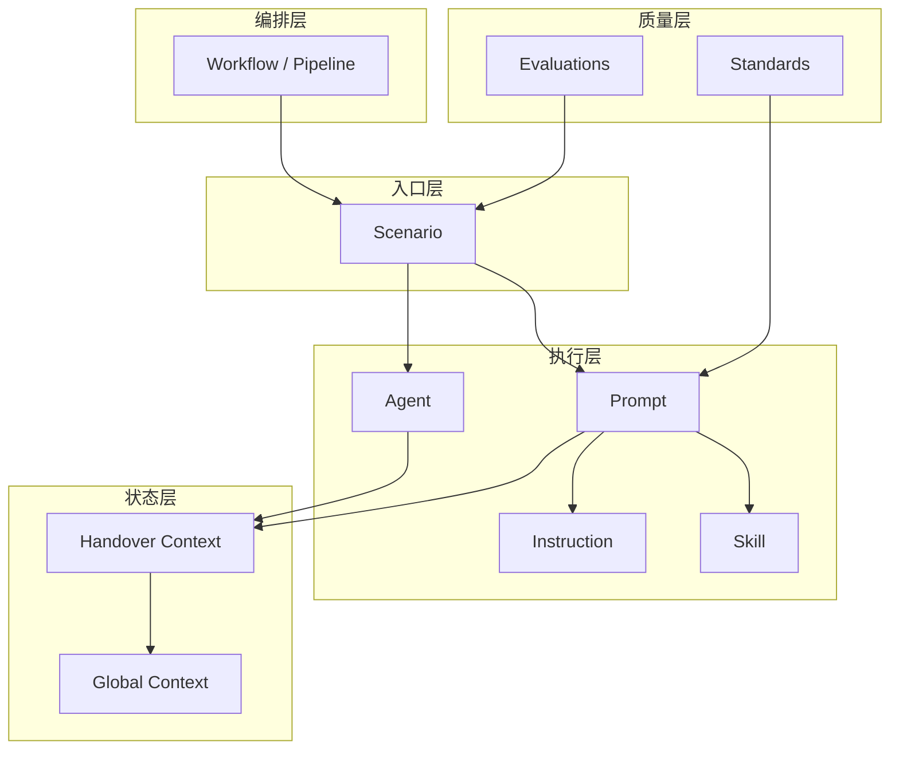

# E2E Delivery Harness — AGENTS.md

> **本文档面向 AI Agent**：在 `e2e-delivery-harness/` 内执行任何交付、运维或治理任务前，请先阅读本文件。它是本资产库的**导航图、执行协议与质量契约**。

---

## 目录

1. [执行摘要（Agent 必读）](#执行摘要agent-必读)
2. [项目定位与资产统计](#项目定位与资产统计)
3. [架构：分层模型与组合公式](#架构分层模型与组合公式)
4. [双 Pipeline：主交付与故障响应](#双-pipeline主交付与故障响应)
5. [资产类型深度说明](#资产类型深度说明)
6. [标准执行协议](#标准执行协议)
7. [上下文与阶段交接](#上下文与阶段交接)
8. [ID、决策点与量化门禁](#id决策点与量化门禁)
9. [场景全目录（37）](#场景全目录37)
10. [场景选型指南](#场景选型指南)
11. [质量评估与回归](#质量评估与回归)
12. [目录结构与文件索引](#目录结构与文件索引)
13. [资产维护与扩展](#资产维护与扩展)
14. [相关文档](#相关文档)

---

## 执行摘要（Agent 必读）

### 你在本仓库中的角色

本仓库**不是应用代码**，而是一套 **AI Harness 工程化资产库**：用可组合 Markdown 资产，把「需求 → 设计 → 开发 → 测试 → 部署 → 运维 → 治理」固化为可重复执行的 Agent 工作流。

### 强制加载顺序（单次场景执行）

```
1. workflows/*.pipeline.md     → 确认当前处于哪条流水线、哪一阶段
2. contexts/global-context.md    → 读取/更新项目全局状态（若存在实例化副本）
3. scenarios/{name}/SCENARIO.md  → 场景入口：Purpose、CoT、Error Handling、KPI
4. agents/{name}.agent.md        → 角色身份、工作规则、输入输出契约
5. prompts/{name}.prompt.md      → 变量、思维链、输出验证、Handover
6. instructions/{name}.instructions.md  → 操作步骤与检查清单（按需）
7. skills/{name}/SKILL.md        → 领域知识与反模式（按需）
8. evaluations/*                 → 阶段准出前自检
9. 生成交接 → contexts/handover-context.template.md 或 unified-handover-template.md
```

### 五条不可违反的规则

| # | 规则 | 违反后果 |
|---|------|----------|
| R1 | **先 Scenario 后 Prompt**：Scenario 负责导航与异常；Prompt 负责逐步执行 | 跳过质量门禁与错误处理 |
| R2 | **变量未填不执行**：`prompts/*.prompt.md` 中 `Required: true` 的变量必须确认 | 产出不可追溯、无法交接 |
| R3 | **每步 [VALIDATE]**：思维链每步完成后自检，不通过则回退修正 | 幻觉需求/设计漂移 |
| R4 | **准出前量化**：对照 `standards/id-generation-quantification.md` 与 Scenario KPI | 无法进入下一阶段 |
| R5 | **必须 Handover**：阶段结束输出 YAML 交接包，更新 Global Context | 下游 Agent 上下文断裂 |

### 命名对齐原则

五类执行资产共享同一 **`{verb}-{noun}`** 基名（kebab-case），例如 `analyze-requirement` 同时对应 Agent / Skill / Instruction / Prompt / Scenario 目录。禁止跨场景混用基名。

### Harness Engineering 合规

审查与优化基准：[standards/harness-engineering.md](standards/harness-engineering.md)（Goal / Strategy / Tooling / Constraint / Feedback / Observability 六层映射）。

维护脚本：`scripts/harness-compliance-patch.py`、`scripts/harness-full-compliance.py`、`scripts/generate-deliverable-templates.py`。

---

## 项目定位与资产统计

| 维度 | 说明 |
|------|------|
| **名称** | E2E Delivery Harness（端到端交付全流程工作流资产库） |
| **理念** | AI Harness Engineering：用结构化资产「驾驭」大模型，而非单次即兴 Prompt |
| **目标** | 一致性、可复用性、可审计的交付产出 |
| **适用** | 新项目全流程、单阶段增强、团队流程标准化、Runbook/Agent 技能沉淀 |

### 资产数量（截至仓库当前状态）

| 类别 | 数量 | 路径 |
|------|------|------|
| Scenario | **37** | `scenarios/*/SCENARIO.md` |
| Agent | **37** | `agents/*.agent.md` |
| Prompt | **37** | `prompts/*.prompt.md` |
| Instruction | **37** | `instructions/*.instructions.md` |
| Skill | **37** | `skills/*/SKILL.md` |
| Pipeline | **2** | `workflows/*.pipeline.md` |
| Context 模板 | **3** | `contexts/*.md` |
| Standard | **37** | `standards/*.md` |
| Evaluation | **28** | `evaluations/*.md` |
| Template | **33** | `templates/`（含交付物模板与资产模板） |

**对齐关系**：37 个场景 × 5 类执行资产 = **185 个一一映射的核心执行单元**（同名 `{verb}-{noun}`）。

---

## 架构：分层模型与组合公式

### 分层视图



### 组合公式

```
Scenario = Agent + Prompt + Instruction + Skill[] + (隐式) Standards + Evaluations

Pipeline   = ordered(Scenario_core[]) + supporting(Scenario_optional[])

Team       = Agent[] + handoff_protocol
```

### 职责分离（避免重复劳动）

| 资产 | 职责 | Agent 何时读 |
|------|------|----------------|
| **Workflow** | 阶段顺序、准入准出、阶段间 handoff 字段 | 多阶段任务开始时 |
| **Scenario** | 业务目的、CoT、决策点 DC-*、错误处理 EH-*、KPI | **首先** |
| **Agent** | 角色人格、工作规则、输入/输出表、Handoff 契约 | 与 Scenario 同时 |
| **Prompt** | 变量表、逐步 CoT、输出模板、Output Validation | **执行时主文档** |
| **Instruction** | 可执行步骤、工具命令、检查清单 | 需要具体操作细节时 |
| **Skill** | 领域方法、示例、反模式、参考标准 | 需要专业知识时 |
| **Standard** | 命名、资产模型、量化指标 | 写作/评审/准出时 |
| **Evaluation** | 回归清单、评分卡、输出验证 | 阶段结束前 |

### AI-First 设计要点

1. **Scenario / Prompt 分离**：Scenario = 轻量导航 + 异常策略；Prompt = 重执行脚本。
2. **强制思维链**：步骤标签 `[THINK]` `[ANALYZE]` `[VALIDATE]` 等，禁止跳步汇总。
3. **可机器读的交接**：Handover 使用 YAML，字段与 `workflows/e2e-delivery.pipeline.md` 一致。
4. **决策点存档**：`DC-xxx` 记录分歧与 rationale，供审计与复盘。
5. **错误可升级**：Scenario 内定义识别信号 → 处理流程 → 降级 → 升级条件。

---

## 双 Pipeline：主交付与故障响应

### Pipeline A：E2E 主交付（7 个核心阶段）

定义文件：[workflows/e2e-delivery.pipeline.md](workflows/e2e-delivery.pipeline.md)（v1.1.0）

| 序 | Stage ID | 场景 | 准出要点 |
|----|----------|------|----------|
| 1 | `analyze-requirement` | 需求分析 | 需求规格评审通过；REQ-COVER ≥95% |
| 2 | `design-system` | 系统设计 | 架构评审通过；设计可追溯需求 |
| 3 | `decompose-task` | 任务拆分 | 迭代计划评审；TASK-COVER ≥98% |
| 4 | `implement-feature` | 开发实现 | CR 通过；DEV-COVERAGE ≥80% |
| 5 | `verify-test` | 测试验证 | 测试报告；TEST-PASS ≥90% |
| 6 | `deploy-release` | 部署发布 | 部署成功；DEPLOY-SUCCESS ≥99% |
| 7 | `monitor-operate` | 监控运维 | 监控就绪；MON-SLO ≥99.5% |

**Pipeline 声明的辅助场景**（可在核心阶段内并行触发）：

| 锚定阶段 | 辅助场景 |
|----------|----------|
| `implement-feature` | `manage-dependencies`, `manage-tech-debt` |
| `deploy-release` | `plan-rollback` |
| `monitor-operate` | `respond-incident`, `plan-disaster-recovery` |
| 跨阶段 | `manage-knowledge` |

### Pipeline B：故障响应（4 阶段）

定义文件：[workflows/incident-response.pipeline.md](workflows/incident-response.pipeline.md)（v1.1.0）

```
检测与分级 → 响应与缓解 → 恢复与闭环 → 复盘与改进
```

**推荐场景映射**：

| 响应阶段 | 推荐场景 |
|----------|----------|
| 检测/响应/恢复 | `respond-incident` |
| 紧急修复 | `apply-hotfix` |
| 复盘改进 | `review-incident` |
| 灾备能力 | `plan-disaster-recovery` |

主交付 Pipeline 与故障 Pipeline **可交织**：例如生产故障时从 `monitor-operate` 跳到 `respond-incident`，恢复后回到 `review-incident` 与 `manage-knowledge`。

### 核心七阶段 vs 扩展三十场景

| 类型 | 数量 | 说明 |
|------|------|------|
| **核心（Canonical）** | 7 | 与 `e2e-delivery.pipeline.md` 的 `stages` 一一对应，代表最小完整交付链 |
| **扩展（Extended）** | 30 | 同一 `{verb}-{noun}` 命名空间下的专项能力，可插入核心阶段前后或并行 |

扩展场景**不替代**核心阶段，而是**加深**某一环节（如 `design-database` 在 `design-system` 之后；`automate-test` 在 `verify-test` 并行）。

---

## 资产类型深度说明

规范总览：[standards/asset-model.md](standards/asset-model.md)

### 1. Agent（`agents/*.agent.md`）

**作用**：定义 AI 的**身份、边界、工作规则、I/O 契约**。

**YAML 头（必填）**：

```yaml
name: <verb-noun>
description: <string>
type: agent
version: "<semver>"
status: draft | active | deprecated
tags: []
```

**正文推荐章节**：

| 章节 | 内容 |
|------|------|
| Role Definition | 角色能力与气质 |
| Use When / Not Applicable | 激活与排除条件 |
| Working Rules | 原则 + `workflow` 步骤 YAML |
| Decision Criteria | 表格：条件 → 行动 |
| Expected Input / Output | 字段级验证规则 |
| Handoff | 下游阶段 YAML 模板 |
| Quality Checklist | 执行前/中/后检查项 |
| Related Assets | 相对路径链接 |

**参考样例**：[agents/analyze-requirement.agent.md](agents/analyze-requirement.agent.md)

---

### 2. Scenario（`scenarios/{name}/SCENARIO.md`）

**作用**：Agent 的**快速入口**与**异常策略手册**。

**YAML 头**：

```yaml
name: <verb-noun>
type: scenario
stage: <phase-id>
category: <string>
status: active
```

**正文推荐章节**：

| 章节 | 内容 |
|------|------|
| Purpose / Business Value | 为什么做 |
| Chain of Thought | Think-Aloud 逐步协议 |
| Decision Checkpoints | `DC-001`… |
| Error Handling | 识别信号 + 流程 + 降级 + 升级 |
| Quality Metrics | KPI-* 与加权评分 |
| Handover Criteria | 准出勾选 + handover YAML 片段 |
| Prerequisites | 必需前置与输入表 |
| Related Assets | 五类资产链接 |

**参考样例**：[scenarios/analyze-requirement/SCENARIO.md](scenarios/analyze-requirement/SCENARIO.md)

---

### 3. Prompt（`prompts/*.prompt.md`）

**作用**：**可执行脚本**——变量绑定、逐步推理、输出结构、自检。

**必填增强结构**：

| 章节 | 用途 |
|------|------|
| Input Variables | 类型、Required、Validation、示例 YAML |
| Chain of Thought | 与 Scenario 对齐但更细的执行步骤 |
| Error Handling | 与 Scenario 呼应的执行级处理 |
| Output Format | 章节化交付物模板 |
| Output Validation | 自检清单 + 评分 |
| Handover Preparation | 填充 handoff 字段 |

**参考样例**：[prompts/analyze-requirement.prompt.md](prompts/analyze-requirement.prompt.md)

---

### 4. Instruction（`instructions/*.instructions.md`）

**作用**：**操作层 Runbook**——命令、文件路径、检查清单、工具交互。

**YAML 头常见字段**：

```yaml
applyTo: "<glob>"
phase: <stage>
order: <int>
```

用于 IDE 规则或 Copilot 按路径自动附着（见 [copilot-instructions.md](copilot-instructions.md)）。

---

### 5. Skill（`skills/{name}/SKILL.md`）

**作用**：**领域知识包**——方法论、模板片段、反模式、行业惯例。

与 Agent 的区别：Agent 管「谁来做、做到什么程度」；Skill 管「怎么做才专业」。

**参考样例**：[skills/analyze-requirement/SKILL.md](skills/analyze-requirement/SKILL.md)

---

### 6. Workflow（`workflows/*.pipeline.md`）

**作用**：多场景**编排**与**阶段间 handoff 契约**。

**YAML 头**：

```yaml
name: <pipeline-name>
type: pipeline
version: "<semver>"
stages: [<stage-id>, ...]
supporting-scenarios: { ... }  # 可选
```

**正文**：Overview → Stage Flow → Stage Definitions（含 entry/exit、artifacts、handoff YAML）→ Quality Gates。

---

### 7. Context（`contexts/`）

| 文件 | 用途 |
|------|------|
| [global-context.md](contexts/global-context.md) | 项目元数据、团队、时间线、技术栈、阶段状态 |
| [handover-context.template.md](contexts/handover-context.template.md) | 阶段交接模板 |
| [unified-handover-template.md](contexts/unified-handover-template.md) | 统一交接（推荐优先使用） |

实例化时建议复制为项目侧 `project-context.yaml`，勿直接覆盖模板。

---

### 8. Standards & Evaluations

| 标准文件 | 内容 |
|----------|------|
| [asset-model.md](standards/asset-model.md) | 资产类型与组合 |
| [naming-conventions.md](standards/naming-conventions.md) | `{verb}-{noun}` 与路径 |
| [lifecycle.md](standards/lifecycle.md) | draft → review → active → update → deprecated |
| [id-generation-quantification.md](standards/id-generation-quantification.md) | ID 前缀与阶段 KPI |
| [output-quality-rubric.md](standards/output-quality-rubric.md) | 输出质量 Rubric |
| [authoring-checklist.md](standards/authoring-checklist.md) | 创作检查清单 |

| 评估文件 | 内容 |
|----------|------|
| [regression-checklist.md](evaluations/regression-checklist.md) | 分阶段 R/D/T/C/E/P/M 检查项 |
| [scorecard-template.md](evaluations/scorecard-template.md) | 加权 7 阶段评分 |
| [output-validation-checklist.md](evaluations/output-validation-checklist.md) | 通用输出验证 |
| [common-error-patterns.md](evaluations/common-error-patterns.md) | 常见错误模式库 |

---

## 标准执行协议

### 流程图

```
选择场景 → 读 Scenario + Agent
    → 读 Prompt，填充 Variables
    → 按 CoT 执行（每步 VALIDATE）
    → 异常？→ Scenario Error Handling → 仍失败则升级人工
    → Output Validation（evaluations）
    → 填写 Handover YAML
    → 更新 Global Context
    → 进入 Pipeline 下一阶段或辅助场景
```

### 升级（Escalation）通用条件

当满足以下**任一**条件时，停止自主推断并请求人工决策：

- 错误处理流程中定义的「升级条件」触发（如 3 轮澄清仍模糊）
- 质量评分低于 Scenario 规定的合格线（常见为 70 分）
- 变更影响超过阈值（如范围蔓延 >20%、关键里程碑延期）
- 安全/合规类 `DC-*` 无明确授权
- 交接必填字段无法从上下文推断

### 与 Cursor / Copilot 的集成

- 仓库根级 Agent 指南：**本文件 `AGENTS.md`**
- Copilot 补充：[copilot-instructions.md](copilot-instructions.md)（按阶段索引资产路径）
- 人类可读：[USAGE.zh.md](USAGE.zh.md)、[INTRODUCTION.zh.md](INTRODUCTION.zh.md)

---

## 上下文与阶段交接

### Global Context 维护

在 [contexts/global-context.md](contexts/global-context.md) 中维护：

- `project.stage`：当前 Pipeline 阶段 ID
- `timeline.milestones`：里程碑状态
- `tech_stack`：约束下游设计/实现
- `status.risk_level`：影响测试与发布策略

**每完成一个核心阶段**，至少更新：`stage`、`updated_at`、最近 `handover_id`。

### Handover 必填字段

```yaml
handoff:
  header:
    from_stage: "<source>"
    to_stage: "<target>"
    handover_id: "HO-<ISO8601>-<seq>"
    timestamp: "<ISO8601>"
  artifacts:
    delivered: [{ name, path, version }]
  decisions: [{ id: "DC-xxx", description, rationale }]
  open_issues:
    blocking: []
    non_blocking: []
  risks: [{ id: "RISK-xxx", probability, impact, mitigation }]
  quality_metrics: { kpi_results: [...] }
  recommendations: []
```

模板：[contexts/unified-handover-template.md](contexts/unified-handover-template.md)

### 核心链 Handoff 路径（Pipeline A）

```
analyze-requirement → design-system → decompose-task
  → implement-feature → verify-test → deploy-release → monitor-operate
```

各阶段 `artifacts` 与 `context` 字段详见 [workflows/e2e-delivery.pipeline.md](workflows/e2e-delivery.pipeline.md) 内嵌 YAML。

---

## ID、决策点与量化门禁

完整定义：[standards/id-generation-quantification.md](standards/id-generation-quantification.md)

### ID 前缀（常用）

| 前缀 | 用途 | 示例 |
|------|------|------|
| REQ | 需求 | REQ-001 |
| DES | 设计 | DES-001 |
| TASK | 任务 | TASK-001 |
| TC | 测试用例 | TC-001 |
| BUG | 缺陷 | BUG-001 |
| DC | 决策点 | DC-001 |
| RISK | 风险 | RISK-001 |
| INC | 故障 | INC-001 |
| HO | 交接 | HO-20260401-001 |

格式：`^{PREFIX}-\d{3}$`，同文档内唯一且不可复用已废弃 ID。

### Pipeline 级质量门禁（阶段间）

| 过渡 | 门禁 ID | 标准 |
|------|---------|------|
| 需求 → 设计 | Q-001 | REQ-COVER ≥ 95% |
| 设计 → 任务 | Q-002 | 设计评审 100% 通过 |
| 任务 → 开发 | Q-003 | TASK-COVER ≥ 98% |
| 开发 → 测试 | Q-004 | DEV-COVERAGE ≥ 80% |
| 测试 → 部署 | Q-005 | TEST-PASS ≥ 90% |
| 部署 → 运维 | Q-006 | DEPLOY-SUCCESS ≥ 99% |
| 运维稳态 | Q-007 | MON-SLO ≥ 99.5% |

### 阶段准出（管理视图）

| 阶段 | 准入 | 准出 |
|------|------|------|
| 需求分析 | 有明确业务诉求 | 干系人评审签字 |
| 系统设计 | 需求基线冻结 | 技术评审通过 |
| 任务拆分 | 设计基线可用 | 迭代计划评审 |
| 开发实现 | 任务已分配 | 代码评审 + 单测 |
| 测试验证 | 可测构建可用 | 测试报告签发 |
| 部署发布 | 测试准出 | 部署验证 + 回滚预案 |
| 监控运维 | 已上线 | 监控/告警/Runbook 就绪 |

---

## 场景全目录（37）

基名 = 目录名 = 五类资产文件名。路径模式：`scenarios/{base}/SCENARIO.md` 等。

### Phase 1：Requirement（需求）

| 基名 | 中文 | 类型 | 典型触发 | 主要产出 |
|------|------|------|----------|----------|
| `analyze-requirement` | 需求分析 | **核心** | 新项目/需求变更/文档缺失 | 需求规格、干系人分析、用例、追溯矩阵 |
| `plan-sprint` | 冲刺规划 | 扩展 | 迭代开始前 | Sprint 目标、容量、承诺清单 |

### Phase 2：Design（设计）

| 基名 | 中文 | 类型 | 典型触发 | 主要产出 |
|------|------|------|----------|----------|
| `design-system` | 系统设计 | **核心** | 需求基线后 | 架构说明、组件、API 概要 |
| `design-architecture` | 架构模式 | 扩展 | 复杂非功能/多系统集成 | 架构决策 ADR、模式选型 |
| `design-database` | 数据库设计 | 扩展 | 数据密集型功能 | ER/Schema、迁移策略 |
| `review-design` | 方案评审 | 扩展 | 设计完成后 | 评审意见、问题清单 |

### Phase 3：Development（开发）

| 基名 | 中文 | 类型 | 典型触发 | 主要产出 |
|------|------|------|----------|----------|
| `decompose-task` | 任务拆分 | **核心** | 设计评审后 | Backlog、估算、依赖图 |
| `implement-feature` | 功能开发 | **核心** | 任务就绪 | 代码、单测、技术说明 |
| `integrate-api` | API 集成 | 扩展 | 第三方/内部 API | 集成代码、契约测试 |
| `manage-dependencies` | 依赖管理 | 扩展* | 依赖冲突/升级 | 依赖报告、锁定文件策略 |
| `manage-config` | 配置管理 | 扩展 | 多环境配置 | 配置分层、变更记录 |
| `manage-secrets` | 密钥管理 | 扩展 | 凭证/证书轮换 | 密钥存储策略、访问审计 |
| `document-project` | 项目文档 | 扩展 | 文档债/ onboarding | README、架构说明、API 文档 |

\* `manage-dependencies` 为 Pipeline 声明的 `implement-feature` 辅助场景。

### Phase 4：Testing（测试）

| 基名 | 中文 | 类型 | 典型触发 | 主要产出 |
|------|------|------|----------|----------|
| `verify-test` | 测试验证 | **核心** | 开发准出 | 测试报告、缺陷列表 |
| `automate-test` | 自动化测试 | 扩展 | 回归成本高 | 自动化用例、CI 测试作业 |
| `performance-testing` | 性能测试 | 扩展 | NFR 性能项 | 压测报告、瓶颈分析 |
| `review-code` | 代码审查 | 扩展 | PR/MR 就绪 | 审查意见、质量门禁 |

### Phase 5：Deployment（部署）

| 基名 | 中文 | 类型 | 典型触发 | 主要产出 |
|------|------|------|----------|----------|
| `setup-infra` | 基础设施 | 扩展 | 新环境/云资源 | IaC、环境拓扑 |
| `implement-cicd` | CI/CD | 扩展 | 无流水线或需改造 | Pipeline 定义、制品策略 |
| `prepare-release` | 发布准备 | 扩展 | 上线前检查 | 发布说明、检查清单 |
| `deploy-release` | 部署发布 | **核心** | 测试准出 | 部署记录、发布报告 |
| `plan-rollback` | 回滚计划 | 扩展* | 发布前/重大变更 | 回滚步骤、验证点 |

\* Pipeline 声明的 `deploy-release` 辅助场景。

### Phase 6：Operations（运维）

| 基名 | 中文 | 类型 | 典型触发 | 主要产出 |
|------|------|------|----------|----------|
| `backup-data` | 数据备份 | 扩展 | 合规/灾备要求 | 备份策略、恢复演练记录 |
| `migrate-data` | 数据迁移 | 扩展 |  schema 变更/系统合并 | 迁移脚本、对账报告 |
| `migrate-environment` | 环境迁移 | 扩展 | 机房/云迁移 | 迁移计划、割接窗口 |
| `monitor-operate` | 监控运维 | **核心** | 上线后 | 监控、告警、Runbook |
| `integrate-monitor` | 监控集成 | 扩展 | 新服务/新指标 | 仪表板、告警规则 |
| `manage-change` | 变更管理 | 扩展 | 生产变更 | 变更单、审批记录 |
| `optimize-performance` | 性能优化 | 扩展 | SLO 逼近阈值 | 优化方案、前后对比 |
| `plan-capacity` | 容量规划 | 扩展 | 增长预测/大促 | 容量模型、扩容计划 |

### Phase 7：Governance（治理）

| 基名 | 中文 | 类型 | 典型触发 | 主要产出 |
|------|------|------|----------|----------|
| `audit-security` | 安全审计 | 扩展 | 合规/上线前 | 审计报告、整改项 |
| `manage-tech-debt` | 技术债务 | 扩展* | 质量下滑/重构 | 债务清单、偿还计划 |
| `manage-knowledge` | 知识管理 | 扩展† | 项目结束/里程碑 | 复盘文档、Wiki |
| `respond-incident` | 事件响应 | 扩展* | 告警/用户报障 | 时间线、缓解动作 |
| `review-incident` | 故障复盘 | 扩展 | 事件关闭后 | Postmortem、改进项 |
| `plan-disaster-recovery` | 灾备规划 | 扩展* | BCP/合规 | DR 方案、演练计划 |
| `apply-hotfix` | 紧急修复 | 扩展 | P0 生产缺陷 | Hotfix 分支、快速发布记录 |

\* Pipeline 辅助；† 跨阶段 `cross-cutting`。

### 五类资产路径速查（任一场景 `{base}`）

```
agents/{base}.agent.md
prompts/{base}.prompt.md
instructions/{base}.instructions.md
skills/{base}/SKILL.md
scenarios/{base}/SCENARIO.md
```

---

## 场景选型指南

### 按用户意图快速路由

| 用户说… | 首选场景 | 可选并行 |
|---------|----------|----------|
| 分析/澄清需求 | `analyze-requirement` | `plan-sprint` |
| 做架构/设计 | `design-system` | `design-architecture`, `design-database`, `review-design` |
| 拆任务/排期 | `decompose-task` | `plan-sprint` |
| 写代码/做功能 | `implement-feature` | `integrate-api`, `manage-dependencies`, `manage-tech-debt` |
| 测试 | `verify-test` | `automate-test`, `performance-testing` |
| 上线 | `deploy-release` | `prepare-release`, `plan-rollback`, `implement-cicd` |
| 线上问题 | `respond-incident` | `apply-hotfix`, `review-incident` |
| 安全/合规 | `audit-security` | `manage-secrets` |
| 文档欠缺 | `document-project` | `manage-knowledge` |

### 决策树（简化）

```
是否有生产故障？
  是 → respond-incident → (需要代码?) apply-hotfix → review-incident
  否 → 项目处于哪一阶段？
        需求 → analyze-requirement
        设计 → design-system (+ 专项设计场景)
        开发 → implement-feature (+ manage-dependencies)
        测试 → verify-test
        发布 → deploy-release (+ plan-rollback)
        运维 → monitor-operate
```

### 完整映射表（Phase × 五类资产）

| Phase | `{base}` | Agent | Instruction | Prompt | Skill |
|-------|----------|-------|-------------|--------|-------|
| Requirement | analyze-requirement | ✓ | ✓ | ✓ | ✓ |
| Requirement | plan-sprint | ✓ | ✓ | ✓ | ✓ |
| Design | design-system | ✓ | ✓ | ✓ | ✓ |
| Design | design-architecture | ✓ | ✓ | ✓ | ✓ |
| Design | design-database | ✓ | ✓ | ✓ | ✓ |
| Design | review-design | ✓ | ✓ | ✓ | ✓ |
| Development | decompose-task | ✓ | ✓ | ✓ | ✓ |
| Development | implement-feature | ✓ | ✓ | ✓ | ✓ |
| Development | integrate-api | ✓ | ✓ | ✓ | ✓ |
| Development | manage-dependencies | ✓ | ✓ | ✓ | ✓ |
| Development | manage-config | ✓ | ✓ | ✓ | ✓ |
| Development | manage-secrets | ✓ | ✓ | ✓ | ✓ |
| Development | document-project | ✓ | ✓ | ✓ | ✓ |
| Testing | verify-test | ✓ | ✓ | ✓ | ✓ |
| Testing | automate-test | ✓ | ✓ | ✓ | ✓ |
| Testing | performance-testing | ✓ | ✓ | ✓ | ✓ |
| Testing | review-code | ✓ | ✓ | ✓ | ✓ |
| Deployment | setup-infra | ✓ | ✓ | ✓ | ✓ |
| Deployment | implement-cicd | ✓ | ✓ | ✓ | ✓ |
| Deployment | prepare-release | ✓ | ✓ | ✓ | ✓ |
| Deployment | deploy-release | ✓ | ✓ | ✓ | ✓ |
| Deployment | plan-rollback | ✓ | ✓ | ✓ | ✓ |
| Operations | backup-data | ✓ | ✓ | ✓ | ✓ |
| Operations | migrate-data | ✓ | ✓ | ✓ | ✓ |
| Operations | migrate-environment | ✓ | ✓ | ✓ | ✓ |
| Operations | monitor-operate | ✓ | ✓ | ✓ | ✓ |
| Operations | integrate-monitor | ✓ | ✓ | ✓ | ✓ |
| Operations | manage-change | ✓ | ✓ | ✓ | ✓ |
| Operations | optimize-performance | ✓ | ✓ | ✓ | ✓ |
| Operations | plan-capacity | ✓ | ✓ | ✓ | ✓ |
| Governance | audit-security | ✓ | ✓ | ✓ | ✓ |
| Governance | manage-tech-debt | ✓ | ✓ | ✓ | ✓ |
| Governance | manage-knowledge | ✓ | ✓ | ✓ | ✓ |
| Governance | respond-incident | ✓ | ✓ | ✓ | ✓ |
| Governance | review-incident | ✓ | ✓ | ✓ | ✓ |
| Governance | plan-disaster-recovery | ✓ | ✓ | ✓ | ✓ |
| Governance | apply-hotfix | ✓ | ✓ | ✓ | ✓ |

---

## 质量评估与回归

### 阶段完成前必做

1. 运行 [evaluations/output-validation-checklist.md](evaluations/output-validation-checklist.md) 通用项
2. 运行 [evaluations/regression-checklist.md](evaluations/regression-checklist.md) 对应阶段章节（R/D/T/C/E/P/M）
3. 可选：[evaluations/scorecard-template.md](evaluations/scorecard-template.md) 加权评分（发布决策）
4. 对照 [evaluations/common-error-patterns.md](evaluations/common-error-patterns.md) 排除已知反模式

### 评分等级（Scorecard）

| 分数 | 等级 | 含义 |
|------|------|------|
| 90–100 | A | 优秀 |
| 80–89 | B | 良好 |
| 70–79 | C | 合格（最低可准出参考线） |
| 60–69 | D | 需改进 |
| 0–59 | F | 不准出 |

---

## 目录结构与文件索引

```
e2e-delivery-harness/
├── AGENTS.md                 # 本文件 — Agent 导航与协议
├── README.md
├── INTRODUCTION.zh.md / INTRODUCTION.en.md
├── USAGE.zh.md
├── copilot-instructions.md
│
├── workflows/                # 2 pipelines
│   ├── e2e-delivery.pipeline.md
│   └── incident-response.pipeline.md
│
├── contexts/                 # 3 context files
│   ├── global-context.md
│   ├── handover-context.template.md
│   └── unified-handover-template.md
│
├── scenarios/                # 37 × SCENARIO.md
├── agents/                   # 37 × *.agent.md
├── prompts/                  # 37 × *.prompt.md
├── instructions/             # 37 × *.instructions.md
├── skills/                   # 37 × SKILL.md
│
├── standards/                # 37 specs（含 harness-engineering 与领域标准）
├── evaluations/              # 28 checklists
└── templates/                # 33 交付物与资产模板
    ├── agent-template.agent.md
    ├── instruction-template.instructions.md
    ├── prompt-template.prompt.md
    ├── skill-template/SKILL.md
    └── scenario-template/SCENARIO.md
```

---

## 资产维护与扩展

### 新增一个场景（须保持五类对齐）

1. 在 [standards/lifecycle.md](standards/lifecycle.md) 确认阶段归属
2. 从 [templates/](templates/) 复制五类模板，基名 `{verb}-{noun}` 一致
3. 填写 YAML 元数据（`status: draft` → 评审 → `active`）
4. 在 [workflows/e2e-delivery.pipeline.md](workflows/e2e-delivery.pipeline.md) 注册为核心或 `supporting-scenarios`
5. 更新本 `AGENTS.md` 场景表
6. 按 [standards/authoring-checklist.md](standards/authoring-checklist.md) 自检

### 版本与状态

- 语义化版本写在各资产 YAML `version`
-  Breaking 变更递增 major，交接格式变更需同步所有 Prompt Handover 段
- 废弃资产标记 `status: deprecated` 并保留至少一个版本的迁移说明

### 已知注意事项

- 部分历史 Scenario 曾引用尚未落地的标准文件；现已通过 `scripts/harness-full-compliance.py` 批量补齐 **standards/** 与 **evaluations/** 引用资产。
- `scenarios/README.md` 中示例目录名（如 `requirement-analysis/`）为说明性示例，**实际目录**均为 `{verb}-{noun}/`。

---

## 相关文档

| 文档 | 用途 |
|------|------|
| [USAGE.zh.md](USAGE.zh.md) | 人类使用指南 |
| [INTRODUCTION.zh.md](INTRODUCTION.zh.md) | 项目介绍 |
| [standards/asset-model.md](standards/asset-model.md) | 资产模型规范 |
| [workflows/e2e-delivery.pipeline.md](workflows/e2e-delivery.pipeline.md) | 主交付流水线 |
| [workflows/incident-response.pipeline.md](workflows/incident-response.pipeline.md) | 故障响应流水线 |
| [copilot-instructions.md](copilot-instructions.md) | Copilot 专用指引 |

---

*本文档由 `e2e-delivery-harness` 资产库结构分析生成，随资产增删同步维护。*
