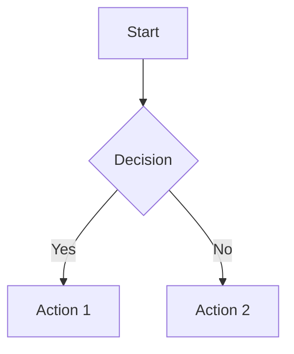

# Requirement Analysis Instructions

## Purpose

本文档定义了需求分析阶段的标准操作流程、质量检查标准和工作产出规范。需求分析是将原始业务需求转换为结构化、可验证的需求规格说明书的系统性过程，为后续系统设计和开发提供清晰基线。

### Business Value

- **降低需求风险**: 通过系统化分析识别模糊和冲突的需求，避免后期返工和成本超支
- **提升干系人满意度**: 全面识别干系人诉求，确保关键需求不被遗漏，建立信任关系
- **建立清晰基线**: 形成可追溯、可验证的需求基线，为后续设计和开发提供明确输入
- **提高交付质量**: 明确的验收标准和非功能需求定义，减少交付偏差和质量问题
- **增强变更可控性**: 建立需求变更流程，控制范围蔓延，保持项目进度稳定

## Investigation Flow

### 流程概览

```
需求收集 → 干系人分析 → 业务建模 → 需求规格化 → 评审确认 → 交接准备
```

### 步骤 1：需求收集

**目的**：从多渠道收集原始需求，建立完整的需求池

**输入**：
- 业务方的原始需求描述（raw_requirements）
- 相关的业务文档和背景材料（existing_docs）
- 现有系统的问题反馈和用户调研数据

**操作**：

1. **渠道识别**
   - 识别需求来源渠道（会议记录、邮件、工单、访谈纪要、用户调研等）
   - 记录每个需求的来源、时间和提出人
   - 评估信息来源的可靠性和权威性

2. **初步整理**
   - 去重合并相似的需求（相似度>80%的需求合并）
   - 按业务领域分类整理（如：用户管理、订单处理、支付结算等）
   - 标注需求优先级初稿（高/中/低，基于业务价值初步判断）

3. **缺失识别**
   - 识别信息不完整的需求（缺少业务场景、用户角色、期望结果等）
   - 列出需要进一步澄清的问题清单
   - 标记需要补充的干系人 input

**输出**：初步整理的需求清单（包含需求ID、描述、来源、优先级初稿、待澄清问题）

**质量标准**：
- 需求覆盖率 ≥95%（已收集需求/总需求）
- 每条需求都有明确的来源和提出人
- 待澄清问题清单完整

---

### 步骤 2：干系人分析

**目的**：识别所有相关干系人，理解其诉求和期望

**输入**：
- 项目背景和组织架构
- 已识别的干系人名单（stakeholders）
- 利益相关程度和业务影响范围

**操作**：

1. **干系人识别**
   - 使用四类角色框架列出所有利益相关方：
     - 决策者（Decision Maker）：有最终决策权的人
     - 使用者（User）：日常使用系统的人
     - 影响者（Influencer）：对项目有影响但无决策权的人
     - 监管者（Regulator）：负责合规和监管的人
   - 补充识别可能遗漏的角色（运维团队、数据分析团队、客服团队等）

2. **影响力评估**
   - 使用Power-Interest Grid评估每个干系人的权力（高/中/低）和利益（高/中/低）
   - 确定干系人优先级（P0/P1/P2/P3）
   - 识别关键干系人（高权力-高利益）

3. **诉求收集**
   - 通过访谈、问卷、工作坊等方式收集各干系人的核心诉求
   - 记录诉求背后的业务目标和利益考量
   - 识别不同干系人之间的潜在冲突点

4. **沟通计划制定**
   - 根据干系人类型制定沟通频率和方式
   - 明确沟通负责人和沟通内容
   - 建立反馈机制

**输出**：干系人分析报告（包含干系人矩阵、影响力评估、诉求清单、冲突点、沟通计划）

**质量标准**：
- 关键干系人覆盖率 100%（四类角色齐全）
- 每个干系人的核心诉求已记录
- 冲突点已标注并有解决策略

---

### 步骤 3：业务建模

**目的**：构建业务流程和用例模型，可视化业务逻辑

**输入**：
- 业务需求描述
- 现有业务流程文档（如有）
- 业务规则和约束条件

**操作**：

1. **流程识别**
   - 识别主要业务流程（通常3-5个核心流程）
   - 确定每个流程的起点（触发事件）和终点（期望结果）
   - 识别流程中的参与者（角色和系统）

2. **流程描述**
   - 使用Mermaid流程图描述业务流转
   - 标注关键决策点和分支条件
   - 说明异常处理流程和回退机制
   - 确保流程边界清晰，无死循环

3. **用例建模**
   - 识别系统用例（通常5-10个主要用例）
   - 描述每个用例的前置条件（Preconditions）
   - 编写主流程（Main Flow，正常路径）
   - 编写备选流程（Alternative Flows，异常或分支路径）
   - 定义后置条件（Postconditions）
   - 列出相关业务规则（Business Rules）

**输出**：业务流程图（Mermaid格式）和用例模型（结构化文本）

**质量标准**：
- 主要业务流程覆盖率 100%
- 关键决策点和异常处理已标注
- 用例覆盖主要场景和边界情况
- 流程图清晰易读，符合Mermaid语法

---

### 步骤 4：需求规格化

**目的**：将需求转换为结构化、可验证的规格说明

**输入**：
- 初步需求清单
- 干系人分析结果
- 业务模型（流程图和用例）
- 约束条件和假设

**操作**：

1. **功能需求定义**
   - 使用 "As a [角色], I want [功能], so that [价值]" 格式重写每条需求
   - 为每个需求定义Given-When-Then格式的验收标准
   - 标注需求优先级（P0/P1/P2/P3）和依赖关系
   - 建立需求与业务目标的追溯关系

2. **非功能需求定义**
   - 性能需求：响应时间、吞吐量、并发用户数
   - 安全需求：认证、授权、数据加密、审计日志
   - 可用性需求：可用率、RTO、RPO
   - 可维护性需求：监控、日志、配置管理
   - 兼容性需求：浏览器、设备、操作系统
   - 合规性需求：行业标准、法规要求

3. **约束条件整理**
   - 技术约束：技术栈、集成要求、兼容性限制
   - 时间约束：交付节点、里程碑、关键日期
   - 资源约束：预算上限、人力配置、基础设施
   - 法规约束：法律法规、行业标准、合规要求

4. **假设列表**
   - 列出当前做出的所有假设
   - 评估假设不成立的风险和影响
   - 标注需要验证的假设和验证方法

**输出**：需求规格说明书（草稿），包含10个章节

**质量标准**：
- 功能需求符合用户故事格式 100%
- 验收标准符合Given-When-Then格式 ≥90%
- 非功能需求覆盖关键维度（性能、安全、可用性）
- 每条需求都可追溯到业务目标

---

### 步骤 5：评审确认

**目的**：与干系人评审需求，确保理解一致，获得签字确认

**输入**：
- 需求规格说明书（草稿）
- 相关业务和技术人员（干系人代表）
- 评审会议安排

**操作**：

1. **评审准备**
   - 提前3天发送评审材料（需求规格说明书、业务流程图、用例模型）
   - 准备评审议程（2-3小时）
   - 邀请关键干系人（决策者、使用者代表、技术负责人）
   - 准备演示环境或原型（如有）

2. **评审执行**
   - 开场介绍（10分钟）：说明评审目标和议程
   - 业务目标回顾（15分钟）：确认业务目标和范围
   - 功能需求逐条评审（60分钟）：重点关注P0需求和复杂功能
   - 非功能需求评审（20分钟）：确认性能、安全等指标
   - 业务流程和用例模型评审（30分钟）：验证流程完整性
   - 开放问题讨论（20分钟）：收集反馈和建议
   - 总结和下一步（15分钟）：确认修改计划和时间表

3. **反馈处理**
   - 记录所有反馈意见（使用问题跟踪表）
   - 现场解决简单问题（澄清误解、补充细节）
   - 标记需要进一步讨论的复杂问题
   - 对于冲突需求，组织专项会议深入讨论

4. **修订完善**
   - 根据评审意见修订需求文档
   - 标注修改处（使用版本对比工具）
   - 更新版本号（如从1.0-draft到1.1-draft）

5. **确认签字**
   - 获得关键干系人的签字确认（电子签名或邮件确认）
   - 记录确认日期和版本
   - 通知所有相关人员确认完成

6. **基线锁定**
   - 锁定需求基线，版本号更新为1.0-final
   - 建立变更流程（后续变更需走变更申请）
   - 通知所有相关人员基线已锁定

**输出**：需求规格说明书（确认版）、评审会议纪要、签字确认记录

**质量标准**：
- 关键干系人参与率 100%
- 所有反馈已处理或记录（标注待处理的原因）
- 关键干系人已签字确认
- 需求基线已锁定

---

### 步骤 6：交接准备

**目的**：生成交接上下文，准备移交系统设计阶段

**输入**：
- 需求规格说明书（确认版）
- 干系人分析报告
- 业务流程图和用例模型
- 评审会议纪要

**操作**：

1. **交接上下文生成**
   - 填写Handover Context模板
   - 包含摘要、交付物清单、决策记录、开放问题、风险、建议
   - 计算质量评分（基于KPIs）

2. **交付物整理**
   - 确认所有交付物已完成并命名规范
   - 检查文件路径和版本信息
   - 生成checksum用于完整性验证

3. **开放问题和风险梳理**
   - 列出所有未解决的问题（blocking和non-blocking）
   - 评估风险的概率和影响
   - 提供缓解措施和建议

4. **下一步行动建议**
   - 明确系统设计阶段的优先事项
   - 建议需要立即开展的技术调研（technical spikes）
   - 推荐需要安排的会议（设计评审、架构讨论等）

**输出**：Handover Context（YAML格式）、交付物清单、交接会议安排

**质量标准**：
- Handover Context字段完整率 100%
- 质量评分 ≥70分
- 开放问题和风险已记录并有缓解措施

## What To Check

### 必检项

| 检查项 | 标准 | 检查方法 | 通过条件 |
|--------|------|----------|----------|
| 业务目标清晰 | 每个需求都关联业务目标 | 逐条核对追溯矩阵 | 100% 需求有业务目标 |
| 干系人覆盖 | 四类关键角色都有输入 | 干系人核对表 | 100% 关键干系人已覆盖 |
| 验收标准明确 | 每个功能需求有验收标准 | 逐条检查Given-When-Then格式 | ≥90% 功能需求有验收标准 |
| 需求无遗漏 | 核心业务流程都有覆盖 | 用例核对表 | 覆盖率 ≥95% |
| 需求无冲突 | 需求之间无逻辑冲突 | 交叉检查，自动化扫描 | 无发现冲突 |
| 非功能需求完整 | 包含性能、安全、可用性等 | 检查清单逐项核对 | 覆盖所有必需类型 |
| 术语一致性 | 整个文档术语统一 | 术语表检查，自动化扫描 | 100% 术语一致 |
| 格式规范性 | 遵循用户故事和SMART原则 | 格式检查，抽样审查 | ≥90% 符合规范 |

### 建议检查项

| 检查项 | 标准 | 检查方法 | 通过条件 |
|--------|------|----------|----------|
| 需求可测试 | 每个需求可转化为测试用例 | 测试映射，抽样转化 | 可转化率 ≥90% |
| 优先级合理 | 优先级与业务价值一致 | 干系人确认，业务目标对齐 | 100% P0需求已确认 |
| 依赖关系明确 | 需求间的依赖已标注 | 依赖图检查 | 所有依赖已标注 |
| 假设风险评估 | 假设已评估风险 | 风险矩阵检查 | 100% 假设有风险评估 |
| 流程图可读性 | Mermaid流程图清晰易读 | 人工审查，语法检查 | 无语法错误，逻辑清晰 |

## Quality Criteria

### 质量维度

| 维度 | 要求 | 权重 | 计算方法 |
|------|------|------|----------|
| 完整性 | 产出包含所有必需项 | 25% | (已完成项/必需项) × 100% |
| 准确性 | 业务理解正确，无误解 | 20% | (干系人确认正确的需求数/总需求数) × 100% |
| 一致性 | 术语统一，无逻辑冲突 | 15% | (无冲突的需求数/总需求数) × 100% |
| 可追溯性 | 需求与目标可追溯 | 20% | (可追溯的需求数/总需求数) × 100% |
| 可验证性 | 验收标准明确可测 | 20% | (有验收标准的需求数/总需求数) × 100% |

### 评分标准

| 等级 | 分值 | 描述 | 行动 |
|------|------|------|------|
| 卓越 | 95-100 | 需求完整清晰，干系人高度认可，可直接进入设计阶段 | 无需修改，直接交接 |
| 优秀 | 85-94 | 需求基本完整，有小幅改进空间，不影响设计 | 记录改进建议，可交接 |
| 良好 | 70-84 | 满足核心要求，有优化空间，需在设计阶段补充 | 标注待完善项，可交接 |
| 合格 | 60-69 | 基本可用，需补充不完整项，可能影响设计效率 | 补充缺失项后再交接 |
| 不合格 | <60 | 不满足基本要求，存在重大缺陷 | 重新进行需求分析 |

### 质量评分计算

```
Quality Score = (Completeness × 0.25) + (Accuracy × 0.20) + (Consistency × 0.15) 
              + (Traceability × 0.20) + (Testability × 0.20)

示例计算:
Completeness = 100% (10/10章节完成)
Accuracy = 95% (干系人确认95%需求理解正确)
Consistency = 100% (无逻辑冲突)
Traceability = 100% (所有需求可追溯到业务目标)
Testability = 90% (90%需求有明确验收标准)

Quality Score = (100 × 0.25) + (95 × 0.20) + (100 × 0.15) + (100 × 0.20) + (90 × 0.20)
              = 25 + 19 + 15 + 20 + 18
              = 97分 (卓越)
```

## Output Specification

### 产出清单

| 产出 | 格式 | 必填 | 描述 | 文件路径示例 |
|------|------|------|------|--------------|
| 需求规格说明书 | .md | 是 | 结构化的需求文档，包含10个章节 | docs/requirements-spec.md |
| 干系人分析报告 | .md | 是 | 干系人识别、影响力矩阵、诉求清单、沟通计划 | docs/stakeholder-analysis.md |
| 业务流程图 | .md (含Mermaid) | 是 | 主要业务流程，使用Mermaid格式可视化 | docs/business-process-diagrams.md |
| 用例模型 | .md | 是 | 系统用例定义，包含前置条件、主流程、备选流程、后置条件 | docs/use-case-model.md |
| 追溯矩阵 | .md (表格) | 是 | 需求与业务目标的追溯关系 | docs/traceability-matrix.md |
| Handover Context | .yaml | 是 | 交接给系统设计阶段的完整上下文 | contexts/handover-REQ-{timestamp}.yaml |

### 产出模板

需求规格说明书应包含以下10个章节：

```markdown
# Requirements Specification

## 1. Document Information
- Project Name: {project_name}
- Version: 1.0
- Date: {current_date}
- Status: Draft/Confirmed
- Author: {agent_name}

## 2. Business Background & Goals
### 2.1 Business Context
{描述业务背景、现状和问题}

### 2.2 Business Objectives
| Objective ID | Description | Priority | KPI/Metric | Target Value | Timeline |
|--------------|-------------|----------|------------|--------------|----------|
| OBJ-001 | {目标描述} | P0/P1/P2 | {可衡量指标} | {具体数值} | {时间点} |

## 3. Stakeholder Analysis
### 3.1 Stakeholder Matrix
| Stakeholder | Role | Type | Influence | Priority | Key Concerns | Contact |
|-------------|------|------|-----------|----------|--------------|---------|
| {name} | {role} | Decision Maker/User/Influencer/Regulator | High/Medium/Low | P0/P1/P2 | {concerns} | {contact} |

### 3.2 Communication Plan
{与各干系人的沟通频率和方式}

## 4. Functional Requirements
### 4.1 Requirements Overview
| ID | Requirement Name | Priority | Status | Dependencies | Trace to Objective |
|----|------------------|----------|--------|--------------|--------------------|
| FR-001 | {名称} | P0/P1/P2 | New/Modified | {依赖ID} | OBJ-XXX |

### 4.2 Detailed Requirements
#### FR-001: {Requirement Name}
- **User Story**: As a {role}, I want {feature}, so that {value}
- **Acceptance Criteria**:
  1. Given {condition}, When {action}, Then {expected_result}
  2. ...
- **Priority**: P0/P1/P2
- **Dependencies**: {FR-XXX or None}
- **Trace to Objective**: OBJ-XXX

## 5. Non-Functional Requirements
### 5.1 Performance Requirements
| Metric | Target | Measurement Method | Test Condition |
|--------|--------|--------------------|----------------|
| Response Time | < X ms | Under normal load | Average user scenario |

### 5.2 Security Requirements
| Requirement | Specification | Compliance Standard |
|-------------|---------------|---------------------|
| Authentication | {method} | {standard} |

### 5.3 Availability Requirements
| Metric | Target | Recovery Strategy |
|--------|--------|--------------------|
| Uptime | 99.9% | {strategy} |

## 6. Business Process Models
### 6.1 Process: {Process Name}
**Description**: {流程描述}
**Participants**: {参与者列表}

**Flow Steps**:
1. {Step 1}
2. {Step 2}

**Diagram**:


## 7. Use Case Model
### UC-001: {Use Case Name}
- **Actors**: {actor list}
- **Preconditions**: {preconditions}
- **Main Flow**:
  1. {step 1}
  2. {step 2}
- **Alternative Flows**:
  - Alt 1: {description}
- **Postconditions**: {postconditions}

## 8. Constraints & Assumptions
### 8.1 Constraints
- **Technical**: {constraints}
- **Time**: {deadlines}
- **Budget**: {budget limits}
- **Regulatory**: {compliance requirements}

### 8.2 Assumptions
- [Assumption] {description} - Risk if invalid: {impact}

### 8.3 Open Issues
- ISSUE-001: {issue description} - Status: Pending confirmation from {stakeholder}

## 9. Traceability Matrix
| Business Objective | Related Requirements | Acceptance Criteria | Priority |
|--------------------|----------------------|---------------------|----------|
| OBJ-001 | FR-001, FR-002 | AC-001, AC-002 | P0 |

## 10. Validation Summary
- Total Requirements: {count}
- Functional Requirements: {count}
- Non-Functional Requirements: {count}
- With Acceptance Criteria: {count} ({percentage}%)
- Stakeholders Reviewed: {list}
- Conflicts Resolved: {count}/{total}
- Quality Score: {score}/100
- Next Review Date: {date}
```

## Related Assets (关联资产)

| Asset Type | Path | Description |
|------------|------|-------------|
| Scenario | `../scenarios/analyze-requirement/SCENARIO.md` | 需求分析场景定义 |
| Agent | `../agents/analyze-requirement.agent.md` | 需求分析Agent角色 |
| Prompt | `../prompts/analyze-requirement.prompt.md` | 需求分析提示词模板 |
| Skill | `../skills/analyze-requirement/SKILL.md` | 需求分析技能包 |

## Related Resources (相关资源)

- **Standards**: 
  - [SMART Criteria](../standards/smart-criteria.md) - 需求编写标准
  - [User Story Format](../standards/user-story-format.md) - 用户故事格式规范
  - [Stakeholder Analysis Guide](../standards/stakeholder-analysis-guide.md) - 干系人分析指南
- **Templates**: 
  - [Requirements Specification Template](../templates/requirements-spec.template.md) - 需求规格说明书模板
  - [Stakeholder Analysis Template](../templates/stakeholder-analysis.template.md) - 干系人分析模板
  - [Business Process Diagram Template](../templates/business-process-diagram.template.md) - 业务流程图模板
- **Evaluations**: 
  - [Requirement Quality Checklist](../evaluations/requirement-quality-checklist.md) - 需求质量检查清单
  - [Acceptance Criteria Review](../evaluations/acceptance-criteria-review.md) - 验收标准审查表
