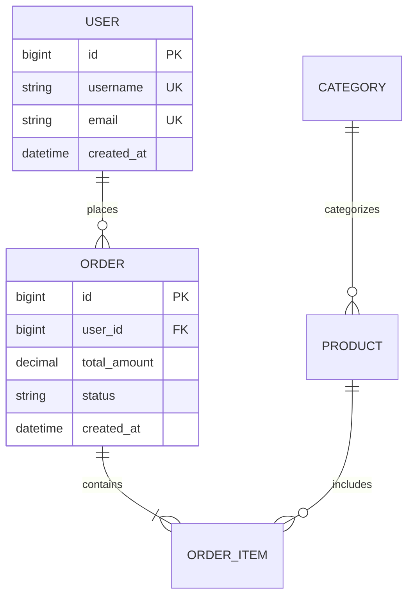

# Database Design Instructions

## Purpose

本文档定义了数据库设计阶段的标准操作流程、质量检查标准和工作产出规范。数据库设计是将领域模型转换为高效、可靠、可扩展的数据库Schema的系统性过程。

### Business Value

- **数据一致性保障**: 通过规范化设计和约束机制确保数据完整性和一致性
- **查询性能优化**: 合理的索引设计和表结构优化提升查询效率
- **可扩展性设计**: 分库分表策略支持数据量增长，避免单点瓶颈
- **运维成本降低**: 标准化的Schema设计和文档化减少维护复杂度

## Investigation Flow

### 流程概览

```
业务需求分析 → 数据约束分析 → 概念模型设计 → 逻辑模型设计 → 物理模型设计 → 性能优化 → 容量规划 → 文档输出
```

### 步骤 1：业务需求分析

**目的**: 理解核心实体、数据特征、访问模式

**输入**:
- 领域模型或ER图描述
- 业务流程文档
- 用户故事或用例

**操作**:

1. **实体识别**
   - 从领域模型中提取核心业务实体（至少3-5个）
   - 为每个实体定义属性和数据类型
   - 标注主键候选字段

2. **关系建模**
   - 确定实体间关系类型：1:1、1:N、M:N
   - 绘制初步的关系图
   - 标注关系的基数（Cardinality）

3. **访问模式分析**
   - OLTP（在线事务处理）：高频读写，强调一致性
   - OLAP（在线分析处理）：复杂查询，强调吞吐量
   - 实时查询：低延迟要求（P99 < 100ms）
   - 批量处理：高吞吐量，允许延迟

4. **数据特征评估**
   - 静态数据 vs 动态数据
   - 结构化数据 vs 半结构化数据
   - 热数据（频繁访问）vs 冷数据（归档）

**输出**: 业务需求分析摘要

---

### 步骤 2：数据约束分析

**目的**: 评估一致性要求、合规约束、数据类型选择

**输入**:
- 业务需求分析摘要
- 合规要求清单
- 性能指标要求

**操作**:

1. **一致性级别确定**
   - **强一致性**: 金融交易、库存扣减、账户余额
   - **最终一致性**: 社交feed、推荐系统、统计数据
   - **因果一致性**: 评论回复链、聊天消息

2. **合规要求识别**
   - **GDPR**: 用户数据可删除权、数据可携带权
   - **PII保护**: 手机号、邮箱、身份证号需加密
   - **审计日志**: 记录所有数据变更（谁、何时、做了什么）
   - **数据保留**: 定义数据保留期限和归档策略

3. **数据类型选择**
   - **整数**: INT（±21亿）/ BIGINT（±922亿亿）
   - **字符串**: VARCHAR（可变长度）/ CHAR（固定长度）/ TEXT（大文本）
   - **时间**: DATETIME（无时区）/ TIMESTAMP（有时区）
   - **小数**: DECIMAL(10,2)（精确计算）/ FLOAT（近似计算）
   - **JSON**: JSON类型（MySQL 5.7+，适合半结构化数据）
   - **布尔**: TINYINT(1) 或 BOOLEAN

4. **字符集和排序规则**
   - 字符集：utf8mb4（支持emoji和多语言）
   - 排序规则：utf8mb4_unicode_ci（大小写不敏感）

**输出**: 数据约束分析报告

---

### 步骤 3：概念模型设计（ER图）

**目的**: 绘制ER图，定义实体和关系

**输入**:
- 业务需求分析摘要
- 数据约束分析报告

**操作**:

1. **实体表示**
   - 使用矩形框表示实体
   - 在框内列出实体名和主要属性
   - 主键属性加下划线或标注PK

2. **关系表示**
   - 使用菱形框表示关系
   - 在菱形内标注关系名
   - 用线段连接实体和关系

3. **基数标注**
   - 1:1（一对一）：一个用户有一个个人资料
   - 1:N（一对多）：一个用户可以有多个订单
   - M:N（多对多）：一个学生可以选多门课，一门课可以有多个学生

4. **绘制工具**
   - Mermaid语法（推荐，易于版本控制）
   - draw.io / Lucidchart（图形化工具）
   - PlantUML（代码化绘图）

**ER图示例（Mermaid）**:


**输出**: ER图（概念模型）

---

### 步骤 4：逻辑模型设计（表结构）

**目的**: 转换为表结构，定义主键、外键、约束

**输入**:
- ER图（概念模型）

**操作**:

1. **表命名规范**
   - 使用小写字母和下划线（snake_case）
   - 表名用复数形式（users, orders, products）
   - 避免使用数据库保留字（order, select, group等）
   - 前缀可选：tbl_ 或模块名（user_、order_）

2. **主键设计**
   - **单节点架构**: AUTO_INCREMENT（简单高效）
   - **分布式架构**: Snowflake ID / UUID v4（全局唯一）
   - **复合主键**: 谨慎使用，增加查询复杂度
   - **自然主键 vs 代理主键**: 优先使用代理主键（自增ID）

3. **外键设计**
   - **物理外键**: 开发环境使用，保证参照完整性
   - **逻辑外键**: 生产环境使用，应用层维护（提升性能）
   - **级联操作**: 谨慎使用CASCADE DELETE，可能导致意外删除

4. **约束定义**
   - **NOT NULL**: 必填字段必须设置
   - **UNIQUE**: 唯一性约束（用户名、邮箱）
   - **CHECK**: 值域约束（年龄 > 0，状态 IN ('active', 'inactive')）
   - **DEFAULT**: 默认值（created_at = CURRENT_TIMESTAMP）
   - **ENUM**: 枚举类型（状态、类型等有限值）

5. **审计字段**
   - `created_at`: 记录创建时间
   - `updated_at`: 记录最后更新时间
   - `deleted_at`: 软删除标记（NULL表示未删除）
   - `created_by`: 创建人ID（可选）
   - `updated_by`: 更新人ID（可选）

**输出**: 表结构设计初稿

---

### 步骤 5：物理模型设计（索引和分区）

**目的**: 设计索引策略、分区方案、存储参数

**输入**:
- 表结构设计初稿
- 查询模式分析

**操作**:

1. **索引类型选择**
   - **B-Tree索引**: 最常用，支持范围查询、排序、模糊查询
   - **哈希索引**: 仅支持等值查询，速度极快（Memory引擎）
   - **全文索引**: 文本搜索（FULLTEXT，适合文章、评论）
   - **空间索引**: 地理位置查询（GIS，R-Tree）
   - **覆盖索引**: 包含查询所需的所有字段，避免回表

2. **索引设计原则**
   - 高频查询字段必须有索引
   - WHERE、JOIN、ORDER BY、GROUP BY子句中的字段优先考虑
   - 联合索引遵循最左前缀原则
   - 选择性高的字段放在联合索引前面
   - 避免过度索引（≤5个/表）
   - 定期审查无用索引（使用performance_schema）

3. **联合索引设计**
   ```sql
   -- 查询: SELECT * FROM orders WHERE user_id = 123 AND status = 'pending' ORDER BY created_at DESC
   
   -- 最佳索引: (user_id, status, created_at)
   CREATE INDEX idx_user_status_created ON orders(user_id, status, created_at);
   
   -- 原因: 
   -- 1. user_id选择性高，放前面
   -- 2. status用于过滤
   -- 3. created_at用于排序，避免filesort
   ```

4. **分区策略**
   - **范围分区（RANGE）**: 按时间范围（适合日志、订单）
     ```sql
     PARTITION BY RANGE (YEAR(created_at)) (
       PARTITION p2023 VALUES LESS THAN (2024),
       PARTITION p2024 VALUES LESS THAN (2025),
       PARTITION pmax VALUES LESS THAN MAXVALUE
     );
     ```
   - **哈希分区（HASH）**: 均匀分布（适合用户ID、订单ID）
     ```sql
     PARTITION BY HASH(user_id) PARTITIONS 16;
     ```
   - **列表分区（LIST）**: 按枚举值（适合状态、地区）
     ```sql
     PARTITION BY LIST (status) (
       PARTITION p_active VALUES IN (1, 2),
       PARTITION p_inactive VALUES IN (0, 3)
     );
     ```

5. **存储参数配置**
   - 字符集：utf8mb4
   - 排序规则：utf8mb4_unicode_ci
   - 存储引擎：InnoDB（支持事务、外键、行级锁）
   - 行格式：DYNAMIC（支持大字段高效存储）
   - 页大小：16KB（默认，一般不需调整）

**输出**: 物理模型设计方案

---

### 步骤 6：性能优化

**目的**: 分析执行计划，优化慢查询

**输入**:
- 物理模型设计方案
- 典型查询模式

**操作**:

1. **EXPLAIN分析**
   ```sql
   EXPLAIN SELECT o.id, o.total_amount, u.username
   FROM orders o
   JOIN users u ON o.user_id = u.id
   WHERE o.status = 'pending'
   AND o.created_at > '2024-01-01'
   ORDER BY o.created_at DESC
   LIMIT 100;
   ```
   
   **关键指标**:
   - `type`: ALL（全表扫描，差）→ ref/range（索引扫描，好）→ const（最优）
   - `key`: 实际使用的索引
   - `rows`: 预估扫描行数
   - `Extra`: Using filesort（需优化）、Using temporary（需优化）、Using index（覆盖索引，好）

2. **优化技巧**
   - **避免SELECT ***: 只查询需要的字段
   - **减少JOIN数量**: ≤5个表，超过考虑 denormalization
   - **避免在索引列上使用函数**: `WHERE YEAR(created_at) = 2024` → `WHERE created_at >= '2024-01-01'`
   - **使用覆盖索引**: 避免回表查询
   - **分页优化**: 使用游标而非OFFSET（`WHERE id > last_id LIMIT 100`）
   - **批量操作**: INSERT使用批量插入，UPDATE使用CASE WHEN

3. **缓存策略**
   - **热点数据**: Redis缓存（用户信息、商品详情）
   - **查询结果**: 应用层缓存（Caffeine/Guava）
   - **静态数据**: CDN缓存（图片、CSS、JS）
   - **缓存失效**: TTL + 主动失效结合

4. **读写分离**
   - 主库：写操作、强一致性读
   - 从库：读操作、最终一致性读
   - 注意：主从延迟问题（通常<1秒）

**输出**: 性能优化建议

---

### 步骤 7：容量规划

**目的**: 预估数据增长，制定分库分表策略

**输入**:
- 当前数据量
- 增长率预估
- 性能指标要求

**操作**:

1. **容量估算公式**
   ```
   单行大小估算：
   - INT: 4字节
   - BIGINT: 8字节
   - VARCHAR(100): 平均50字节（实际使用的一半）
   - DATETIME: 8字节
   - TEXT: 平均长度 +  overhead
   - 索引开销：约数据量的30-50%
   
   年增长率 = 当前数据量 × 月增长率(%) × 12
   3年容量 = (当前数据 + 年增长 × 3) × 1.5余量
   ```

2. **分库分表触发条件**
   - 单表行数 > 1000万
   - 单库大小 > 500GB
   - QPS > 5000
   - 写入 TPS > 1000

3. **分片策略选择**
   - **垂直拆分**: 按业务域拆分
     - 用户库（users、profiles）
     - 订单库（orders、order_items）
     - 商品库（products、categories）
     - 优点：简单清晰，跨库查询少
     - 缺点：分布式事务复杂
   
   - **水平拆分**: 按分片键拆分
     - 分片键选择：user_id（常用查询条件）
     - 分片算法：hash(user_id) % 16（16个分片）
     - 优点：线性扩展，负载均衡
     - 缺点：跨分片查询复杂，rebalancing困难
   
   - **混合拆分**: 先垂直后水平
     - 适合超大规模系统

4. **迁移方案**
   - **双写过渡期**: 同时写入旧库和新库
   - **数据同步**: 使用Canal/DTS同步历史数据
   - **灰度切换**: 按用户ID逐步迁移（1% → 10% → 50% → 100%）
   - **回滚预案**: 保留旧库数据至少1个月

**输出**: 容量规划报告

---

### 步骤 8：文档输出

**目的**: 生成完整的数据库设计文档

**输入**:
- 所有前期分析和设计结果

**操作**:

1. **DDL脚本生成**
   ```sql
   -- Create Database
   CREATE DATABASE IF NOT EXISTS `ecommerce` CHARACTER SET utf8mb4 COLLATE utf8mb4_unicode_ci;
   
   USE `ecommerce`;
   
   -- Create Tables
   CREATE TABLE `users` (
     `id` BIGINT NOT NULL AUTO_INCREMENT COMMENT '主键ID',
     `username` VARCHAR(50) NOT NULL COMMENT '用户名',
     `email` VARCHAR(100) NOT NULL COMMENT '邮箱',
     `phone` VARCHAR(20) DEFAULT NULL COMMENT '手机号',
     `password_hash` VARCHAR(255) NOT NULL COMMENT '密码哈希',
     `status` TINYINT NOT NULL DEFAULT 1 COMMENT '状态：1-激活，0-禁用',
     `created_at` DATETIME NOT NULL DEFAULT CURRENT_TIMESTAMP COMMENT '创建时间',
     `updated_at` DATETIME NOT NULL DEFAULT CURRENT_TIMESTAMP ON UPDATE CURRENT_TIMESTAMP COMMENT '更新时间',
     `deleted_at` DATETIME DEFAULT NULL COMMENT '删除时间（软删除）',
     PRIMARY KEY (`id`),
     UNIQUE KEY `uk_username` (`username`),
     UNIQUE KEY `uk_email` (`email`),
     KEY `idx_created_at` (`created_at`)
   ) ENGINE=InnoDB DEFAULT CHARSET=utf8mb4 COLLATE=utf8mb4_unicode_ci COMMENT='用户表';
   
   -- Repeat for all tables
   ```

2. **数据字典编写**
   - 表名、描述
   - 字段名、类型、长度、是否可空、默认值、约束、注释
   - 索引列表
   - 外键关系

3. **ER图绘制**
   - 概念模型ER图
   - 逻辑模型ER图（含字段类型）

4. **性能测试报告**
   - 基准测试数据
   - 典型查询的P50/P95/P99延迟
   - 并发测试结果

**输出**: 完整的数据库设计文档

---

## What To Check

### 必检项

| 检查项 | 标准 | 检查方法 | 通过条件 |
|--------|------|----------|----------|
| Schema完整性 | ER图包含所有核心实体 | ER图审查 | 100%实体已建模 |
| 规范化合规 | 所有表达到第三范式（3NF） | Schema审查 | 无重复列或派生列 |
| 索引覆盖 | 高频查询有索引覆盖 | 查询模式分析 | ≥90%查询有索引 |
| DDL可执行 | 无语法错误 | 执行DDL脚本 | 100%成功执行 |
| 数据字典完整 | 所有表和字段有注释 | 数据字典检查 | 100%字段有注释 |
| 性能达标 | P99延迟<500ms | 性能基准测试 | 所有典型查询达标 |

### 建议检查项

| 检查项 | 标准 | 检查方法 | 通过条件 |
|--------|------|----------|----------|
| 命名规范 | 统一使用snake_case | 命名审查 | 100%符合规范 |
| 审计字段 | 所有表包含created_at/updated_at | Schema审查 | 100%表有审计字段 |
| 敏感字段加密 | PII字段有加密方案 | 安全审查 | 100%敏感字段加密 |
| 容量规划 | 支持3年增长 | 容量估算审查 | 有余量≥50% |

## Quality Criteria

### 质量维度

| 维度 | 要求 | 权重 |
|------|------|------|
| 完整性 | Schema包含所有必需实体和关系 | 25% |
| 规范性 | 达到第三范式（3NF），命名规范 | 25% |
| 性能 | 索引覆盖高频查询，P99延迟达标 | 20% |
| 可扩展性 | 支持3年数据增长，有分库分表方案 | 15% |
| 安全性 | 敏感字段加密，符合合规要求 | 15% |

### 评分标准

| 等级 | 分值 | 描述 |
|------|------|------|
| 卓越 | 5 | 数据库设计优秀，完全满足所有要求，有创新优化 |
| 优秀 | 4 | 数据库设计良好，满足核心要求，有小改进空间 |
| 良好 | 3 | 数据库设计合格，满足基本要求，有优化空间 |
| 合格 | 2 | 数据库设计基本可用，需补充不完整项 |
| 不合格 | 1 | 数据库设计不满足基本要求 |

## Output Specification

### 产出清单

| 产出 | 格式 | 必填 | 描述 |
|------|------|------|------|
| 数据库设计文档 | .md | 是 | 完整的数据库设计文档（12章节） |
| ER图 | .md/.png | 是 | 概念模型和逻辑模型ER图 |
| DDL脚本 | .sql | 是 | 可执行的CREATE TABLE语句 |
| 数据字典 | .md/.xlsx | 是 | 所有表和字段的详细定义 |
| 索引设计文档 | .md | 是 | 索引策略和优化建议 |
| 容量规划报告 | .md | 是 | 数据增长预估和扩容方案 |
| 性能测试报告 | .md | 否 | 基准测试结果和优化建议 |

### 产出模板

数据库设计文档应包含以下章节：

```markdown
# Database Design Document

## 1. Executive Summary
## 2. Business Requirements Analysis
## 3. Conceptual Model (ER Diagram)
## 4. Logical Model (Table Structure)
## 5. Physical Model
## 6. Indexing Strategy
## 7. Data Dictionary
## 8. DDL Scripts
## 9. Performance Optimization
## 10. Security & Compliance
## 11. Capacity Planning
## 12. Validation Summary
```

## Related Assets (关联资产)

| Asset Type | Path | Description |
|------------|------|-------------|
| Scenario | `../scenarios/design-database/SCENARIO.md` | 数据库设计场景定义 |
| Agent | `../agents/design-database.agent.md` | 数据库设计Agent角色 |
| Prompt | `../prompts/design-database.prompt.md` | 数据库设计提示词模板 |
| Skill | `../skills/design-database/SKILL.md` | 数据库设计技能包 |

## Related Resources (相关资源)

- **Standards**: 
  - [Database Naming Convention](../standards/database-naming-convention.md) - 数据库命名规范
  - [Normalization Guidelines](../standards/normalization-guidelines.md) - 数据库规范化指南
- **Templates**: 
  - [ER Diagram Template](../templates/er-diagram.template.md) - ER图模板
  - [Data Dictionary Template](../templates/data-dictionary.template.md) - 数据字典模板
- **Evaluations**: 
  - [Schema Review Checklist](../evaluations/schema-review-checklist.md) - Schema评审检查清单
  - [Query Performance Benchmark](../evaluations/query-performance-benchmark.md) - 查询性能基准测试
