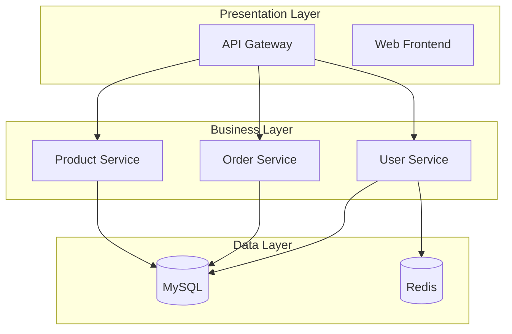

# System Design Instructions

## Purpose

本文档定义了系统设计阶段的标准操作流程、质量检查标准和工作产出规范。系统设计是将需求规格转换为具体技术架构方案的关键设计过程。

**核心目标**:
- 将业务需求转化为可落地的技术架构
- 确保设计方案满足功能和非功能需求
- 识别并控制技术风险
- 为开发实施提供清晰的技术指导

**适用范围**: 
- 新系统的架构设计
- 现有系统的重构设计
- 重大技术升级的方案设计

## Investigation Flow

### 流程概览

```
Step 1: Requirements Understanding → Step 2: Architecture Selection → Step 3: Component Design
       ↓
Step 4: Interface Design → Step 5: Risk Analysis → Step 6: Design Review & Finalization
```

**预计工时**: 4-8 小时  
**质量标准**: 评审通过率 ≥90%

---

### Step 1: Requirements Understanding (需求理解)

**Objective**: 深入理解业务需求和技术约束，建立设计基础

**Duration**: 30-60 分钟

#### Input

| Item | Type | Source | Required |
|------|------|--------|----------|
| Requirements Specification | Markdown file | Requirement Analysis phase | Yes |
| Non-functional Requirements | Text | Requirements doc | Yes |
| Technical Constraints | Text | Project documentation | Yes |
| Team Capabilities | List | Team assessment | No |
| Budget & Timeline | Object | Project plan | No |

#### Actions

1. **Requirements梳理** (15 min)
   - 阅读需求规格说明书
   - 提取所有功能需求 (FR)，编号 FR-001, FR-002...
   - 提取所有非功能需求 (NFR)，量化指标
   - 识别业务优先级 (P0/P1/P2)

2. **Constraints识别** (15 min)
   - 技术约束：技术栈、安全要求、性能要求
   - 资源约束：预算、人力、时间
   - 环境约束：基础设施、第三方依赖、合规要求

3. **Design Assumptions明确** (15 min)
   - 确定设计边界（什么在设计范围内，什么不在）
   - 列出所有设计假设
   - 定义风险接受标准

#### Validation Checklist

- [ ] 所有 FR 已提取并编号
- [ ] 所有 NFR 已量化（响应时间、并发数、可用率等）
- [ ] 技术约束清单完整
- [ ] 设计边界明确
- [ ] 假设条件已记录

#### Output

**文件**: `docs/requirements-understanding.md`

**内容结构**:
```markdown
# Requirements Understanding Summary

## Functional Requirements
- FR-001: {描述}
- FR-002: {描述}

## Non-Functional Requirements
- NFR-001: Response time < 200ms
- NFR-002: Availability 99.9%

## Constraints
- Technical: {列表}
- Resource: {列表}
- Environmental: {列表}

## Design Boundaries
- In scope: {列表}
- Out of scope: {列表}

## Assumptions
- {假设1}
- {假设2}
```

---

### Step 2: Architecture Selection (架构选型)

**Objective**: 评估并选择适合项目特点的架构风格

**Duration**: 60-90 分钟

#### Input

- Requirements Understanding Summary (Step 1 output)
- Team capabilities assessment
- Historical project data (if available)

#### Actions

1. **Architecture Styles调研** (30 min)
   
   评估以下架构风格：
   
   | Style | Pros | Cons | Fit Score (1-5) |
   |-------|------|------|-----------------|
   | Monolithic | Simple, easy to deploy | Limited scalability | ? |
   | Microservices | Scalable, flexible | Complex ops | ? |
   | Event-Driven | Loose coupling | Debugging hard | ? |
   | Layered | Clear separation | Performance overhead | ? |
   | Hexagonal | Testable, flexible | Learning curve | ? |

2. **Evaluation维度** (30 min)
   
   从以下维度评分（1-5分）：
   - 业务复杂度匹配度
   - 团队能力匹配度
   - 运维成本可接受度
   - 扩展性满足度
   - 时间成本合理性

3. **Decision记录** (30 min)
   - 选择最优架构风格
   - 编写 ADR (Architecture Decision Record)
   - 记录备选方案及放弃原因
   - 明确架构原则

#### Validation Checklist

- [ ] 至少评估了 3 种架构风格
- [ ] 评估矩阵完整
- [ ] ADR 已编写
- [ ] 备选方案已记录
- [ ] 架构原则已明确

#### Output

**文件**: `docs/architecture-selection.md` + `docs/adrs/ADR-001-architecture-style.md`

**ADR Template**:
```markdown
# ADR-001: Architecture Style Selection

## Status
Accepted

## Context
{业务特点、团队情况、约束条件}

## Decision
Selected: {架构风格}

## Rationale
- Reason 1: {说明}
- Reason 2: {说明}

## Alternatives Considered
- {备选1}: {放弃原因}
- {备选2}: {放弃原因}

## Consequences
### Positive
- {好处1}
- {好处2}

### Negative
- {挑战1}
- {挑战2}
```

---

### Step 3: Component Design (组件设计)

**Objective**: 划分系统组件并定义各组件的职责和交互

**Duration**: 90-120 分钟

#### Input

- Architecture Selection Report (Step 2 output)
- Functional requirements list
- Business domain model

#### Actions

1. **Component Identification** (40 min)
   
   按以下方式划分组件：
   
   a) **By Business Domain** (DDD approach):
      - 识别限界上下文 (Bounded Contexts)
      - 定义聚合根 (Aggregate Roots)
      - 划分领域服务 (Domain Services)
   
   b) **By Technical Layer**:
      - Presentation Layer (UI/API)
      - Business Logic Layer
      - Data Access Layer
      - Infrastructure Layer
   
   c) **Cross-cutting Concerns**:
      - Authentication & Authorization
      - Logging & Monitoring
      - Configuration Management
      - Error Handling

2. **Responsibility Definition** (40 min)
   
   为每个组件定义：
   - 核心职责（单一职责原则）
   - 输入接口
   - 输出接口
   - 依赖关系
   - 数据所有权

3. **Technology Assignment** (40 min)
   
   为每个组件确定：
   - 技术栈（语言、框架）
   - 数据存储方案
   - 部署模式
   - 通信协议

#### Validation Checklist

- [ ] 组件划分符合单一职责原则
- [ ] 组件间耦合度低
- [ ] 依赖关系清晰（无循环依赖）
- [ ] 每个组件有明确的数据所有权
- [ ] 技术选型合理

#### Output

**文件**: `docs/component-design.md` + `docs/diagrams/component-diagram.md`

**Component Diagram Example** (Mermaid):


---

### Step 4: Interface Design (接口设计)

**Objective**: 设计组件间的接口规范和数据流

**Duration**: 60-90 分钟

#### Input

- Component Design Document (Step 3 output)
- Integration requirements
- Data flow requirements

#### Actions

1. **Interface Identification** (20 min)
   - 识别所有对外 API（面向客户端）
   - 识别所有内部 API（服务间调用）
   - 分类接口类型：同步 (REST/gRPC) / 异步 (Message Queue)

2. **API Specification** (40 min)
   
   为每个 API 定义：
   - HTTP Method (GET/POST/PUT/DELETE)
   - URL Path (遵循 RESTful 规范)
   - Request Parameters (headers, query, body)
   - Response Format (success/error)
   - Error Codes (4xx, 5xx)
   - Authentication requirements

3. **Data Flow Design** (30 min)
   - 绘制数据流图
   - 定义数据存储方案
   - 设计缓存策略
   - 设计数据同步机制

#### Validation Checklist

- [ ] 所有接口已识别并文档化
- [ ] API 规范遵循 RESTful 原则
- [ ] 错误码定义完整
- [ ] 数据流图清晰
- [ ] 缓存策略合理

#### Output

**文件**: `docs/api-specification.md` + `docs/diagrams/data-flow.md`

**API Spec Example**:
```yaml
POST /api/v1/orders
Summary: Create a new order
Authentication: Bearer Token required

Request Body:
{
  "userId": "integer (required)",
  "items": [
    {
      "productId": "integer (required)",
      "quantity": "integer (required)"
    }
  ],
  "shippingAddress": "string (required)"
}

Response (201 Created):
{
  "orderId": "string",
  "status": "created",
  "totalAmount": "number",
  "createdAt": "datetime"
}

Error Responses:
- 400: Invalid request parameters
- 401: Unauthorized
- 404: Product not found
- 500: Internal server error
```

---

### Step 5: Risk Analysis (风险分析)

**Objective**: 识别技术风险并制定应对策略

**Duration**: 45-60 分钟

#### Input

- Complete architecture design
- Technology stack decisions
- Historical project lessons learned

#### Actions

1. **Risk Identification** (20 min)
   
   识别以下类别的风险：
   - **Technical Risks**: 新技术、复杂集成、性能瓶颈
   - **Operational Risks**: 部署复杂度、监控盲区
   - **Security Risks**: 认证漏洞、数据泄露
   - **Resource Risks**: 技能缺口、时间不足

2. **Risk Assessment** (20 min)
   
   对每个风险评估：
   - Probability: Low / Medium / High
   - Impact: Low / Medium / High
   - Risk Level = Probability × Impact

3. **Mitigation Planning** (20 min)
   
   为每个中高风险制定：
   - Preventive measures (预防措施)
   - Detective measures (检测措施)
   - Corrective measures (纠正措施)
   - Contingency plan (应急预案)

#### Validation Checklist

- [ ] 所有主要风险已识别
- [ ] 风险评估准确
- [ ] 缓解措施可行
- [ ] 应急预案完善
- [ ] 责任人已指定

#### Output

**文件**: `docs/risk-analysis.md`

**Risk Register Example**:
```markdown
## Risk Register

| ID | Risk Description | Probability | Impact | Level | Mitigation Strategy | Owner |
|----|------------------|-------------|--------|-------|---------------------|-------|
| RISK-001 | Team unfamiliar with microservices | Medium | High | High | Training + PoC phase | Tech Lead |
| RISK-002 | Third-party API instability | Low | High | Medium | Backup provider + circuit breaker | Backend Lead |
| RISK-003 | Performance bottleneck under high load | Medium | Medium | Medium | Load testing + caching strategy | Architect |
```

---

### Step 6: Design Review & Finalization (设计评审与定稿)

**Objective**: 评审架构设计方案并获得批准

**Duration**: 60-90 分钟 (包括会议时间)

#### Input

- Complete design package (Steps 1-5 outputs)
- Review checklist
- Stakeholder list

#### Actions

1. **Review Preparation** (20 min)
   - 整理评审材料（架构图、设计文档、ADR）
   - 邀请评审人员（架构师、技术负责人、开发代表、运维代表）
   - 发送评审议程和材料（提前 24 小时）

2. **Review Execution** (45 min meeting)
   - 架构概述讲解 (10 min)
   - 关键设计点逐一评审 (25 min)
   - Q&A 和反馈收集 (10 min)

3. **Revision & Approval** (25 min)
   - 记录所有评审意见
   - 分类：Blocking / Non-blocking
   - 修复 Blocking 问题
   - 获得签字批准
   - 归档最终版本

#### Validation Checklist

- [ ] 评审材料准备完整
- [ ] 所有关键干系人参与
- [ ] 评审意见已记录
- [ ] Blocking 问题已修复
- [ ] 评审通过并获得批准

#### Output

**文件**: `docs/architecture-design-final.md` (版本号 v1.0.0)

**Review Sign-off**:
```markdown
## Design Review Sign-off

### Reviewers
- [ ] Chief Architect: _____________ Date: _______
- [ ] Tech Lead: _____________ Date: _______
- [ ] Dev Representative: _____________ Date: _______
- [ ] Ops Representative: _____________ Date: _______

### Decision
☐ Approved
☐ Approved with conditions (see below)
☐ Rejected (requires major revision)

### Conditions (if any)
- {条件1}
- {条件2}

### Next Steps
- Proceed to task decomposition
- Begin implementation planning
```

---

## What To Check

### Mandatory Checks (必检项)

| Check Item | Standard | Method | Pass Criteria |
|------------|----------|--------|---------------|
| Requirements Coverage | All FR/NFR addressed | Traceability matrix | 100% coverage |
| Architecture Rationality | Style fits project needs | Peer review | Review approved |
| Component Clarity | Clear responsibilities, low coupling | Component diagram review | No circular dependencies |
| Interface Completeness | All APIs documented | API spec review | 100% documented |
| Risk Management | Major risks identified & mitigated | Risk register review | No unmitigated high risks |
| NFR Satisfaction | Performance, security, availability designed | NFR checklist | 100% addressed |

### Recommended Checks (建议检查项)

| Check Item | Standard | Method | Pass Criteria |
|------------|----------|--------|---------------|
| Scalability | Future growth considered | Architecture review | Scaling strategy defined |
| Testability | Architecture supports testing | Design review | Unit/integration testable |
| Cost Efficiency | Within budget constraints | Cost analysis | Budget approved |
| Maintainability | Easy to understand and modify | Code structure review | Clear module boundaries |

---

## Quality Criteria

### Quantitative Metrics

| Metric | Target | Weight | Measurement |
|--------|--------|--------|-------------|
| Requirements Coverage | 100% | 25% | Traceability matrix |
| Design Completeness | ≥95% | 25% | Section checklist |
| Review Pass Rate | ≥90% | 25% | Review feedback score |
| Risk Coverage | All major risks | 25% | Risk register completeness |

### Qualitative Standards

| Dimension | Standard | Verification |
|-----------|----------|--------------|
| Clarity | Understandable by team members | Peer feedback |
| Consistency | Uniform terminology and style | Document review |
| Feasibility | Implementable within constraints | Technical assessment |
| Maintainability | Easy to update and extend | Architecture review |

### Quality Gate

**Pass Criteria**: 
- All mandatory checks passed
- Overall quality score ≥85/100
- Review approval obtained

**Fail Action**: 
- Identify failed checks
- Revise design
- Re-submit for review

---

## Output Specification

### Deliverables Package

| Artifact | Format | Location | Version | Required |
|----------|--------|----------|---------|----------|
| Requirements Understanding | Markdown | `docs/requirements-understanding.md` | 1.0 | Yes |
| Architecture Selection | Markdown | `docs/architecture-selection.md` | 1.0 | Yes |
| Component Design | Markdown + Diagram | `docs/component-design.md` | 1.0 | Yes |
| API Specification | YAML/Markdown | `docs/api-specification.md` | 1.0 | Yes |
| Risk Analysis | Markdown | `docs/risk-analysis.md` | 1.0 | Yes |
| Architecture Diagrams | Mermaid/PNG | `docs/diagrams/` | 1.0 | Yes |
| ADRs | Markdown | `docs/adrs/` | 1.0 | Yes |
| Final Design Document | Markdown | `docs/architecture-design-final.md` | 1.0 | Yes |

### Documentation Standards

**File Naming**:
- Use lowercase with hyphens
- Include version number in filename or metadata
- Example: `component-design-v1.0.md`

**Content Structure**:
- Start with purpose/objective
- Include input/output specifications
- Provide examples where applicable
- End with validation checklist

**Diagram Standards**:
- Use Mermaid for text-based diagrams
- Export to PNG/SVG for presentations
- Include legend and labels
- Keep diagrams simple and readable

---

## Best Practices

### Practice 1: Start with Why

**Description**: Always document the rationale behind architectural decisions.

**Why**: Future team members need to understand why certain choices were made.

**How**:
- Write ADRs for all significant decisions
- Include context, alternatives, and consequences
- Link ADRs to related design documents

---

### Practice 2: Design for Change

**Description**: Assume requirements will evolve and design accordingly.

**Why**: Software systems rarely stay static; they must adapt.

**How**:
- Use abstraction layers
- Define clear interfaces
- Avoid tight coupling
- Plan for extensibility

---

### Practice 3: Validate Early and Often

**Description**: Don't wait until the end to validate your design.

**Why**: Early validation catches issues when they're easier to fix.

**How**:
- Review component design before interface design
- Validate technology choices with small prototypes
- Get feedback from implementers early

---

### Practice 4: Balance Perfection and Pragmatism

**Description**: Aim for good enough, not perfect.

**Why**: Perfect is the enemy of done; over-engineering wastes resources.

**How**:
- Focus on current requirements
- Plan for future but don't over-build
- Iterate and improve based on real usage

---

## Error Handling

### Error Scenario 1: Requirements Ambiguity

**Symptom**: Unclear or conflicting requirements discovered during design.

**Impact**: Cannot make confident design decisions.

**Resolution**:
1. Document the ambiguity clearly
2. Reach out to product owner/stakeholders
3. Request clarification or decision
4. If urgent, make assumption and mark as "TBD - needs confirmation"
5. Update design once clarified

**Prevention**: Ensure requirements are reviewed and clarified before starting design.

---

### Error Scenario 2: Technology Stack Mismatch

**Symptom**: Selected technology doesn't fit team capabilities or project constraints.

**Impact**: Implementation delays, quality issues, team frustration.

**Resolution**:
1. Reassess technology choice against constraints
2. Evaluate alternative technologies
3. Consider training or hiring if technology is critical
4. Update architecture decision record
5. Communicate changes to stakeholders

**Prevention**: Involve team leads in technology selection; conduct capability assessment.

---

### Error Scenario 3: Scope Creep During Design

**Symptom**: New requirements or features added mid-design.

**Impact**: Design becomes bloated, timeline slips.

**Resolution**:
1. Assess impact of new requirements
2. Determine if it's P0 (must-have) or P1/P2 (nice-to-have)
3. For P0: Incorporate into design, adjust timeline
4. For P1/P2: Defer to future iteration
5. Update requirements understanding document

**Prevention**: Freeze requirements before starting design; use change control process.

---

## Related Assets

- **Scenario**: [../scenarios/design-system/SCENARIO.md](../scenarios/design-system/SCENARIO.md)
- **Prompt**: [../prompts/design-system.prompt.md](../prompts/design-system.prompt.md)
- **Agent**: [../agents/design-system.agent.md](../agents/design-system.agent.md)
- **Skill**: [../skills/design-system/SKILL.md](../skills/design-system/SKILL.md)

---

## Version History

| Version | Date | Changes | Author |
|---------|------|---------|--------|
| 1.2.0 | 2026-05-07 | Enhanced with standardized structure, detailed steps, validation checklists | AI Harness Team |
| 1.1.0 | 2026-04-01 | Initial version | Original Author |

---

**Instruction Version**: 1.2.0  
**Last Updated**: 2026-05-07  
**Author**: AI Harness Engineering Team
