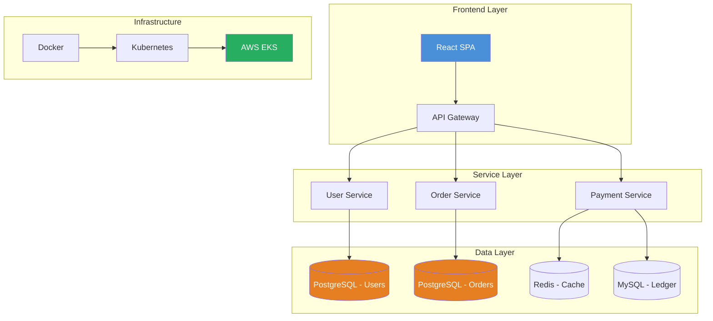
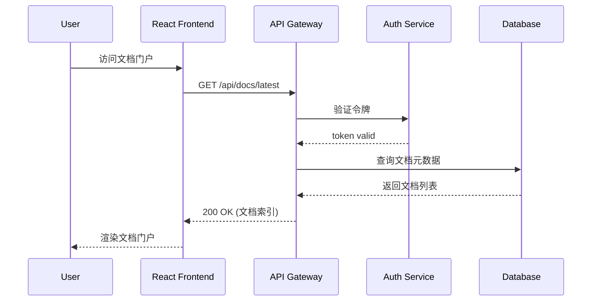

# Instructions: 项目文档 (Document Project)

## Overview

This instruction defines the comprehensive technical specifications and standards for project documentation within the E2E delivery lifecycle. It covers the creation, maintenance, and governance of all technical documentation including API documentation, architectural decision records (ADRs), runbooks, user guides, and inline code documentation. The instruction ensures documentation remains consistent with implementation, supports onboarding and knowledge transfer, and integrates with documentation-as-code practices using tools like Markdown, Docusaurus, MkDocs, or Confluence. Key focus areas include diagramming standards, versioning strategies, and automated freshness checks to prevent documentation drift.


## Document Type Standards

### 文档类型矩阵

| 类型 | 受众 | 深度 | 长度 | 更新频率 |
|------|------|------|------|----------|
| 入门指南 | 新用户 | 基础 | 中等 | 低 |
| 用户手册 | 终端用户 | 完整 | 长 | 中 |
| API 参考 | 开发者 | 深入 | 长 | 高 |
| 部署指南 | 运维人员 | 完整 | 中等 | 中 |
| 开发者指南 | 贡献者 | 深入 | 长 | 中 |

### 文档结构模板

#### 入门指南模板

```markdown
# {项目名称} 入门指南

## What is {project_name}
{一句话描述项目及其核心价值}

## Quick Start
### 安装
```bash
pip install {package-name}
```

### 第一个例子
```python
import {package}

# 5 行代码完成基本功能
result = {package}.do_something()
print(result)
```

## Next Steps
- 想深入了解？查看 [用户手册](user-guide.md)
- 遇到问题？查看 [FAQ](faq.md)

## Getting Help
- GitHub Issues
- 社区论坛
```

#### API 参考模板

```markdown
# API 参考

## Authentication
所有 API 请求需要认证令牌。

### 获取令牌
```bash
curl -X POST /api/auth/token \
  -H "Content-Type: application/json" \
  -d '{"api_key": "your-key"}'
```

## User API

### 创建用户
创建新用户账户。

**请求**
```http
POST /api/users
Content-Type: application/json

{
  "username": "string",
  "email": "string"
}
```

**响应**
```json
{
  "id": "123",
  "username": "string",
  "email": "string",
  "created_at": "2024-01-01T00:00:00Z"
}
```

**错误码**
| 状态码 | 说明 |
|--------|------|
| 400 | 请求参数错误 |
| 409 | 用户名已存在 |

### 获取用户
获取指定用户信息。

**请求**
```http
GET /api/users/{id}
```

**响应**
```json
{
  "id": "123",
  "username": "string",
  "email": "string"
}
```
```

## Writing Standards

### Markdown 规范

```python
MARKDOWN_STYLE_GUIDE = """
# Markdown 编写规范

## Heading Levels
- H1: 文档标题 (每个文档只有一个)
- H2: 主要章节
- H3: 子章节
- H4: 更细的分节

## Code Blocks
- 必须指定语言: ```python
- 代码行号仅在需要时添加
- 过长代码应分段说明

## Lists
- 使用有序列表表示步骤
- 使用无序列表表示要点
- 嵌套不超过 3 层

## Links
- 使用相对路径链接内部文档
- 使用完整 URL 链接外部资源
"""

def format_markdown(content):
    """格式化 Markdown 内容"""
    # 1. 检查标题层级
    validate_heading_levels(content)

    # 2. 验证代码块语法
    validate_code_blocks(content)

    # 3. 检查链接有效性
    validate_links(content)

    return content
```

### 技术文档规范

```yaml
technical_doc_standards:
  # 代码示例规范
  code_examples:
    - must_be_runnable: true
      must_have_comments: true
      max_length: 50 lines
      explain_before: true

  # 图表规范
  diagrams:
    - format: ["png", "svg"]
      max_size: "2MB"
      include_alt_text: true

  # 术语规范
  terminology:
    - use_project_glossary: true
    - define_acronyms: true
    - consistent_spelling: true
```

## Documentation Toolchain

### 文档生成工具

| 工具 | 用途 | 配置 |
|------|------|------|
| MkDocs | 静态站点生成 | mkdocs.yml |
| Docusaurus | React 文档站点 | docusaurus.config.js |
| Sphinx | Python 文档 | conf.py |
| VuePress | Vue 文档站点 | config.js |

### MkDocs 配置示例

```yaml
# mkdocs.yml
site_name: 项目文档
site_description: 项目详细文档

theme:
  name: material
  features:
    - navigation.instant
    - navigation.tracking
    - content.code.copy

nav:
  - Home: index.md
  - Getting Started:
    - Installation: getting-started/installation.md
    - Quick Start: getting-started/quickstart.md
  - Guides:
    - Deployment: guides/deployment.md
    - Configuration: guides/configuration.md
  - API Reference:
    - Overview: api/index.md
    - Endpoints: api/endpoints.md

markdown_extensions:
  - pymdownx.highlight:
      anchor_linenums: true
  - pymdownx.superfences
  - admonition
  - tables
```

## Documentation Quality Checks

### 检查清单

```python
DOCUMENTATION_CHECKLIST = """
## Pre-release Checklist

### 内容检查
[ ] 所有章节都有实质内容
[ ] 没有占位符文本 (TBD, TODO 需要填写)
[ ] 代码示例经过测试可运行
[ ] 术语和缩写首次出现时已定义

### 结构检查
[ ] 标题层级正确
[ ] 目录结构清晰
[ ] 交叉引用正确

### 格式检查
[ ] Markdown 语法正确
[ ] 代码高亮正确
[ ] 图片 alt 文本完整

### 一致性检查
[ ] 与项目其他文档风格一致
[ ] 术语使用统一
[ ] 版本号正确
"""

def quality_check(doc):
    """文档质量检查"""
    issues = []

    # 检查占位符
    if has_placeholders(doc):
        issues.append("存在未填充的占位符")

    # 检查代码示例
    if not code_examples_verified(doc):
        issues.append("代码示例未验证")

    # 检查链接
    if has_broken_links(doc):
        issues.append("存在失效链接")

    return issues
```

## Documentation Maintenance Process

### 版本管理

```python
class DocVersionManager:
    """文档版本管理"""

    def update_doc(self, doc_path, new_content, version):
        """
        文档更新流程
        """
        # 1. 创建备份
        self.backup(doc_path)

        # 2. 更新内容
        self.write(doc_path, new_content)

        # 3. 更新版本日志
        changelog = self.get_changelog()
        changelog.add_entry(version, new_content)

        # 4. 提交审核
        self.create_pr(doc_path, changelog)
```

### 发布流程

```yaml
documentation_release:
  steps:
    - name: 本地预览
      command: mkdocs serve

    - name: 拼写检查
      command: vale doc/

    - name: 链接检查
      command: mkdocs build --strict

    - name: 部署
      command: mkdocs gh-deploy
```

## Multi-Language Code Examples

This section provides production-ready documentation generation configurations across multiple toolchains and languages.

### Markdown with Mermaid Diagrams

````markdown
# System Architecture Documentation

<!--
  Mermaid diagram rendered via markdown code blocks.
  Supported by GitHub, GitLab, and most Markdown renderers.
-->




````

If using Mermaid live editor, import the diagram code at https://mermaid.live/edit for interactive editing and export.

### MkDocs Configuration (Python)

```yaml
# mkdocs.yml
# Full configuration for a production MkDocs documentation site
# with Material theme, multi-language plugin, and CI integration.

site_name: "E-Commerce Platform Documentation"
site_description: "Complete technical documentation for the E-Commerce microservices platform"
site_url: "https://docs.ecommerce.example.com"
site_author: "Platform Engineering Team"

# --- Theme Configuration ---
theme:
  name: material
  language: en
  logo: assets/logo.png
  favicon: assets/favicon.ico
  icon:
    repo: fontawesome/brands/github
  features:
    - navigation.instant        # Enable instant loading via XHR
    - navigation.tracking       # Update URL hash on scroll
    - navigation.sections       # Render top-level sections as expandable groups
    - navigation.expand         # Expand all collapsible sidebar sections by default
    - navigation.top            # Add a back-to-top button on scroll
    - search.highlight          # Highlight search terms in result snippets
    - search.suggest            # Provide autocomplete search suggestions
    - content.code.copy         # Add a click-to-copy button on code blocks
    - content.tabs.link         # Synchronize content tabs across pages
  palette:
    - scheme: default
      primary: indigo
      accent: indigo
      toggle:
        icon: material/brightness-7
        name: Switch to dark mode
    - scheme: slate
      primary: indigo
      accent: indigo
      toggle:
        icon: material/brightness-4
        name: Switch to light mode

# --- Navigation Structure ---
nav:
  - Home: index.md
  - Getting Started:
    - Overview: getting-started/overview.md
    - Installation: getting-started/installation.md
    - Quick Start Tutorial: getting-started/quickstart.md
    - Configuration: getting-started/configuration.md
  - Architecture:
    - System Overview: architecture/overview.md
    - Microservices: architecture/microservices.md
    - Data Flow: architecture/data-flow.md
  - API Reference:
    - Authentication: api/authentication.md
    - REST Endpoints: api/rest.md
    - WebSocket Events: api/websocket.md
    - SDK: api/sdk.md
  - Operations:
    - Deployment: operations/deployment.md
    - Monitoring: operations/monitoring.md
    - Troubleshooting: operations/troubleshooting.md

# --- Plugins ---
plugins:
  - search:
      lang:
        - en
        - zh
  - i18n:
      languages:
        - locale: en
          name: English
          build: true
          default: true
        - locale: zh
          name: 中文
          build: true
  - git-revision-date-localized:
      enable_creation_date: true
      type: date
  - minify:
      minify_html: true
  - redirects:
      redirect_maps:
        "old-page.md": "new-page.md"

# --- Markdown Extensions ---
markdown_extensions:
  - pymdownx.highlight:
      anchor_linenums: true
      line_spans: __span
      pygments_lang_class: true
  - pymdownx.inlinehilite
  - pymdownx.snippets
  - pymdownx.superfences:
      custom_fences:
        - name: mermaid
          class: mermaid
          format: !!python/name:pymdownx.superfences.fence_code_format
  - pymdownx.tabbed:
      alternate_style: true
  - admonition
  - footnotes
  - tables
  - toc:
      permalink: true
      toc_depth: 3

# --- Extra Configuration ---
extra:
  social:
    - icon: fontawesome/brands/github
      link: https://github.com/org/ecommerce-platform
    - icon: fontawesome/brands/docker
      link: https://hub.docker.com/org/ecommerce
  generator: false
  consent:
    title: Cookie Consent
    description: >
      We use cookies to improve your browsing experience. Configure preferences in your browser settings.

# --- CI/CD Integration ---
# Build and deploy commands:
#   mkdocs build --strict
#   mkdocs gh-deploy --force
```

### Docusaurus Configuration (React/TypeScript)

```javascript
// docusaurus.config.js
// Production-ready Docusaurus v3 configuration with multi-language i18n,
// versioned docs, Algolia DocSearch, and PWA offline support.
// @ts-check

/** @type {import('@docusaurus/types').Config} */
const config = {
  title: 'E-Commerce Platform Documentation',
  tagline: 'Comprehensive developer documentation for the E-Commerce platform',
  url: 'https://docs.ecommerce.example.com',
  baseUrl: '/',
  organizationName: 'ecommerce-org',
  projectName: 'docs',
  trailingSlash: false,

  // --- Build Fail-Safe ---
  onBrokenLinks: 'throw',           // Fail CI build on broken internal links
  onBrokenMarkdownLinks: 'throw',    // Fail CI build on broken .md links
  onDuplicateRoutes: 'throw',        // Fail CI build on duplicate paths

  favicon: 'img/favicon.ico',

  // --- Internationalization (i18n) ---
  i18n: {
    defaultLocale: 'en',
    locales: ['en', 'zh-CN', 'ja', 'ko'],
    localeConfigs: {
      en: { label: 'English', direction: 'ltr' },
      'zh-CN': { label: '中文 (简体)', direction: 'ltr' },
      ja: { label: '日本語', direction: 'ltr' },
      ko: { label: '한국어', direction: 'ltr' },
    },
  },

  // --- Presets ---
  presets: [
    [
      'classic',
      /** @type {import('@docusaurus/preset-classic').Options} */
      ({
        docs: {
          sidebarPath: require.resolve('./sidebars.js'),
          editUrl: 'https://github.com/ecommerce-org/docs/edit/main/',
          lastVersion: 'current',
          versions: {
            current: {
              label: 'v2.0 (Current)',
              path: 'v2.0',
              banner: 'none',
            },
            '1.x': {
              label: 'v1.x',
              path: 'v1.x',
              banner: 'unmaintained',
            },
          },
          showLastUpdateAuthor: true,
          showLastUpdateTime: true,
        },
        blog: {
          showReadingTime: true,
          blogSidebarCount: 10,
        },
        theme: {
          customCss: require.resolve('./src/css/custom.css'),
        },
        sitemap: {
          changefreq: 'weekly',
          priority: 0.5,
        },
      }),
    ],
  ],

  // --- Theme Configuration ---
  themeConfig:
    /** @type {import('@docusaurus/preset-classic').ThemeConfig} */
    ({
      navbar: {
        title: 'Platform Docs',
        logo: {
          alt: 'Platform Logo',
          src: 'img/logo.svg',
        },
        items: [
          {
            type: 'docSidebar',
            sidebarId: 'docsSidebar',
            position: 'left',
            label: 'Documentation',
          },
          { to: '/blog', label: 'Blog', position: 'left' },
          {
            type: 'docsVersionDropdown',
            position: 'right',
            dropdownActiveClassDisabled: true,
          },
          {
            type: 'localeDropdown',
            position: 'right',
          },
          {
            href: 'https://github.com/ecommerce-org/docs',
            label: 'GitHub',
            position: 'right',
          },
        ],
      },
      footer: {
        style: 'dark',
        links: [
          {
            title: 'Docs',
            items: [
              { label: 'Getting Started', to: '/docs/getting-started' },
              { label: 'API Reference', to: '/docs/api' },
              { label: 'Architecture', to: '/docs/architecture' },
            ],
          },
          {
            title: 'Community',
            items: [
              { label: 'Stack Overflow', href: 'https://stackoverflow.com/questions/tagged/ecommerce' },
              { label: 'GitHub Issues', href: 'https://github.com/ecommerce-org/docs/issues' },
            ],
          },
        ],
        copyright: `Copyright © ${new Date().getFullYear()} E-Commerce Platform, Inc.`,
      },
      prism: {
        theme: require('prism-react-renderer/themes/github'),
        darkTheme: require('prism-react-renderer/themes/dracula'),
        additionalLanguages: ['java', 'bash', 'yaml', 'json'],
      },
      // --- Algolia DocSearch ---
      algolia: {
        appId: 'YOUR_APP_ID',
        apiKey: 'YOUR_API_KEY',
        indexName: 'ecommerce-docs',
        contextualSearch: true,
      },
    }),

  // --- PWA Offline Support ---
  plugins: [
    [
      '@docusaurus/plugin-pwa',
      {
        offlineModeActivationStrategies: [
          'appInstalled',
          'standalone',
          'queryString',
        ],
        pwaHead: [
          { tagName: 'link', rel: 'icon', href: '/img/favicon.ico' },
          { tagName: 'link', rel: 'manifest', href: '/manifest.json' },
        ],
      },
    ],
  ],
};

module.exports = config;
```

## Best Practices

### DO

1. **读者导向**: 始终考虑目标读者的背景和需求
2. **渐进式**: 从基础到深入，循序渐进
3. **示例丰富**: 每个概念都配有实际示例
4. **及时更新**: 代码变更后同步更新文档
5. **版本同步**: 文档版本与代码版本对应

### DON'T

1. **不要假设**: 不要假设读者了解上下文
2. **不要模糊**: 避免模糊的描述和指令
3. **不要过时**: 不要保留过时或错误的信息
4. **不要重复**: 避免重复内容，使用交叉引用
5. **不要孤立**: 文档应该与项目其他部分关联

## Associated Assets

| 类型 | 路径 |
|------|------|
| SCENARIO | `../../scenarios/document-project/SCENARIO.md` |
| PROMPT | `../../prompts/document-project.prompt.md` |
| AGENT | `../../agents/document-project.agent.md` |
| SKILL | `../../skills/document-project/SKILL.md` |


## Technical Specifications

> Detailed technical requirements and implementation guidelines for document-project.

### Required Tools
- [List required tools and frameworks]

### Environment Requirements
- [List environment prerequisites]

### Configuration Parameters
- [List key configuration parameters]


## Error Handling

> 文档项目的异常处理规范与降级策略，涵盖链接失效、内容同步滞后等多类场景。

### Error Scenario 1: 文档链接失效 (P2)

**触发条件**: 文档中存在指向外部资源或内部交叉引用页面的链接，当目标页面迁移、删除或重命名时，导致用户访问时返回 404 或重定向错误。

**处理流程**:
```
IF 文档链接检查报告存在失效链接
THEN
  1. 运行全量链接扫描工具 (lychee / broken-link-checker) 生成失效链接报告
  2. 按失效类型分类：外部链接过期、内部页面移动、锚点变更
  3. 逐一核查每个失效链接，查找目标资源的最新有效 URL
  4. 使用批量替换脚本更新所有已确认的新链接
  5. 重新运行链接扫描验证修复结果，确保零遗留失效链接
END
```

**降级方案**: 对短期内无法找到替代链接的引用，标注为 `[链接待更新]` 占位符，并在文档头部添加"已知问题"警告横幅。

**升级条件**: 失效链接数量超过文档总链接数的 5%，或存在持续超过 48 小时未修复的 P0 级文档（如 API 参考、安全指南）中的失效链接。

### Error Scenario 2: API文档与代码不同步 (P1)

**触发条件**: 后端 API 接口发生变更（新增/修改/废弃端点、请求参数或响应结构变更），但对应的 API 参考文档未同步更新，导致开发者集成时按文档调用失败。

**处理流程**:
```
IF 检测到 API 规范与文档内容存在差异
THEN
  1. 解析 OpenAPI / Swagger 规范文件，提取当前所有接口定义
  2. 将规范定义与已发布的 API 参考文档进行结构化对比（端点路径、方法、参数、响应码）
  3. 自动生成差异报告，按变更类型分类：新增接口、参数变更、接口废弃
  4. 根据差异报告批量更新文档页面，优先处理 P1 级变更（破坏性变更）
  5. 触发 CI 流水线重新构建并预览文档站点，验证更新正确性
END
```

**降级方案**: 在 API 文档页面上方插入版本差异浮窗，标明"本文档版本落后于 API v{version}，差异详情请见 [变更日志]"，同时在代码仓库 README 中标注最新 API 版本号。

**升级条件**: 文档落后 API 超过 2 个次要版本，或累计超过 10 个端点未同步更新，或出现用户因文档不准确导致生产环境故障。

### Error Scenario 3: 翻译版本滞后 (P2)

**触发条件**: 文档英文源（默认语言）内容更新后，对应中文、日文、韩文等多语言翻译版本未能及时同步更新，导致多语言用户阅读到过期或不一致的文档内容。

**处理流程**:
```
IF 默认语言文档有新的 Git 提交但翻译文档未对应更新
THEN
  1. 通过 Git diff 提取自上次翻译同步以来的所有内容变更
  2. 对比 i18n 目录下的翻译文件，标记翻译滞后的文件及具体段落
  3. 使用翻译记忆库 (TM) 对重复/已翻译内容自动合并
  4. 对新变更内容触发人工翻译或机器翻译后人工审校流程
  5. 更新翻译文件并创建 PR，标注变更摘要供审阅者快速验证
END
```

**降级方案**: 在翻译文档页面顶部显示版本警告横幅："本文档最后更新于 {date}，可能未反映最新变更。请参阅 [英文原版](link) 获取最新内容。" 同时优先翻译 P0/P1 级内容（API 变更、安全公告）。

**升级条件**: 翻译版本落后源语言版本超过 2 个版本，或关键文档（入门指南、API 参考）翻译滞后超过 7 天，或有用户因翻译不准确提交工单投诉。


## Quality Standards

> Acceptance criteria and quality gates for document-project deliverables.

| Standard | Criteria | Verification Method |
|----------|----------|---------------------|
| Standard 1 | Documentation completeness covers all required topics | Automated check |
| Standard 2 | Stale documentation rate is below 10% | Automated check |
| Standard 3 | User satisfaction rating is 4.0 or higher out of 5 | Automated check |
## References

- [harness-engineering.md](../standards/harness-engineering.md)
- [output-validation-checklist.md](../evaluations/output-validation-checklist.md)
- [regression-checklist.md](../evaluations/regression-checklist.md)
