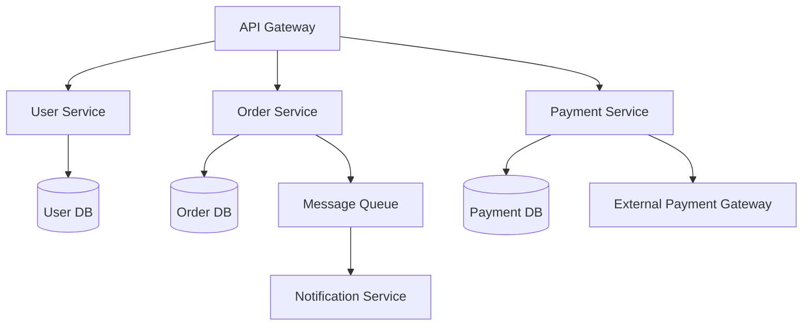

# Knowledge Management Instructions

## Overview

This instruction provides the comprehensive technical specifications and governance framework for knowledge management across engineering teams. It covers knowledge base architecture, taxonomy design, documentation lifecycle management, search and retrieval optimization, and content quality standards. The instruction ensures organizational knowledge is captured, discoverable, and maintained as a first-class engineering asset. Key focus areas include ownership models, review cadences, deprecation policies, and integration with developer workflows to maximize knowledge reuse and minimize silos.


## Documentation Types

### Tutorial (教程)
```yaml
purpose: "Learning by doing"
structure:
  - Prerequisites
  - Step-by-step instructions
  - Expected outcome
  - Next steps
style: "Conversational, encouraging"
```

### How-To Guide (操作指南)
```yaml
purpose: "Achieve a specific goal"
structure:
  - Goal statement
  - Prerequisites
  - Steps
  - Verification
  - Troubleshooting
style: "Direct, practical"
```

### Reference (参考文档)
```yaml
purpose: "Look up facts"
structure:
  - Overview
  - Parameters/Functions
  - Examples
  - Related
style: "Precise, complete"
```

### Explanation (解释说明)
```yaml
purpose: "Understanding"
structure:
  - Context
  - Key concepts
  - Perspectives
  - Further reading
style: "Educational, balanced"
```

## Documentation Structure

### Folder Structure
```
docs/
├── getting-started/
│   ├── quick-start.md
│   ├── installation.md
│   └── configuration.md
├── guides/
│   ├── deployment/
│   │   ├── kubernetes.md
│   │   └── aws.md
│   └── development/
│       ├── setup.md
│       └── testing.md
├── reference/
│   ├── api/
│   │   ├── rest-api.md
│   │   └── graphql-api.md
│   └── configuration/
│       └── config-reference.md
├── explanations/
│   ├── architecture/
│   └── decisions/
└── templates/
    ├── design-doc.md
    └── runbook.md
```

### Frontmatter Template
```yaml
---
title: "Document Title"
description: "Brief description"
author: "Author Name"
date: "2024-01-01"
version: "1.1.0"
category: "guides"
tags: ["tag1", "tag2"]
status: "published|draft|archived"
reviewers: ["reviewer1", "reviewer2"]
last_reviewed: "2024-01-01"
next_review: "2024-04-01"
---
```

## Writing Guidelines

### Style Guide

```markdown
## Voice and Tone
- Use active voice
- Be concise
- Use consistent terminology
- Write for scanning (headings, lists)

## Formatting
- Headings: Sentence case
- Code blocks: Specify language
- Lists: Parallel structure
- Links: Descriptive text

## Terminology
- Use consistent terms
- Define acronyms
- Use industry standard
```

### Code Block Examples

```markdown
```typescript
// Good: Descriptive variable names
const userAuthenticationToken = await authenticateUser(credentials);

// Bad: Cryptic abbreviations
const authToken = await authUser(creds);

// Better: Comment explains why
// Using short variable for brevity in this example
const authToken = await authUser(creds);
`````

## Knowledge Base Tools

### Wiki Platforms
| Platform | Best For | Features |
|----------|----------|----------|
| Confluence | Enterprise | Rich editing, JIRA integration |
| Notion | Flexible | All-in-one, API |
| GitBook | Developer | Git-based, API docs |
| MkDocs | Technical | Markdown, search |
| Docusaurus | Docs sites | React, versioning |

### Documentation Generators
```bash
# MkDocs
mkdocs new my-project
mkdocs serve
mkdocs build

# Docusaurus
npx create-docusaurus@latest my-website classic
npm run build

# VuePress
npm install -D vuepress
npm run docs:build
```

## Knowledge Lifecycle

### Creation
```yaml
workflow:
  - idea: "Identify knowledge need"
  - draft: "Create initial content"
  - review: "Peer review"
  - edit: "Incorporate feedback"
  - publish: "Release to knowledge base"
```

### Maintenance
```yaml
maintenance_schedule:
  monthly:
    - "Review high-traffic articles"
    - "Update outdated information"
    
  quarterly:
    - "Full documentation audit"
    - "Archive obsolete content"
    - "Gather user feedback"
    
  annually:
    - "Major content reorganization"
    - "Style guide review"
    - "Tool evaluation"
```

### Archival
```yaml
archival_criteria:
  - content_older_than: "2 years"
  - page_views_below: "10/month"
  - no_updates_since: "18 months"
  
archival_process:
  - notify_users: "30 days notice"
  - create_archive: "PDF/static version"
  - set_redirect: "point to related content"
```

## Search Optimization

### Metadata Best Practices
```yaml
metadata:
  title:
    - include_keywords
    - front-load important words
    - avoid filler words
    
  description:
    - 150-160 characters
    - include primary keyword
    - clear value proposition
    
  tags:
    - use consistent vocabulary
    - include synonyms
    - group related terms
```

### Content Organization
```yaml
findability_factors:
  - clear_hierarchy: true
  - consistent_naming: true
  - cross_linking: true
  - related_content: true
  - breadcrumbs: true
```

## Quality Metrics

### Content Metrics
| Metric | Target | Measurement |
|--------|--------|-------------|
| Page views | >100/month | Analytics |
| Time on page | >2 minutes | Analytics |
| Helpful votes | >80% | User feedback |
| Search success | >90% | Search logs |
| Update frequency | quarterly | Last modified |

### Quality Checklist
```markdown
## Content Quality Checklist
- [ ] Accurate and up-to-date
- [ ] Clear and understandable
- [ ] Well-structured
- [ ] Contains examples
- [ ] Has no broken links
- [ ] Follows style guide
- [ ] Peer-reviewed
```

## Multi-Language Code Examples

### Markdown 文档模板与 Mermaid 图表

```markdown
---
title: "Architecture Decision Record"
description: "ADR for migrating from Monolith to Microservices"
date: 2026-06-01
version: "1.0.0"
category: "explanations"
tags: ["architecture", "adr", "microservices"]
status: "published"
reviewers: ["alice", "bob"]
last_reviewed: "2026-06-01"
next_review: "2026-09-01"
---

# ADR-001: Migrate to Microservices Architecture

## Context

简要描述当前架构面临的问题和迁移的背景。

## Decision

我们选择基于领域驱动设计拆分微服务，每个服务独立部署。

## Mermaid 架构图



## Consequences

- 正向：独立部署、技术栈灵活、团队自治
- 负向：运维复杂度增加、分布式事务挑战
- 风险：服务间通信延迟、数据一致性保障
```

### MkDocs 知识库配置

```yaml
# mkdocs.yml — MkDocs 知识库站点配置
site_name: "Engineering Knowledge Base"
site_description: "企业级工程知识库"
site_url: "https://knowledge.company.com"
repo_url: "https://github.com/company/knowledge-base"
edit_uri: "edit/main/docs/"

theme:
  name: material
  language: zh
  features:
    - navigation.tabs          # 顶部标签导航
    - navigation.sections      # 侧边栏分区
    - navigation.expand        # 自动展开
    - search.highlight         # 搜索高亮
    - search.suggest           # 搜索建议
    - content.code.copy        # 代码块复制按钮
  palette:
    primary: indigo
    accent: blue

plugins:
  - search:
      lang: zh                  # 中文搜索优化
  - tags:                       # 标签系统
      tags_file: tags.md
  - git-revision-date-localized # 显示最后修改日期
  - minify:
      minify_html: true

markdown_extensions:
  - pymdownx.superfences        # 嵌套代码块
  - pymdownx.tabbed:            # 标签页
      alternate_style: true
  - pymdownx.emoji              # Emoji 支持
  - admonition                  # 提示框
  - toc:
      permalink: true

nav:
  - Home: index.md
  - Getting Started:
    - Quick Start: getting-started/quick-start.md
    - Onboarding: getting-started/onboarding.md
  - Guides:
    - Deployment: guides/deployment/
    - Development: guides/development/
  - Reference:
    - API: reference/api/
    - Config: reference/config/
  - Architecture:
    - Decisions: architecture/adr/
  - Tags: tags.md

extra:
  social:
    - icon: fontawesome/brands/slack
      link: https://company.slack.com/archives/eng-wiki
    - icon: fontawesome/brands/github
      link: https://github.com/company/knowledge-base
```

### Python: Confluence API 知识库同步脚本

```python
#!/usr/bin/env python3
"""
Confluence 知识库批量同步脚本
用途：将本地 Markdown 文档批量同步到 Confluence 空间
"""
import os
import sys
import json
import hashlib
from pathlib import Path
from datetime import datetime, timezone
from typing import Optional

import requests
from requests.auth import HTTPBasicAuth


class ConfluenceSync:
    """Confluence 知识库同步客户端"""

    def __init__(self, base_url: str, username: str, api_token: str):
        self.base_url = base_url.rstrip("/")
        self.auth = HTTPBasicAuth(username, api_token)
        self.session = requests.Session()
        self.session.headers.update({
            "Accept": "application/json",
            "Content-Type": "application/json",
        })

    def get_or_create_space(self, space_key: str, space_name: str) -> dict:
        """获取或创建知识空间"""
        resp = self.session.get(
            f"{self.base_url}/rest/api/space/{space_key}",
            auth=self.auth,
        )
        if resp.status_code == 200:
            return resp.json()
        # 创建空间
        resp = self.session.post(
            f"{self.base_url}/rest/api/space",
            auth=self.auth,
            json={
                "key": space_key,
                "name": space_name,
                "description": {
                    "plain": {"value": "Engineering Knowledge Base", "representation": "plain"}
                },
            },
        )
        resp.raise_for_status()
        return resp.json()

    def upload_page(self, space_key: str, title: str, body: str,
                    parent_id: Optional[str] = None) -> dict:
        """上传/更新页面到 Confluence"""
        # 检查是否已存在
        resp = self.session.get(
            f"{self.base_url}/rest/api/content",
            auth=self.auth,
            params={
                "spaceKey": space_key,
                "title": title,
                "expand": "version",
            },
        )
        existing = resp.json().get("results", [])[0] if resp.json().get("results") else None

        data = {
            "type": "page",
            "title": title,
            "space": {"key": space_key},
            "body": {
                "storage": {
                    "value": body,
                    "representation": "storage",
                }
            },
        }
        if parent_id:
            data["ancestors"] = [{"id": parent_id}]

        if existing:
            data["id"] = existing["id"]
            data["version"] = {"number": existing["version"]["number"] + 1}
            resp = self.session.put(
                f"{self.base_url}/rest/api/content/{existing['id']}",
                auth=self.auth, json=data,
            )
        else:
            resp = self.session.post(
                f"{self.base_url}/rest/api/content",
                auth=self.auth, json=data,
            )
        resp.raise_for_status()
        return resp.json()

    def markdown_to_confluence(self, md_content: str) -> str:
        """将 Markdown 转换为 Confluence Storage 格式（简化示例）"""
        # 生产环境建议使用 md-to-confluence 库
        lines = md_content.split("\n")
        html_parts = []
        for line in lines:
            if line.startswith("# "):
                html_parts.append(f"<h1>{line[2:]}</h1>")
            elif line.startswith("## "):
                html_parts.append(f"<h2>{line[3:]}</h2>")
            elif line.startswith("### "):
                html_parts.append(f"<h3>{line[4:]}</h3>")
            elif line.startswith("- "):
                html_parts.append(f"<li>{line[2:]}</li>")
            elif line.startswith("```"):
                continue
            else:
                html_parts.append(f"<p>{line}</p>")
        return "\n".join(html_parts)


# 使用示例
if __name__ == "__main__":
    client = ConfluenceSync(
        base_url="https://company.atlassian.net/wiki",
        username=os.environ["CONFLUENCE_USER"],
        api_token=os.environ["CONFLUENCE_TOKEN"],
    )

    space = client.get_or_create_space("ENG", "Engineering Wiki")
    print(f"Space ready: {space['key']}")

    # 同步 docs/ 目录下所有 Markdown 文件
    docs_dir = Path("./docs")
    for md_file in docs_dir.rglob("*.md"):
        relative = md_file.relative_to(docs_dir)
        title = relative.stem.replace("-", " ").title()
        content = md_file.read_text(encoding="utf-8")
        confluence_body = client.markdown_to_confluence(content)

        page = client.upload_page(
            space_key="ENG",
            title=title,
            body=confluence_body,
        )
        print(f"Uploaded: {title} -> {page['_links']['webui']}")
```

### JavaScript: 知识库搜索引擎与标签系统

```javascript
// search-indexer.js — 知识库全文搜索索引生成器
const fs = require('fs');
const path = require('path');
const matter = require('gray-matter');
const { JSDOM } = require('jsdom');

/**
 * 从 Markdown 文件中提取可搜索内容
 */
function extractContent(filePath) {
  const raw = fs.readFileSync(filePath, 'utf-8');
  const { data, content } = matter(raw);

  // 从 Markdown 中去除代码块和特殊字符
  const plainText = content
    .replace(/```[\s\S]*?```/g, '')
    .replace(/`[^`]+`/g, '')
    .replace(/[#*_~\[\]()>|:-]/g, ' ')
    .replace(/\s+/g, ' ')
    .trim();

  return {
    title: data.title || path.basename(filePath, '.md'),
    description: data.description || '',
    tags: data.tags || [],
    category: data.category || 'uncategorized',
    content: plainText,
    path: filePath,
    lastModified: data.last_reviewed || fs.statSync(filePath).mtime.toISOString(),
    author: data.author || 'unknown',
  };
}

/**
 * 生成 Lunr.js 兼容的搜索索引
 */
function buildSearchIndex(docsDir) {
  const docsDirPath = path.resolve(docsDir);
  const documents = [];

  function walk(dir) {
    const entries = fs.readdirSync(dir, { withFileTypes: true });
    for (const entry of entries) {
      const fullPath = path.join(dir, entry.name);
      if (entry.isDirectory()) {
        walk(fullPath);
      } else if (entry.name.endsWith('.md') && entry.name !== 'index.md') {
        documents.push(extractContent(fullPath));
      }
    }
  }

  walk(docsDirPath);

  // 生成标签聚合数据
  const tagCloud = {};
  for (const doc of documents) {
    for (const tag of doc.tags) {
      tagCloud[tag] = (tagCloud[tag] || 0) + 1;
    }
  }

  // 生成搜索索引 JSON
  const index = {
    version: '1.0',
    generatedAt: new Date().toISOString(),
    totalDocs: documents.length,
    tagCloud,
    documents,
  };

  const outputPath = path.join(docsDir, '..', 'search-index.json');
  fs.writeFileSync(outputPath, JSON.stringify(index, null, 2));
  console.log(`Index built: ${documents.length} documents, ${Object.keys(tagCloud).length} tags`);
  console.log(`Output: ${outputPath}`);
  return index;
}

// 执行索引构建
if (require.main === module) {
  const docsDir = process.argv[2] || './docs';
  buildSearchIndex(docsDir);
}
```

## Error Handling

### Error Scenario 1: 文档搜索索引失效 (P1)

**触发条件**: 知识库搜索返回空结果或结果不完整，全文索引服务（Elasticsearch / Lunr）异常

**处理流程**:
```
IF 搜索返回空结果或索引服务返回 5xx
THEN
  1. 检查搜索服务健康状态：
     - Elasticsearch: curl -f http://elasticsearch:9200/_cluster/health
     - MkDocs: 检查 search_index.json 是否存在且非空
  2. 检查索引服务日志，定位崩溃原因
     - 磁盘空间不足 → 清理历史索引数据
     - 内存溢出 → 调整 JVM heap 大小
  3. 触发重建索引：
     - Elasticsearch: POST /_reindex 或重新导入文档
     - MkDocs/Docusaurus: 重新执行构建命令
     - 自定义搜索: 执行 search-indexer.js 重新生成
  4. 验证索引重建完成后搜索功能恢复正常
  5. 对搜索请求进行抽样验证，确保结果质量
END
```

**降级方案**: 启用静态站点搜索（浏览器端 JS 模糊搜索）作为临时替代

**升级条件**: 索引重建失败超过 3 次，或搜索服务中断超过 30 分钟

### Error Scenario 2: 知识库权限错误 (P2)

**触发条件**: 用户访问知识库页面时返回 403 Forbidden，或 Confluence 页面无法编辑

**处理流程**:
```
IF 用户报告 403 权限错误
THEN
  1. 确认用户的组织身份和所在团队
  2. 检查知识库空间/页面的权限配置：
     - Confluence: Space Settings > Permissions > View/Edit
     - Git-based: 检查仓库的 .github/CODEOWNERS 和 branch protection
  3. 识别缺少的具体权限（查看/编辑/删除/导出）
  4. 按最小权限原则授予所需权限：
     - 只读用户 → View Only
     - 编辑用户 → View + Edit + Comment
     - 管理员 → View + Edit + Delete + Admin
  5. 记录权限变更到变更日志
  6. 通知用户权限已更新
END
```

**降级方案**: 将页面内容导出为 PDF 或静态 HTML 通过内部链接分享，临时绕过权限限制

**升级条件**: 权限问题涉及跨部门协作且无法由团队自行解决，需要上报 IT 安全团队

### Error Scenario 3: 多版本内容冲突 (P1)

**触发条件**: 多人同时编辑同一知识库页面，或 Git 合并时 .md 文件发生冲突

**处理流程**:
```
IF 检测到内容版本冲突
THEN
  1. 识别冲突的范围和影响：
     - Confluence: 查看页面历史版本，对比变更差异
     - Git: git diff --name-only --diff-filter=U 列出所有冲突文件
  2. 召集相关编辑者进行协调会议
  3. 决定保留哪一方的变更或手动合并双方变更
  4. 对于 Git 冲突：
     - 接受双方变更：保留冲突标记，手动逐行合并
     - 使用视觉对比工具：git difftool 或 IDE 对比
  5. 解决冲突后，更新 frontmatter 的 version 和 last_reviewed 字段
  6. 通知相关订阅者内容已更新
  7. 考虑启用编辑锁定机制防止未来冲突
END
```

**降级方案**: 临时锁定页面为只读模式，仅允许管理员编辑，待冲突解决后恢复

**升级条件**: 内容冲突涉及关键架构决策文档或合规文档，需要架构师委员会介入裁定


## Quality Standards

> Acceptance criteria and quality gates for manage-knowledge deliverables.

| Standard | Criteria | Verification Method |
|----------|----------|---------------------|
| Standard 1 | Knowledge indexing coverage is 95% or higher | Automated check |
| Standard 2 | User search success rate is 80% or higher | Automated check |
| Standard 3 | Content updated within last 6 months is 90% or higher | Automated check |
## References

- [harness-engineering.md](../standards/harness-engineering.md)
- [output-validation-checklist.md](../evaluations/output-validation-checklist.md)
- [regression-checklist.md](../evaluations/regression-checklist.md)
