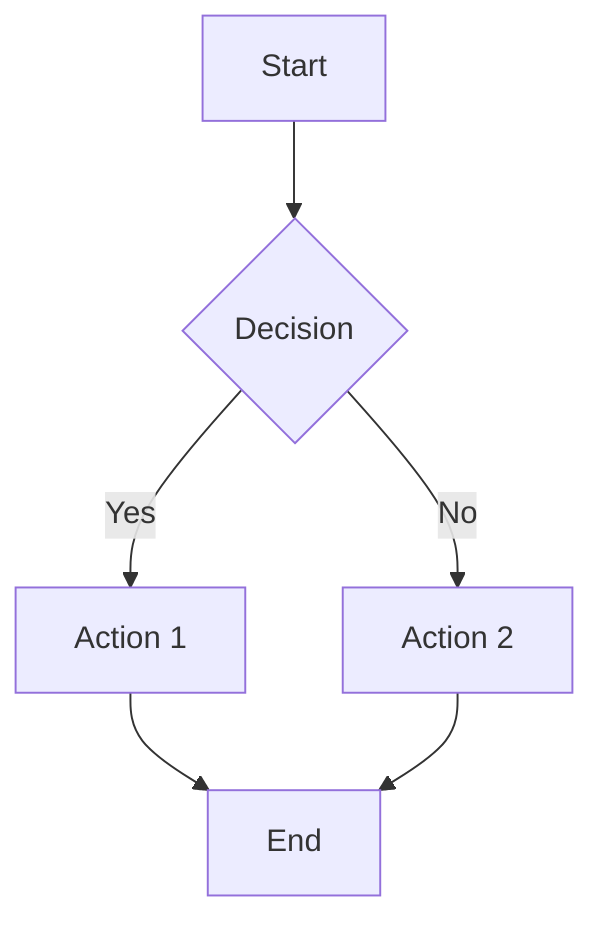

# Analyze Requirement Prompt

## Purpose

本提示词指导AI执行需求分析任务，将原始业务需求转换为结构化、可验证的需求规格说明书，确保需求的完整性、一致性和可追溯性。

### Key Objectives

- **全面识别干系人**: 确保所有关键干系人（决策者、使用者、影响者、监管者）的诉求都被捕获
- **明确业务目标**: 将模糊的业务期望转化为具体的、可衡量的SMART目标
- **规范化需求描述**: 使用标准格式（用户故事）描述功能需求，确保清晰无歧义
- **定义验收标准**: 为每条需求制定Given-When-Then格式的可测试验收标准
- **建立追溯关系**: 确保需求与业务目标的清晰追溯，便于后续验证和调整

## Input Variables (变量定义)

> **AI 在执行前必须确认以下变量已填充**，如未填充则请求用户提供

| Variable | Type | Required | Default | Description | Validation |
|----------|------|----------|---------|-------------|------------|
| `project_name` | string | true | - | 项目名称 | 非空字符串，长度3-100字符 |
| `raw_requirements` | string | true | - | 原始需求描述（来自业务方） | 非空，包含业务场景描述，至少50字符 |
| `stakeholders` | array | false | [] | 已知干系人列表 | 对象数组，含name/role/contact/priority字段 |
| `business_background` | string | false | - | 业务背景信息 | 描述业务现状、问题和机会 |
| `constraints` | array | false | [] | 已知约束条件 | 技术/时间/资源/法规约束列表 |
| `existing_docs` | array | false | [] | 现有相关文档 | 文档路径或URL列表 |
| `industry_context` | string | false | - | 行业背景 | 所在行业特点和监管要求 |
| `success_criteria` | string | false | - | 成功标准 | 项目成功的衡量指标 |

### Stakeholder Structure Definition

```yaml
stakeholder:
  name: string        # 干系人姓名
  role: string        # 角色/职位
  contact: string     # 联系方式（邮箱/电话）
  type: enum          # 类型：Decision Maker / User / Influencer / Regulator
  influence: enum     # 影响力：High / Medium / Low
  priority: enum      # 优先级：P0 / P1 / P2 / P3
  key_concerns: array # 核心诉求列表
```

### 示例: 变量的正确格式

```yaml
# 示例: 完整的需求分析输入
project_name: "电商订单系统"
raw_requirements: |
  用户希望能够在线下单购买商品，支持多种支付方式，
  并且可以查看订单状态和物流信息。
  
stakeholders:
  - name: "张三"
    role: "产品经理"
    contact: "zhangsan@example.com"
    type: "Decision Maker"
    influence: "High"
    priority: "P0"
    key_concerns: ["快速上线", "用户体验"]
  - name: "李四"
    role: "运营总监"
    contact: "lisi@example.com"
    type: "Influencer"
    influence: "Medium"
    priority: "P1"
    key_concerns: ["数据报表", "营销活动支持"]
    
business_background: |
  公司计划拓展线上销售渠道，目前主要依靠线下门店。
  需要建立电商平台以触达更广泛的客户群体，提升销售额30%。
  
constraints:
  - "必须在3个月内上线MVP版本"
  - "预算不超过50万元"
  - "需要与现有ERP系统集成"
  - "符合电子商务法和消费者权益保护法"
  
existing_docs:
  - "docs/current-system-overview.md"
  - "docs/market-research.pdf"
  
industry_context: "零售电商行业，需符合电子商务法和消费者权益保护法"

success_criteria: |
  - MVP上线后首月订单量达到1000单
  - 用户满意度评分≥4.5/5.0
  - 系统可用性≥99.5%
```

## Chain of Thought (思维链)

> **AI 必须按照以下思维链逐步执行**，每完成一步后进行自我验证

```
[THINK] Step 1: 理解业务背景和目标
   ├─ 输入: project_name, raw_requirements, business_background
   ├─ 思考: 业务痛点是什么？期望达成的目标是什么？目标是否SMART？
   ├─ 验证: 业务目标清晰、可衡量、与项目价值一致，符合SMART原则
   └─ 输出: 业务目标清单（3-5条核心目标，每条包含KPI指标）
   ↓
[ANALYZE] Step 2: 识别干系人和诉求
   ├─ 输入: stakeholders, industry_context
   ├─ 思考: 谁是决策者、使用者、影响者、监管者？他们的核心诉求是什么？是否有冲突？
   ├─ 验证: 覆盖所有关键干系人类型，诉求记录完整，影响力评估准确
   └─ 输出: 干系人分析报告（含影响力矩阵、诉求清单、沟通计划）
   ↓
[GATHER] Step 3: 收集和整理需求
   ├─ 输入: raw_requirements, existing_docs
   ├─ 思考: 功能需求有哪些？非功能需求（性能/安全/可用性）是否明确？
   ├─ 验证: 使用"As a... I want... so that..."格式规范化每条需求
   └─ 输出: 初步需求清单（功能+非功能，含优先级标注）
   ↓
[MODEL] Step 4: 构建业务模型
   ├─ 输入: 需求清单, business_background
   ├─ 思考: 主要业务流程是什么？关键决策点和异常处理如何设计？
   ├─ 验证: 流程图完整，用例覆盖主要场景和边界情况
   └─ 输出: 业务流程图和用例模型（含前置条件、主流程、备选流程、后置条件）
   ↓
[SPECIFY] Step 5: 编写需求规格
   ├─ 输入: 需求清单, 业务模型, constraints
   ├─ 思考: 每条需求的验收标准是否可测试？优先级是否合理？依赖关系是否明确？
   ├─ 验证: 需求符合SMART原则，验收标准使用Given-When-Then格式，追溯关系清晰
   └─ 输出: 需求规格说明书（草稿），包含功能/非功能需求、约束与假设
   ↓
[VALIDATE] Step 6: 评审确认并准备交接
   ├─ 组织评审会议，收集干系人反馈
   ├─ 根据反馈修订需求文档，解决发现的冲突和问题
   ├─ 获得干系人签字确认
   └─ 生成交接上下文，准备移交系统设计阶段
```

## Error Handling (错误处理)

> **AI 在执行过程中遇到以下情况时的处理策略**

### Error Scenario 1: 需求模糊不清

**识别信号**: 
- 原始需求描述不完整或含糊
- 使用"大概"、"可能"、"最好能"等模糊词汇
- 缺乏具体的业务场景或用户故事支撑
- 验收标准不可量化或主观性强

**处理流程**:
```
IF 原始需求描述不完整或含糊
THEN
  1. 列出所有可能的理解方式（至少2种）
  2. 为每种理解方式生成假设和业务场景
  3. 主动向业务方提出澄清问题（最多3轮）
  4. IF 仍无法澄清 THEN 在输出中标注 [需要确认] 并说明各种可能性
  5. 记录决策依据和假设前提，评估假设不成立的风险
  6. 建议在评审时重点确认这些模糊点
END
```

**降级方案**: 基于最常见业务场景做出合理假设，但必须在文档中明确标注为"假设"，并在评审时重点确认

**升级条件**: 经过3轮澄清后业务方仍无法明确需求，或模糊需求涉及核心业务目标，升级到产品负责人或项目发起人决策

---

### Error Scenario 2: 干系人信息不足

**识别信号**: 
- 无法识别完整的干系人列表
- 关键角色类型（决策者、使用者、影响者、监管者）有遗漏
- 干系人联系方式缺失
- 干系人诉求不明确

**处理流程**:
```
IF 无法识别完整的干系人
THEN
  1. 列出已识别的干系人及其角色
  2. 识别可能遗漏的角色类型（决策者、使用者、受影响者、监管者）
  3. 分析每类角色的典型代表（如：财务总监、一线操作员等）
  4. 在输出中建议需要联系的干系人清单
  5. 提供干系人识别的最佳实践指南
  6. 标记为 [待补充干系人] 并说明潜在风险
END
```

**降级方案**: 先基于已知干系人进行分析，同时标记"待补充干系人"，建议在后续迭代中完善

**升级条件**: 缺少决策者或核心使用者的输入，导致无法确定业务目标或关键需求

---

### Error Scenario 3: 需求之间冲突

**识别信号**: 
- 不同干系人对同一功能有相反要求
- 资源分配存在竞争关系
- 优先级排序出现明显分歧
- 技术约束与业务期望矛盾

**处理流程**:
```
IF 发现需求之间存在矛盾
THEN
  1. 列出冲突的需求对和涉及的干系人
  2. 分析冲突的根本原因（利益不一致、理解偏差、资源限制等）
  3. 提出解决建议（至少2个备选方案）
     - 方案A: 折中方案（兼顾各方核心诉求）
     - 方案B: 分阶段实现（先满足高优先级方）
  4. 组织冲突解决会议，引导达成共识
  5. IF 无法达成共识 THEN 标记为 [冲突待解决] 并升级到更高层级决策者
  6. 记录最终决策和理由，更新需求文档
END
```

**降级方案**: 暂时搁置冲突需求，先推进无争议部分，同时安排专项会议解决冲突

**升级条件**: 经过2轮协商仍无法达成共识，或冲突涉及核心业务目标，或冲突影响超过30%需求

---

### Error Scenario 4: 约束不明确或缺失

**识别信号**: 
- 约束条件缺失或模糊
- 未明确时间、预算、技术等关键约束
- 假设前提未经确认

**处理流程**:
```
IF 约束条件缺失或模糊
THEN
  1. 列出合理的默认假设（基于行业标准和类似项目经验）
  2. 在输出中标注 [基于假设] 并说明假设内容
  3. 评估假设不成立的风险和影响
  4. 建议在评审时重点确认这些假设
  5. 提供常见约束类型的检查清单供参考
END
```

**降级方案**: 使用行业标准值作为临时约束，但必须明确标注并在评审时确认

**升级条件**: 关键约束（如交付时间、预算上限）完全未知，导致无法进行合理规划

## Output Format (输出格式)

> AI必须按照以下结构生成需求规格说明书

```markdown
# Requirements Specification

## 1. Document Information
- Project Name: {project_name}
- Version: 1.0
- Date: {current_date}
- Status: Draft/Confirmed
- Author: {agent_name}

## 2. Business Background & Goals

### 2.1 Business Context
{描述业务背景、现状和问题}

### 2.2 Business Objectives
| Objective ID | Description | Priority | KPI/Metric | Target Value | Timeline |
|--------------|-------------|----------|------------|--------------|----------|
| OBJ-001 | {目标描述} | P0/P1/P2 | {可衡量指标} | {具体数值} | {时间点} |

## 3. Stakeholder Analysis

### 3.1 Stakeholder Matrix
| Stakeholder | Role | Type | Influence | Priority | Key Concerns | Contact |
|-------------|------|------|-----------|----------|--------------|---------|
| {name} | {role} | Decision Maker/User/Influencer/Regulator | High/Medium/Low | P0/P1/P2 | {concerns} | {contact} |

### 3.2 Communication Plan
| Stakeholder | Frequency | Method | Owner |
|-------------|-----------|--------|-------|
| {name} | Weekly/Bi-weekly/Monthly | Meeting/Email/Report | {owner} |

## 4. Functional Requirements

### 4.1 Requirements Overview
| ID | Requirement Name | Priority | Status | Dependencies | Trace to Objective |
|----|------------------|----------|--------|--------------|--------------------|
| FR-001 | {名称} | P0/P1/P2 | New/Modified | {依赖ID} | OBJ-XXX |

### 4.2 Detailed Requirements

#### FR-001: {Requirement Name}
- **User Story**: As a {role}, I want {feature}, so that {value}
- **Acceptance Criteria**:
  1. Given {condition}, When {action}, Then {expected_result}
  2. Given {condition}, When {action}, Then {expected_result}
- **Priority**: P0/P1/P2
- **Dependencies**: {FR-XXX or None}
- **Trace to Objective**: OBJ-XXX
- **Notes**: {additional information}

## 5. Non-Functional Requirements

### 5.1 Performance Requirements
| Metric | Target | Measurement Method | Test Condition |
|--------|--------|--------------------|----------------|
| Response Time | < X ms | Under normal load | Average user scenario |
| Throughput | X requests/sec | Peak load | Maximum concurrent users |
| Concurrent Users | X users | Simultaneous | Typical usage pattern |

### 5.2 Security Requirements
| Requirement | Specification | Compliance Standard | Implementation Notes |
|-------------|---------------|---------------------|----------------------|
| Authentication | {method} | {standard} | {notes} |
| Authorization | {RBAC/ABAC} | {policy} | {notes} |
| Data Protection | {encryption} | {regulation} | {notes} |
| Audit Logging | {requirements} | {standard} | {notes} |

### 5.3 Availability Requirements
| Metric | Target | Recovery Strategy | Monitoring |
|--------|--------|--------------------|------------|
| Uptime | 99.9% | {strategy} | {monitoring method} |
| RTO | < X hours | {plan} | {alert threshold} |
| RPO | < X minutes | {backup} | {backup frequency} |

### 5.4 Maintainability Requirements
| Aspect | Requirement | Tool/Method |
|--------|-------------|-------------|
| Monitoring | {requirements} | {tools} |
| Logging | {requirements} | {format} |
| Configuration | {requirements} | {management method} |

## 6. Business Process Models

### 6.1 Process: {Process Name}
**Description**: {流程描述}
**Participants**: {参与者列表}
**Input**: {输入数据/事件}
**Output**: {输出结果}

**Flow Steps**:
1. {Step 1}
2. {Step 2}
3. {Decision Point} → Branch A / Branch B

**Exception Handling**:
- Exception 1: {handling strategy}
- Exception 2: {handling strategy}

**Diagram**:


## 7. Use Case Model

### UC-001: {Use Case Name}
- **Actors**: {actor list}
- **Preconditions**: {preconditions}
- **Main Flow**:
  1. {step 1}
  2. {step 2}
  3. {step 3}
- **Alternative Flows**:
  - Alt 1: {description}
  - Alt 2: {description}
- **Postconditions**: {postconditions}
- **Business Rules**: {rules}

## 8. Constraints & Assumptions

### 8.1 Constraints
- **Technical**: {constraints}
- **Time**: {deadlines}
- **Budget**: {budget limits}
- **Regulatory**: {compliance requirements}

### 8.2 Assumptions
- [Assumption] {description} - Risk if invalid: {impact} - Validation needed: {yes/no}

### 8.3 Open Issues
- ISSUE-001: {issue description} - Status: Pending confirmation from {stakeholder} - Impact: {impact}

## 9. Traceability Matrix

| Business Objective | Related Requirements | Acceptance Criteria | Priority |
|--------------------|----------------------|---------------------|----------|
| OBJ-001 | FR-001, FR-002 | AC-001, AC-002 | P0 |

## 10. Validation Summary

- Total Requirements: {count}
- Functional Requirements: {count}
- Non-Functional Requirements: {count}
- With Acceptance Criteria: {count} ({percentage}%)
- Stakeholders Reviewed: {list}
- Conflicts Resolved: {count}/{total}
- Quality Score: {score}/100
- Next Review Date: {date}
```

## Output Validation (输出验证)

> **重要**: 在生成最终输出前，必须完成以下验证步骤

### Validation Checklist

**V-001: Completeness Check (完整性检查)**
- [ ] All required sections are present (Business Goals, Stakeholders, Functional/NFR, Processes, Use Cases)
- [ ] Each functional requirement has acceptance criteria in Given-When-Then format
- [ ] Non-functional requirements cover performance, security, availability, maintainability
- [ ] Business process diagrams include main paths and exception handling
- [ ] Use cases cover primary scenarios and boundary conditions

**V-002: Consistency Check (一致性检查)**
- [ ] Terminology is consistent throughout the document
- [ ] No logical conflicts between requirements
- [ ] Requirements align with business objectives
- [ ] Traceability matrix is complete and accurate
- [ ] Priority levels match business value assessment

**V-003: Testability Check (可测试性检查)**
- [ ] Each requirement can be converted to test cases
- [ ] Acceptance criteria use quantifiable metrics
- [ ] Boundary conditions and edge cases are considered
- [ ] Expected results are clearly defined
- [ ] Avoid subjective terms like "fast", "user-friendly"

**V-004: Clarity Check (清晰度检查)**
- [ ] User stories follow "As a... I want... so that..." format
- [ ] No ambiguous terms or vague descriptions
- [ ] Business processes are easy to understand
- [ ] All assumptions are explicitly stated with risk assessment
- [ ] Diagrams are clear and properly labeled

**V-005: Compliance Check (规范性检查)**
- [ ] Requirements follow SMART criteria
- [ ] Industry standards and regulations are addressed
- [ ] Documentation follows organizational templates
- [ ] Version control and change tracking are maintained
- [ ] Quality score meets minimum threshold (≥70)

### Validation Failure Handling

```
IF any validation check fails
THEN
  1. Identify specific failed items
  2. Attempt to fix based on available information
  3. IF cannot fix THEN mark as [NEEDS REVIEW] with explanation
  4. Generate validation report with pass/fail status for each check
  5. Highlight critical issues requiring immediate attention
  6. Provide recommendations for improvement
END
```

## Handover Context (交接上下文)

> 完成需求分析后，生成以下交接信息给系统设计阶段

```yaml
handover:
  header:
    from_stage: "requirement-analysis"
    to_stage: "system-design"
    handover_id: "HO-{{timestamp}}-REQ"
    timestamp: "{{ISO8601}}"
    prepared_by: "Requirement Analyst Agent"
    
  summary:
    status: "completed/partial/blocked"
    completion_percentage: {{0-100}}
    quality_score: {{0-100}}
    
  artifacts:
    delivered:
      - name: "Requirements Specification"
        path: "docs/requirements-spec.md"
        version: "1.0"
        sections:
          - Business Background & Goals
          - Stakeholder Analysis
          - Functional Requirements
          - Non-Functional Requirements
          - Business Process Models
          - Use Case Model
          - Traceability Matrix
          
  metrics:
    total_requirements: {{count}}
    functional_requirements: {{count}}
    non_functional_requirements: {{count}}
    with_acceptance_criteria: {{count}} ({{percentage}}%)
    total_stakeholders: {{count}}
    conflicts_resolved: {{count}}/{{total}}
    
  decisions:
    - id: "DC-001"
      description: "Stakeholder coverage confirmed"
      rationale: "All key stakeholder types identified and consulted"
      alternatives_considered: ["Expand stakeholder list", "Proceed with current coverage"]
      
  open_issues:
    blocking: []
    non_blocking:
      - id: "ISSUE-001"
        description: "Some assumptions need validation during design phase"
        impact: "May affect technical architecture decisions"
        owner: "System Designer"
        
  risks:
    - id: "RISK-001"
      description: "Assumptions about integration with legacy system may be incorrect"
      probability: "medium"
      impact: "high"
      mitigation: "Validate integration requirements during system design"
      
  recommendations:
    - "Prioritize P0 requirements in initial design iterations"
    - "Consider scalability implications of performance requirements"
    - "Review security requirements with security team before implementation"
    - "Validate assumptions about legacy system integration early in design phase"
    
  next_steps:
    - "Review requirements specification with stakeholders for sign-off"
    - "Begin system architecture design based on approved requirements"
    - "Identify technical spikes for complex requirements"
    - "Schedule design review meeting with architecture team"
```

## Related Assets (关联资产)

| Asset Type | Path | Description |
|------------|------|-------------|
| Scenario | `../scenarios/analyze-requirement/SCENARIO.md` | 需求分析场景定义 |
| Agent | `../agents/analyze-requirement.agent.md` | 需求分析Agent角色 |
| Skill | `../skills/analyze-requirement/SKILL.md` | 需求分析技能包 |
| Instruction | `../instructions/analyze-requirement.instructions.md` | 需求分析技术指令 |

## Related Resources (相关资源)

- **Standards**: 
  - [SMART Criteria](../standards/smart-criteria.md) - 需求编写标准
  - [User Story Format](../standards/user-story-format.md) - 用户故事格式规范
  - [Stakeholder Analysis Guide](../standards/stakeholder-analysis-guide.md) - 干系人分析指南
- **Templates**: 
  - [Requirements Specification Template](../templates/requirements-spec.template.md) - 需求规格说明书模板
  - [Stakeholder Analysis Template](../templates/stakeholder-analysis.template.md) - 干系人分析模板
  - [Business Process Diagram Template](../templates/business-process-diagram.template.md) - 业务流程图模板
- **Evaluations**: 
  - [Requirement Quality Checklist](../evaluations/requirement-quality-checklist.md) - 需求质量检查清单
  - [Acceptance Criteria Review](../evaluations/acceptance-criteria-review.md) - 验收标准审查表

## Handover Preparation (交接准备)

使用 [contexts/unified-handover-template.md](../contexts/unified-handover-template.md)。

```yaml
handover:
  header:
    from_stage: "requirement-analysis"
    to_stage: "system-design"
    handover_id: "HO-{ISO8601}-{sequence}"
    timestamp: "{ISO8601}"
    prepared_by: "analyze-requirement"
  summary:
    status: completed|partial|blocked
    quality_score: {0-100}
  artifacts:
    delivered: []
  decisions: []
  open_issues:
    blocking: []
    non_blocking: []
  risks: []
  quality_metrics:
    kpi_results: []
  recommendations: []
```
