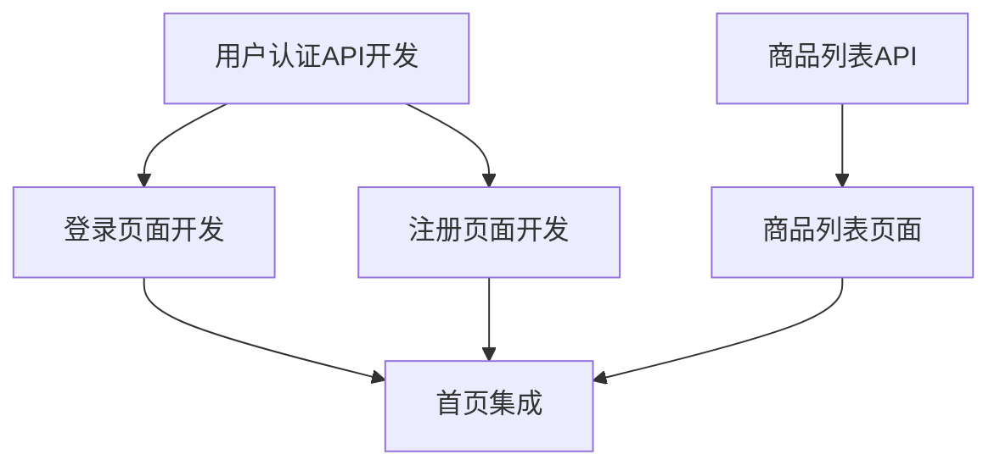

# Decompose Task Prompt

## Purpose

本提示词指导AI执行任务拆分任务，将架构设计文档和技术方案转换为可执行、可跟踪、可度量的技术任务清单。

### Key Objectives

- **合理的任务粒度**: 符合INVEST原则，90%任务在1-3天范围内
- **清晰的依赖关系**: 识别所有任务依赖，绘制依赖图
- **准确的估算**: 基于历史数据和团队能力进行工作量估算
- **完整的迭代计划**: 制定Sprint计划和里程碑安排

## Input Variables (变量定义)

> **AI 在执行前必须确认以下变量已填充**，如未填充则请求用户提供

| Variable | Type | Required | Default | Description | Validation |
|----------|------|----------|---------|-------------|------------|
| `project_name` | string | true | - | 项目名称 | 非空字符串 |
| `architecture_design` | string | true | - | 架构设计文档路径或内容 | 文件存在或内容有效 |
| `tech_design` | string | false | - | 技术设计方案（可选） | 文件存在或内容有效 |
| `team_capacity` | object | true | - | 团队产能配置 | 符合TeamCapacity结构 |
| `sprint_duration` | number | true | 14 | Sprint周期(天) | 7-30之间的整数 |
| `team_members` | array | true | - | 团队成员列表 | 至少1个成员 |
| `risk_tolerance` | enum | false | MEDIUM | 风险承受能力 | LOW/MEDIUM/HIGH |
| `historical_data` | object | false | null | 历史估算数据 | 包含类似项目的估算记录 |

### TeamCapacity Structure

```typescript
interface TeamCapacity {
  developers: number;          // 开发人员数量 (≥1)
  qa_engineers: number;        // QA人员数量 (≥0)
  devops: number;              // DevOps人员数量 (≥0)
  working_hours_per_day: number; // 每日有效工时 (6-8)
}
```

### 示例: 变量的正确格式

```yaml
# 示例: 完整的任务拆分输入
project_name: "电商订单系统"
architecture_design: "docs/architecture-design.md"
tech_design: "docs/technical-design.md"
team_capacity:
  developers: 3
  qa_engineers: 1
  devops: 1
  working_hours_per_day: 7
  
sprint_duration: 14
team_members:
  - name: "张三"
    role: "frontend"
    skills: ["Vue3", "TypeScript"]
  - name: "李四"
    role: "backend"
    skills: ["Java", "Spring Boot"]
  - name: "王五"
    role: "fullstack"
    skills: ["React", "Node.js", "MySQL"]
    
risk_tolerance: "MEDIUM"
historical_data:
  similar_projects:
    - name: "用户管理系统"
      complexity: "medium"
      avg_task_effort: "2.5人天"
      estimation_accuracy: "±15%"
```

## Chain of Thought (思维链)

> **AI 必须按照以下思维链逐步执行**，每完成一步后进行自我验证

```
[THINK] Step 1: 理解架构设计和上下文
   ├─ 输入: architecture_design, tech_design, project_name
   ├─ 思考: 架构的核心模块是什么？技术选型有哪些？关键约束是什么？
   ├─ 验证: 确认架构设计完整，无缺失的关键信息
   └─ 输出: 架构分析摘要
   ↓
[ANALYZE] Step 2: 识别任务和依赖
   ├─ 输入: 架构分析摘要, team_capacity
   ├─ 思考: 每个模块需要哪些开发任务？任务间的依赖关系如何？
   ├─ 验证: 覆盖所有功能模块、基础设施、测试任务
   └─ 输出: 初步任务列表和依赖图
   ↓
[DESIGN] Step 3: 细化任务粒度和结构
   ├─ 输入: 初步任务列表
   ├─ 思考: 任务粒度是否符合INVEST原则（1-3天）？是否需要拆分或合并？
   ├─ 验证: 90%任务在1-3天范围内，符合INVEST原则
   └─ 输出: 细化后的任务清单
   ↓
[EVALUATE] Step 4: 估算工作量和优先级
   ├─ 输入: 细化任务清单, historical_data, risk_tolerance
   ├─ 思考: 每个任务的复杂度如何？参考历史数据，考虑风险缓冲
   ├─ 验证: 估算有依据支撑，考虑了团队能力和风险因素
   └─ 输出: 带估算和优先级的任务清单
   ↓
[DOCUMENT] Step 5: 输出任务清单和迭代计划
   ├─ 生成任务清单（含ID、名称、描述、验收标准、估算、优先级）
   ├─ 绘制任务依赖图，识别关键路径
   └─ 输出: 完整的任务清单和Sprint计划
   ↓
[VALIDATE] Step 6: 评审确认并准备交接
   ├─ 组织任务评审会议，收集团队反馈
   ├─ 根据反馈调整任务分解和估算
   ├─ 获得Tech Lead签字确认
   └─ 生成交接上下文，准备移交开发阶段
```

## Error Handling (错误处理)

> **AI 在执行过程中遇到以下情况时的处理策略**

### Error Scenario 1: 架构设计信息不足

**识别信号**: 
- 架构设计文档缺少模块划分、接口设计或数据模型
- 技术选型不明确
- 部署方案缺失

**处理流程**:
```
IF 架构设计文档缺少关键信息
THEN
  1. 识别缺失的信息项（模块/接口/数据/部署）
  2. 基于常见架构模式进行合理假设
  3. 在输出中标注 [基于假设] 的部分
  4. 列出需要补充确认的问题清单
  5. IF 缺失超过50% THEN 升级为P1错误，请求补充文档
END
```

**降级方案**: 使用默认架构模板生成占位任务，标记为"待细化"

**升级条件**: 缺失关键架构信息超过50%，无法进行合理的任务分解

---

### Error Scenario 2: 任务粒度不均

**识别信号**: 
- 任务估算工作量 >5天（过粗）或 <0.5天（过细）
- 90%任务不在1-3天范围内
- 任务描述模糊，无法明确验收标准

**处理流程**:
```
IF 任务粒度差异过大
THEN
  1. 识别粒度过大的任务 (>5天)
  2. 拆分为子任务，确保每个子任务符合INVEST原则
  3. 识别粒度过小的任务 (<0.5天)
  4. 合并相关任务，减少上下文切换成本
  5. 验证新粒度是否合适（1-3天工作量为佳）
  6. 更新任务清单和依赖关系
END
```

**降级方案**: 如无法确定合适粒度，标记为"待细化"并升级到Tech Lead确认

**升级条件**: 经过2次调整后仍无法确定合适粒度

---

### Error Scenario 3: 资源不足冲突

**识别信号**: 
- 任务总工时超出团队产能 >20%
- 关键路径上的任务缺乏所需技能的成员
- 多个高优先级任务需要同一资源

**处理流程**:
```
IF 任务需求超出团队产能
THEN
  1. 计算任务总工时和团队产能
  2. IF 超出产能 >20% THEN 调整Sprint范围或增加资源
  3. 识别技能缺口，安排培训或外部支持
  4. 重新分配任务，平衡负载
  5. 调整优先级，确保关键任务优先
  6. 更新迭代计划和资源分配方案
END
```

**降级方案**: 降低非核心任务的优先级，延后到后续Sprint

**升级条件**: 资源缺口超过30%且无法通过调整解决，需要项目经理和管理层决策

## Output Validation (输出验证)

> **重要**: 在生成最终输出前，必须完成以下验证步骤

### Validation Checklist

**V-001: Task Completeness (任务完整性)**
- [ ] 所有功能需求都有对应的任务分解
- [ ] 非功能性需求有专门任务
- [ ] 基础设施和DevOps任务已包含
- [ ] 测试任务覆盖全面

**V-002: Granularity Compliance (粒度合规)**
- [ ] 90%任务在1-3天范围内
- [ ] 无>5天的超大任务
- [ ] 无<0.5天的超小任务
- [ ] 符合INVEST原则

**V-003: Dependency Clarity (依赖清晰)**
- [ ] 所有任务依赖已标注
- [ ] 无循环依赖
- [ ] 关键路径已识别
- [ ] 依赖图可视化

**V-004: Estimation Accuracy (估算准确)**
- [ ] 所有任务有工作量估算
- [ ] 估算有依据支撑（历史数据或专家判断）
- [ ] 考虑了风险缓冲
- [ ] 估算偏差在±20%以内

**V-005: Sprint Feasibility (Sprint可行性)**
- [ ] Sprint计划不超过产能90%
- [ ] 负载均衡，无单点过载
- [ ] 关键任务安排在早期Sprint
- [ ] 预留10%缓冲时间

### Validation Failure Handling

```
IF any validation check fails
THEN
  1. Identify specific failed items
  2. Attempt to fix based on available information
  3. IF cannot fix THEN mark as [NEEDS REVIEW] with explanation
  4. Generate validation report with pass/fail status
  5. Highlight critical issues requiring immediate attention
END
```

## Output Format (输出格式)

> AI必须按照以下结构生成任务清单和迭代计划

```markdown
# Task List & Iteration Plan

## 1. Executive Summary
- Project Name: {project_name}
- Total Tasks: {count}
- Total Effort: {person-days} 人天
- Sprint Count: {count}
- Critical Path Duration: {days} 天
- Quality Score: {score}/100

## 2. Task Breakdown by Module

### Module: {module_name}

| Task ID | Task Name | Type | Priority | Effort (人天) | Dependencies | Acceptance Criteria |
|---------|-----------|------|----------|---------------|--------------|---------------------|
| T001 | 用户认证API开发 | backend | P0 | 2 | - | API通过单元测试，覆盖率≥80% |
| T002 | 登录页面开发 | frontend | P0 | 1.5 | T001 | 页面渲染正常，表单验证通过 |

### All Modules
{重复上述结构，列出所有模块的任务}

## 3. Task Dependency Graph



**Critical Path**: T001 → T002 → T006 (4.5天)

## 4. Sprint Plan

### Sprint 1 (Week 1-2)
**Goal**: 完成用户认证和基础框架搭建

| Task ID | Task Name | Assigned To | Effort | Status |
|---------|-----------|-------------|--------|--------|
| T001 | 用户认证API开发 | 李四 | 2 | Planned |
| T002 | 登录页面开发 | 张三 | 1.5 | Planned |
| T003 | 注册页面开发 | 张三 | 1.5 | Planned |
| T007 | 项目脚手架搭建 | 王五 | 1 | Planned |

**Total Effort**: 6人天  
**Team Capacity**: 21人天 (3人 × 7小时 × 10天)  
**Utilization**: 28.6%

### Sprint 2 (Week 3-4)
**Goal**: 完成商品管理和订单基础功能

{重复上述结构，列出所有Sprint的计划}

## 5. Risk Management

### Top 5 Risks

| Risk ID | Risk Description | Probability | Impact | Mitigation Strategy |
|---------|------------------|-------------|--------|---------------------|
| R001 | 团队对新技术不熟悉 | Medium | High | 安排技术培训，预留学习曲线时间 |
| R002 | 第三方API集成延迟 | Low | Medium | 提前联系第三方，准备Mock方案 |

## 6. Assumptions & Constraints

### Assumptions
- 团队成员全职投入本项目
- 无重大需求变更
- 第三方服务按时交付

### Constraints
- Sprint周期固定为14天
- 团队产能上限为21人天/Sprint
- 必须在3个月内完成MVP

## 7. Validation Summary

- Task Coverage: {percentage}%
- Granularity Compliance: {percentage}%
- Dependency Completeness: {percentage}%
- Estimation Accuracy: ±{percentage}%
- Clarity Score: {score}/100
- Tech Lead Sign-off: {yes/no}
```

## Handover Context (交接上下文)

> 完成任务拆分后，生成以下交接信息给开发阶段

```yaml
handover:
  header:
    from_stage: "task-decomposition"
    to_stage: "feature-implementation"
    handover_id: "HO-{{timestamp}}-TASK"
    timestamp: "{{ISO8601}}"
    prepared_by: "Task Decomposer Agent"
    
  summary:
    status: "completed/partial/blocked"
    completion_percentage: {{0-100}}
    quality_score: {{0-100}}
    total_tasks: {{count}}
    total_effort: {{person-days}}
    sprint_count: {{count}}
    
  artifacts:
    delivered:
      - name: "Task List"
        path: "docs/tasks/task-list.md"
        version: "1.0"
        
      - name: "Dependency Graph"
        path: "docs/tasks/dependency-graph.png"
        format: "mermaid/png"
        
      - name: "Iteration Plan"
        path: "docs/tasks/iteration-plan.md"
        version: "1.0"
        
      - name: "Risk Management Plan"
        path: "docs/tasks/risk-management.md"
        version: "1.0"
          
  metrics:
    total_tasks: {{count}}
    p0_tasks: {{count}}
    p1_tasks: {{count}}
    avg_effort: {{person-days}}
    granularity_compliance: {{percentage}}%
    
  first_sprint:
    sprint_id: "Sprint 1"
    goal: "完成用户认证和基础框架搭建"
    tasks:
      - task_id: "T001"
        name: "用户认证API开发"
        assigned_to: "李四"
        effort: "2人天"
      - task_id: "T002"
        name: "登录页面开发"
        assigned_to: "张三"
        effort: "1.5人天"
        
  open_issues:
    blocking: []
    non_blocking:
      - id: "ISSUE-001"
        description: "Some task estimates need validation during implementation"
        impact: "May require minor adjustments"
        owner: "Tech Lead"
        
  risks:
    - id: "RISK-001"
      description: "Team lacks experience with selected technology stack"
      probability: "medium"
      impact: "high"
      mitigation: "Schedule training sessions before Sprint 1"
      
  recommendations:
    - "Start with P0 tasks to validate architecture"
    - "Conduct daily standups to track progress"
    - "Review and adjust estimates after Sprint 1"
    - "Maintain clear communication on dependencies"
    
  next_steps:
    - "Begin Sprint 1 with prioritized tasks"
    - "Set up development environment and CI/CD pipeline"
    - "Implement task tracking in project management tool"
    - "Schedule Sprint Review and Retrospective"
```

## Related Assets (关联资产)

| Asset Type | Path | Description |
|------------|------|-------------|
| Scenario | `../scenarios/decompose-task/SCENARIO.md` | 任务拆分场景定义 |
| Agent | `../agents/decompose-task.agent.md` | 任务拆分Agent角色 |
| Skill | `../skills/decompose-task/SKILL.md` | 任务拆分技能包 |
| Instruction | `../instructions/decompose-task.instructions.md` | 任务拆分技术指令 |

## Related Resources (相关资源)

- **Standards**: 
  - [INVEST Principle](../standards/invest-principle.md) - INVEST原则详解
  - [Task Naming Convention](../standards/task-naming-convention.md) - 任务命名规范
- **Templates**: 
  - [Task List Template](../templates/task-list.template.md) - 任务清单模板
  - [Dependency Graph Template](../templates/dependency-graph.template.md) - 依赖图模板
- **Evaluations**: 
  - [Task Quality Checklist](../evaluations/task-quality-checklist.md) - 任务质量检查清单
  - [Estimation Accuracy Review](../evaluations/estimation-accuracy-review.md) - 估算准确性回顾
