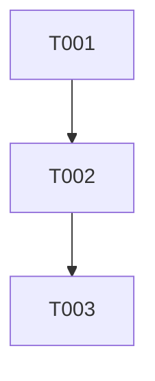

# Task Decomposition Prompt

> **版本**: 1.2.0 | **适用阶段**: 任务分解 | **预计工时**: 1-2小时

## Purpose

将架构设计文档和技术方案转换为可执行、可跟踪、可度量的技术任务清单，为开发团队提供清晰的工作项和迭代计划。

### Business Value

- **降低认知负荷**: 将复杂架构拆解为小颗粒度任务
- **提升可预测性**: 通过任务估算和依赖分析提高计划准确性
- **增强可追溯性**: 建立需求-设计-任务-代码的完整追溯链
- **优化资源配置**: 基于任务优先级和技能匹配合理分配人力

## Input Variables (变量定义)

> **AI 在执行前必须确认以下变量已填充**，如未填充则请求用户提供

| Variable | Type | Required | Default | Description | Validation |
|----------|------|----------|---------|-------------|------------|
| `project_name` | string | true | - | 项目名称 | 非空字符串 |
| `architecture_design` | string | true | - | 架构设计文档路径或内容 | 文件存在或内容有效 |
| `tech_design` | string | false | - | 技术设计方案（可选） | 文件存在或内容有效 |
| `team_capacity` | object | true | - | 团队产能配置 | 符合TeamCapacity结构 |
| `sprint_duration` | number | true | 14 | Sprint周期(天) | 7-30之间的整数 |
| `team_members` | array | true | - | 团队成员列表 | 至少1个成员 |
| `available_skills` | array | false | [] | 可用技能列表 | 字符串数组 |
| `risk_tolerance` | enum | false | MEDIUM | 风险承受能力 | LOW/MEDIUM/HIGH |
| `historical_data` | object | false | null | 历史估算数据 | 包含类似项目的估算记录 |

### TeamCapacity Structure

```typescript
interface TeamCapacity {
  developers: number;          // 开发人员数量 (≥1)
  qa_engineers: number;        // QA人员数量 (≥0)
  devops: number;              // DevOps人员数量 (≥0)
  working_hours_per_day: number; // 每日有效工时 (6-8)
  capacity_per_sprint: number; // 每Sprint可用工时 (自动计算)
}
```

### Variable Examples

```yaml
# 示例: 变量的正确格式
project_name: "电商订单系统"
architecture_design: "docs/architecture-design.md"
tech_design: "docs/technical-design.md"
team_capacity:
  developers: 3
  qa_engineers: 1
  devops: 1
  working_hours_per_day: 7
  capacity_per_sprint: 210  # 3人 * 7小时 * 10天
sprint_duration: 14
team_members:
  - name: "张三"
    role: "frontend"
    skills: ["Vue3", "TypeScript"]
  - name: "李四"
    role: "backend"
    skills: ["Java", "Spring Boot"]
available_skills:
  - "Vue3"
  - "Java"
  - "MySQL"
risk_tolerance: "MEDIUM"
```

## Chain of Thought (思维链)

> **AI 必须按照以下思维链逐步执行**，每完成一步后进行自我验证

```
[THINK] Step 1: 理解架构设计和上下文
   ├─ 输入: architecture_design, tech_design, project_name
   ├─ 思考: 架构的核心模块是什么？技术选型有哪些？关键约束是什么？
   ├─ 验证: 确认架构设计完整，无缺失的关键信息
   └─ 输出: 架构分析摘要
   ↓
[ANALYZE] Step 2: 识别任务和依赖
   ├─ 输入: 架构分析摘要, team_capacity
   ├─ 思考: 每个模块需要哪些开发任务？任务间的依赖关系如何？
   ├─ 验证: 覆盖所有功能模块、基础设施、测试任务
   └─ 输出: 初步任务列表和依赖图
   ↓
[DESIGN] Step 3: 细化任务粒度和结构
   ├─ 输入: 初步任务列表
   ├─ 思考: 任务粒度是否符合INVEST原则（1-3天）？是否需要拆分或合并？
   ├─ 验证: 90%任务在1-3天范围内，符合INVEST原则
   └─ 输出: 细化后的任务清单
   ↓
[ESTIMATE] Step 4: 估算工作量和优先级
   ├─ 输入: 细化任务清单, historical_data, risk_tolerance
   ├─ 思考: 每个任务的复杂度如何？参考历史数据，考虑风险缓冲
   ├─ 验证: 估算有依据支撑，考虑了团队能力和风险因素
   └─ 输出: 带估算和优先级的任务清单
   ↓
[VERIFY] Step 5: 验证任务分解质量
   ├─ 输入: 带估算的任务清单
   ├─ 执行: 完整性检查、粒度检查、依赖检查、估算检查
   ├─ 验证: 通过所有验证检查项（V-001至V-005）
   └─ 输出: 验证报告
   ↓
[HANDOVER] Step 6: 准备交接给开发阶段
   ├─ 生成: Handover Context（包含任务清单、依赖图、迭代计划）
   ├─ 更新: Global Context（任务状态追踪）
   └─ 通知: Feature Implementer Agent
```

## Error Handling (错误处理)

> **AI 遇到以下情况时必须按指定流程处理**

### 错误分类体系

| 级别 | 标识 | 描述 | 处理方式 |
|------|------|------|----------|
| P0 - Critical | ERR-CRITICAL | 阻塞性错误，无法继续 | 立即停止，升级人工处理 |
| P1 - Major | ERR-MAJOR | 严重错误，影响核心功能 | 尝试修复，失败则升级 |
| P2 - Minor | ERR-MINOR | 一般错误，可降级处理 | 记录并继续，后续修复 |
| P3 - Warning | ERR-WARNING | 警告信息，不影响执行 | 记录并继续 |

### Error Scenario 1: 架构设计信息不足

**识别信号**: 
- 架构设计文档缺少模块划分、接口设计或数据模型
- 技术选型不明确
- 部署方案缺失

**处理流程**:
```
IF 架构设计文档缺少关键信息
THEN
  1. 识别缺失的信息项（模块/接口/数据/部署）
  2. 基于常见架构模式进行合理假设
  3. 在输出中标注 [基于假设] 的部分
  4. 列出需要补充确认的问题清单
  5. IF 缺失超过50% THEN 升级为P1错误，请求补充文档
END
```

**降级方案**: 使用默认架构模板生成占位任务，标记为“待细化”

**升级条件**: 缺失关键架构信息超过50%，无法进行合理的任务分解

---

### Error Scenario 2: 任务粒度不均

**识别信号**: 
- 任务估算工作量 >5天（过粗）或 <0.5天（过细）
- 90%任务不在1-3天范围内
- 任务描述模糊，无法明确验收标准

**处理流程**:
```
IF 任务粒度差异过大
THEN
  1. 识别粒度过大的任务 (>5天)
  2. 拆分为子任务，确保每个子任务符合INVEST原则
  3. 识别粒度过小的任务 (<0.5天)
  4. 合并相关任务，减少上下文切换成本
  5. 验证新粒度是否合适（1-3天工作量为佳）
  6. 更新任务清单和依赖关系
END
```

**降级方案**: 如无法确定合适粒度，标记为“待细化”并升级到Tech Lead确认

**升级条件**: 经过2次调整后仍无法确定合适粒度

---

### Error Scenario 3: 资源不足冲突

**识别信号**: 
- 任务总工时超出团队产能 >20%
- 关键路径上的任务缺乏所需技能的成员
- 多个高优先级任务需要同一资源

**处理流程**:
```
IF 任务需求超出团队产能
THEN
  1. 计算产能缺口（总工时 - 可用工时）
  2. 识别可推迟的任务（P2/P3优先级）
  3. 建议调整Sprint范围或增加Sprint数量
  4. 标记为 [需要决策] 的事项
  5. 提供至少2个备选方案（缩减范围/延长时间/增加资源）
END
```

**降级方案**: 优先保证P0任务，将P1/P2任务推迟到后续Sprint

**升级条件**: 产能缺口 >30%且无可行调整方案

---

### Error Scenario 4: 循环依赖

**识别信号**: 
- 任务A依赖任务B，任务B依赖任务A
- 依赖图中存在环路
- 无法确定任务的执行顺序

**处理流程**:
```
IF 存在循环依赖
THEN
  1. 识别参与循环的任务集合
  2. 分析循环的根本原因（设计问题/拆分不当）
  3. 引入抽象层或接口打破循环
  4. 或标记需要并行开发的窗口
  5. 制定临时方案和长期重构计划
  6. 更新依赖图并重新验证
END
```

**降级方案**: 将循环依赖的任务组标记为“需并行开发”，增加协调成本估算

**升级条件**: 循环依赖涉及核心模块，需要架构师重新设计

---

### 错误日志格式

```yaml
error_log:
  error_id: "ERR-{timestamp}-XXX"
  timestamp: "{{ISO8601}}"
  level: "P0/P1/P2/P3"
  type: "{insufficient_architecture/uneven_granularity/resource_conflict/circular_dependency}"
  description: "{详细描述}"
  action_taken: "{已采取的行动}"
  result: "resolved/blocked/degraded/escalated"
  escalated_to: "{升级对象，如有}"
```


## Output Format (输出格式)

> **AI 必须严格按照以下格式生成输出**

### 标准输出结构

```markdown
# Task Decomposition Deliverables

## 1. Document Information
- **项目名称**: {{project_name}}
- **版本**: 1.0
- **日期**: {{current_date}}
- **总任务数**: {{total_tasks}}
- **总工时**: {{total_effort}} 人天
- **质量评分**: {{quality_score}}/100

## 2. Task List

### 2.1 任务总览
| ID | 任务名称 | 模块 | 类型 | 优先级 | 估算(人天) | 负责人 | 依赖 |
|----|----------|------|------|--------|------------|--------|------|
| T001 | 用户认证模块开发 | 认证模块 | 功能 | P0 | 2 | - | - |

### 2.2 任务详情

#### T001: [任务名称]
- **模块**: [所属模块]
- **类型**: [功能/技术债务/基础设施/测试]
- **优先级**: [P0/P1/P2/P3]
- **估算**: [X] 人天
- **依赖任务**: [Txxx]
- **验收标准**:
  1. [标准1]
  2. [标准2]
- **技术要点**:
  - [要点1]
  - [要点2]

## 3. Dependencies

### 3.1 依赖图


### 3.2 关键路径
- **路径**: [T001] → [T005] → [T010] → [T015]
- **总工期**: X 天

### 3.3 可并行任务
| 组 | 任务 | 说明 |
|----|------|------|
| 组1 | T001, T002 | 可并行开发 |

## 4. Iteration Plan

### 4.1 迭代总览
| 迭代 | 时间 | 任务数 | 工时 | 目标 |
|------|------|--------|------|------|
| Sprint 1 | Week 1-2 | X | X | 完成基础设施 |

### 4.2 Sprint 1: [迭代名称]
**时间**: [开始日期] - [结束日期]
**目标**: [迭代目标]

**任务列表**:
| ID | 任务名称 | 估算 | 验收标准 |
|----|----------|------|----------|
| T001 | 任务1 | 2天 | 标准 |

## 5. Milestone Plan

| 里程碑 | 计划日期 | 交付物 | 状态 |
|--------|----------|--------|------|
| M1: 架构完成 | Week 1 | 架构设计 | 待开始 |

## 6. Resource Allocation

### 6.1 团队能力
| 角色 | 人数 | 技能 | 备注 |
|------|------|------|------|
| 前端开发 | 2 | Vue3 | - |

### 6.2 容量规划
| 迭代 | 可用工时 | 计划工时 | 缓冲 |
|------|----------|----------|------|
| Sprint 1 | 20 | 18 | 10% |

## 7. Risks & Mitigation

| 风险 | 影响 | 概率 | 应对 |
|------|------|------|------|
| 风险1 | 高 | 中 | 措施 |

## 8. Open Items

| 事项 | 影响 | 待确认人 | 截止日期 |
|------|------|----------|----------|
| 事项1 | 中 | 负责人 | 日期 |
```

## Output Validation (输出验证)

> **重要**: 在生成最终输出前，必须完成以下验证步骤

### Self-Validation Report

```markdown
# Self-Validation Report

### V-001: 完整性检查
- [ ] 所有模块都有对应任务
- [ ] 基础设施任务已覆盖
- [ ] 公共模块任务已识别
- [ ] 集成测试任务已规划
- [ ] 文档和部署任务已包含

### V-002: 粒度检查
- [ ] 90% 任务在 1-3 天范围内
- [ ] 没有超过 5 天的任务（需要拆分）
- [ ] 没有小于 0.5 天的任务（需要合并）
- [ ] 每个任务符合INVEST原则

### V-003: 依赖检查
- [ ] 所有依赖关系已标注
- [ ] 没有循环依赖
- [ ] 关键路径已识别
- [ ] 可并行任务已分组

### V-004: 估算检查
- [ ] 每个任务都有估算
- [ ] 估算考虑了风险缓冲
- [ ] 迭代容量平衡合理
- [ ] 总工时不超过团队产能

### V-005: 可追溯性检查
- [ ] 任务可追溯到模块设计
- [ ] 任务可追溯到技术选型
- [ ] 里程碑与业务目标对齐
- [ ] 验收标准清晰可量化

### 验证结果
- **验证通过**: [是/否]
- **未通过的检查项**: [列出]
- **修正措施**: [说明]
```

### 验证失败时的处理

```
IF 验证未通过
THEN
  1. 识别未通过的验证项
  2. 修正相应内容
  3. 重新执行验证
  4. IF 仍无法通过 THEN 记录问题并标记为P2错误
  5. 在输出中明确标注未解决的问题
END
```


## Handover Context (交接上下文)

在完成验证后，生成以下交接信息：

```yaml
handover:
  header:
    from_stage: "task-decomposition"
    to_stage: "feature-implementation"
    handover_id: "HO-{{timestamp}}-{{sequence}}"
    timestamp: "{{ISO8601}}"
    prepared_by: "{{agent.name}}"
    
  summary:
    status: "completed/partial/blocked"
    completion_percentage: {{0-100}}
    quality_score: {{0-100}}
    total_tasks: {{total_tasks}}
    total_effort: {{total_effort}}  # 总工时(人天)
    sprint_count: {{sprint_count}}  # Sprint数量
    critical_path_duration: {{duration}}  # 关键路径工期
    
  artifacts:
    delivered:
      - name: "任务清单"
        path: "docs/task-list.md"
        version: "1.0.0"
      - name: "任务依赖图"
        path: "docs/dependency-graph.png"
        version: "1.0.0"
      - name: "迭代计划"
        path: "docs/iteration-plan.md"
        version: "1.0.0"
      
  decisions:
    - id: "DC-001"
      description: "任务粒度选择"
      decision: "采用细粒度拆分（1-3天/任务）"
      rationale: "提高可预测性，便于并行执行和进度跟踪"
      
  open_issues:
    blocking: []
    non_blocking:
      - id: "ISSUE-001"
        description: "某些任务的技能匹配度需要确认"
        
  risks:
    - id: "RISK-001"
      description: "新技术学习曲线可能影响估算准确性"
      probability: "medium"
      impact: "medium"
      mitigation: "安排技术预研阶段，预留20%缓冲时间"
      
  recommendations:
    - "建议先实现核心功能模块，再扩展辅助功能"
    - "高风险任务安排在Sprint早期，留出应对时间"
    - "每日站会重点关注关键路径任务的进展"
```

## Constraints (约束条件)

1. **语言**: 输出使用中文
2. **粒度**: 任务粒度控制在 1-3 天（90%任务）
3. **完整性**: 所有设计点都有对应任务
4. **可执行**: 每个任务有明确验收标准
5. **可追溯**: 任务可追溯到需求和设计
6. **INVEST原则**: 任务必须独立、可协商、有价值、可估算、小、可测试

## Quality Requirements (质量要求)

| 要求 | 说明 | 目标值 |
|------|------|--------|
| 粒度适中 | 90% 任务在 1-3 天范围 | ≥90% |
| 依赖清晰 | 所有依赖已标注 | 100% |
| 优先级合理 | 优先级与价值匹配 | 无争议 |
| 计划可行 | 在资源和时间约束内可行 | 产能利用率≤90% |
| 估算准确 | 实际工时与估算偏差 | ±20% |

## Related Resources (相关资源)

- **Scenario**: [Task Decomposition Scenario](../scenarios/decompose-task/SCENARIO.md)
- **Agent**: [Decompose Task Agent](../agents/decompose-task.agent.md)
- **Skill**: [Task Decomposition Skill](../skills/decompose-task/SKILL.md)
- **Standards**: [Definition of Ready](../standards/dor.md), [INVEST Principle](../standards/invest.md)
