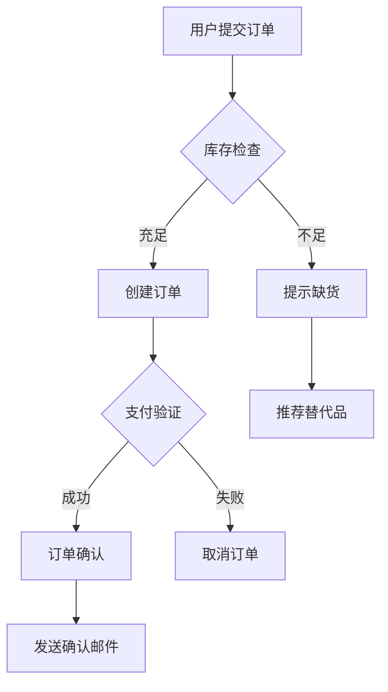

# Requirement Analysis Skill

## Skill Overview

本技能包提供需求分析的专业知识、最佳实践和常见陷阱，指导AI高质量地完成从原始需求到结构化规格说明书的转换。

### Core Competencies

- **需求 Elicitation**: 通过访谈、工作坊、文档分析等方式收集和澄清需求
- **干系人管理**: 全面识别和分析四类关键干系人（决策者、使用者、影响者、监管者）的诉求、期望和影响力
- **业务建模**: 构建业务流程图、用例模型，可视化业务逻辑和数据流
- **需求规范化**: 使用用户故事格式和SMART原则编写清晰、可测试的需求
- **冲突解决**: 协调不同干系人的矛盾诉求，寻求共赢方案
- **非功能需求定义**: 识别和定义性能、安全、可用性、可维护性等质量属性需求
- **追溯关系建立**: 建立需求与业务目标的清晰追溯，便于验证和调整

## Use When

使用此技能的场景：

- 新项目启动，需要进行需求调研和分析
- 业务方提出新需求，需要结构化澄清
- 现有需求文档不完整，需要梳理重构
- 需求变更频繁，需要重新评估影响
- 需求评审会议准备和执行
- 需求质量检查和改进

## Expected Input

### 必需输入

| 输入项 | 类型 | 描述 | 验证要求 |
|--------|------|------|----------|
| 原始需求 | 文本 | 业务方的原始需求描述 | 非空，至少50字符，包含业务场景 |
| 业务背景 | 文本 | 项目的业务背景和历史上下文 | 描述业务现状、问题和机会 |

### 可选输入

| 输入项 | 类型 | 描述 | 用途 |
|--------|------|------|------|
| 干系人信息 | 列表 | 已知干系人及其联系方式、角色、影响力 | 干系人分析和沟通计划 |
| 现有文档 | 文件 | 已有的需求文档或相关资料 | 参考和补充信息 |
| 约束条件 | 文本 | 已知的技术、时间、资源、法规约束 | 需求边界定义 |
| 行业背景 | 文本 | 所在行业特点和监管要求 | 合规性检查 |
| 成功标准 | 文本 | 项目成功的衡量指标 | 目标设定和验证 |

## Instructions

### 步骤 1：业务目标理解

**目标**：识别需求背后的业务触发点和期望达成的目标

**操作方法**:
1. **背景分析**: 理解业务现状、痛点和机会，明确项目发起的原因
2. **目标提取**: 从原始需求中提取3-5条核心业务目标
3. **SMART检查**: 确保每个目标都是具体（Specific）、可衡量（Measurable）、可达成（Achievable）、相关（Relevant）、有时限（Time-bound）的
4. **价值关联**: 将目标与业务价值（收入增长、成本降低、效率提升、客户满意度等）关联
5. **KPI定义**: 为每个目标定义可衡量的关键绩效指标（KPI）和目标值

**检查点**:
- [ ] 业务目标清晰定义，无模糊表述（避免"提升用户体验"等模糊说法）
- [ ] 每个目标都有可衡量的KPI或指标（如"订单量提升30%"）
- [ ] 目标与业务价值明确关联
- [ ] 目标之间无矛盾或重复
- [ ] 目标符合SMART原则

**示例**:
```
BAD: "提升用户体验"
GOOD: "将页面加载时间从3秒降低到1秒以内，提升用户满意度评分从4.0到4.5（5分制）"
```

---

### 步骤 2：干系人分析

**目标**：识别所有相关干系人，理解其诉求和期望

**操作方法**:
1. **角色识别**: 列出所有利益相关方，分类为四类关键角色：
   - **决策者（Decision Maker）**: 有最终决策权的人（如CEO、产品总监）
   - **使用者（User）**: 日常使用系统的人（如一线操作员、终端用户）
   - **影响者（Influencer）**: 对项目有影响但无决策权的人（如技术专家、顾问）
   - **监管者（Regulator）**: 负责合规和监管的人（如法务、审计）
2. **影响力评估**: 使用Power-Interest Grid评估每个干系人的影响力（高/中/低）和优先级
3. **诉求收集**: 通过访谈、问卷、工作坊等方式收集各干系人的核心诉求
4. **冲突识别**: 识别不同干系人之间的潜在冲突点，分析根本原因
5. **沟通计划**: 制定与各干系人的沟通频率和方式（周会、月报、邮件等）

**检查点**:
- [ ] 关键干系人已全部识别（至少覆盖四类关键角色）
- [ ] 每个干系人的核心诉求已记录
- [ ] 影响力评估准确，优先级合理
- [ ] 冲突点已标注并制定解决策略
- [ ] 沟通计划已明确，包含频率、方式和负责人

**工具**: Power-Interest Grid（权力-利益矩阵）
```
高权力-高利益: 重点管理（Key Players）
高权力-低利益: 保持满意（Keep Satisfied）
低权力-高利益: 保持知情（Keep Informed）
低权力-低利益: 最小 effort（Monitor）
```

---

### 步骤 3：业务流程建模

**目标**：构建业务流程和用例模型，可视化业务逻辑

**操作方法**:
1. **流程识别**: 识别主要业务流程，确定起点（触发事件）和终点（期望结果）
2. **参与者映射**: 标注流程中的角色（人）和系统（自动化组件）
3. **流程描述**: 使用流程图（Mermaid格式）描述业务流转，标注关键决策点
4. **异常处理**: 定义异常场景（如数据验证失败、外部系统不可用）和处理策略
5. **用例编写**: 为每个主要功能编写用例，包含：
   - 前置条件（Preconditions）
   - 主流程（Main Flow）
   - 备选流程（Alternative Flows）
   - 后置条件（Postconditions）
   - 业务规则（Business Rules）

**检查点**:
- [ ] 主要业务流程已完整描述，无遗漏关键路径
- [ ] 关键决策点和分支已标注
- [ ] 异常处理流程已定义，覆盖常见异常场景
- [ ] 用例覆盖主要场景和边界情况
- [ ] 流程图使用Mermaid格式，清晰易读

**示例**: Mermaid流程图


---

### 步骤 4：功能需求定义

**目标**：将需求转换为结构化的功能需求规格

**操作方法**:
1. **用户故事格式**: 使用 "As a [角色], I want [功能], so that [价值]" 格式描述每条需求
2. **验收标准**: 为每个需求定义Given-When-Then格式的验收标准
   - Given: 前置条件
   - When: 触发动作
   - Then: 期望结果
3. **优先级标注**: 根据业务价值和紧急程度标注P0/P1/P2/P3优先级
   - P0: 核心需求，必须实现
   - P1: 重要需求，应该实现
   - P2: 次要需求，可以实现
   - P3: 可选需求，有空再实现
4. **依赖识别**: 识别需求间的依赖关系（技术依赖、业务依赖、数据依赖）
5. **追溯建立**: 建立需求与业务目标的追溯关系，确保每条需求都有明确的业务价值

**检查点**:
- [ ] 所有需求都使用标准用户故事格式
- [ ] 每个需求都有明确的验收标准（Given-When-Then格式）
- [ ] 优先级标注合理，与业务价值一致
- [ ] 依赖关系已识别并记录
- [ ] 每条需求都可追溯到业务目标
- [ ] 避免使用模糊词汇（如"快速"、"友好"、"高效"）

**示例**:
```markdown
FR-001: 用户注册

**User Story**: As a 新用户, I want 通过邮箱注册账号, so that 我可以访问系统功能

**Acceptance Criteria**:
1. Given 我未注册过账号, When 我填写有效的邮箱和密码并提交, Then 我应该收到验证邮件
2. Given 我已收到验证邮件, When 我点击验证链接, Then 我的账号应该被激活
3. Given 我尝试使用已注册的邮箱, When 我提交注册表单, Then 我应该收到"邮箱已被使用"的提示

**Priority**: P0
**Dependencies**: None
**Trace to Objective**: OBJ-001 (提升用户转化率)
```

---

### 步骤 5：非功能需求定义

**目标**：定义系统的非功能性需求（质量属性）

**操作方法**:
1. **性能需求**: 定义响应时间、吞吐量、并发用户数等指标
   - 响应时间: < X ms（正常负载下）
   - 吞吐量: X requests/sec（峰值负载下）
   - 并发用户: X users（同时在线）
2. **安全需求**: 定义认证、授权、数据加密、审计等要求
   - 认证方式: OAuth 2.0 / JWT / SSO
   - 授权模型: RBAC / ABAC
   - 数据加密: AES-256（存储）, TLS 1.3（传输）
   - 审计日志: 记录所有关键操作
3. **可用性需求**: 定义可用率、RTO（恢复时间目标）、RPO（恢复点目标）
   - 可用率: 99.9%（年停机时间<8.76小时）
   - RTO: < 4小时（系统故障后恢复时间）
   - RPO: < 15分钟（数据丢失容忍度）
4. **可维护性需求**: 定义监控、日志、配置管理等要求
   - 监控: Prometheus + Grafana
   - 日志: 结构化日志（JSON格式），集中存储
   - 配置: 外部化配置，支持热更新
5. **兼容性需求**: 定义浏览器、设备、操作系统等兼容性要求
   - 浏览器: Chrome 90+, Firefox 88+, Safari 14+
   - 设备: 响应式设计，支持桌面/平板/手机
6. **合规性需求**: 确认行业标准和法规要求（如GDPR、PCI DSS、HIPAA等）

**检查点**:
- [ ] 性能指标具体且可衡量，有明确的测试条件
- [ ] 安全需求覆盖认证、授权、数据保护、审计
- [ ] 可用性目标明确，有恢复策略和监控方案
- [ ] 可维护性需求定义清楚，便于运维团队工作
- [ ] 合规性要求已识别并满足行业标准

**参考标准**:
- 性能: 参考类似项目经验值和行业基准
- 安全: OWASP Top 10, NIST Cybersecurity Framework
- 可用性: ITIL Service Level Management
- 合规: GDPR, PCI DSS, ISO 27001

---

### 步骤 6：约束与假设整理

**目标**：整理已知约束条件和假设，明确项目边界

**操作方法**:
1. **技术约束**: 记录技术栈要求、集成要求、兼容性限制
   - 例如: "必须使用Java 11+", "需要与SAP ERP系统集成"
2. **时间约束**: 记录交付节点、里程碑、关键日期
   - 例如: "MVP必须在2024-Q2上线", "双11前完成性能优化"
3. **资源约束**: 记录预算上限、人力配置、基础设施限制
   - 例如: "预算不超过100万", "团队规模5人"
4. **法规约束**: 记录法律法规、行业标准、合规要求
   - 例如: "符合GDPR数据隐私要求", "通过PCI DSS认证"
5. **假设列表**: 列出当前做出的所有假设，评估假设不成立的风险和影响
   - 格式: "[Assumption] {描述} - Risk if invalid: {影响} - Validation needed: {yes/no}"
6. **未解决问题**: 记录需要进一步澄清的问题，指定负责人和截止日期

**检查点**:
- [ ] 所有已知约束已记录，分类清晰
- [ ] 假设已明确标注并评估风险（概率×影响）
- [ ] 未解决问题已列出并指定负责人和截止日期
- [ ] 约束和假设已与干系人确认

---

### 步骤 7：需求评审确认

**目标**：与干系人评审需求，确保理解一致，获得签字确认

**操作方法**:
1. **评审准备**: 
   - 提前3天发送评审材料（需求规格说明书、业务流程图、用例模型）
   - 准备评审议程（2-3小时）
   - 邀请关键干系人（决策者、使用者代表、技术负责人）
2. **评审执行**: 
   - 逐项讲解需求，重点关注P0需求和复杂功能
   - 收集反馈意见，记录修改建议
   - 现场解决发现的冲突和问题
3. **冲突解决**: 
   - 对于简单冲突，现场协商达成共识
   - 对于复杂冲突，安排专项会议深入讨论
4. **修订完善**: 
   - 根据评审意见修订需求文档
   - 标注修改处，便于干系人复查
5. **签字确认**: 
   - 获得关键干系人的签字确认（电子签名或邮件确认）
   - 记录确认日期和版本
6. **基线锁定**: 
   - 锁定需求基线，后续变更走变更流程
   - 通知所有相关人员基线已锁定

**检查点**:
- [ ] 评审会议已完成，关键干系人均参与
- [ ] 所有反馈已处理或记录（标注待处理的原因）
- [ ] 关键干系人已签字确认（或邮件确认）
- [ ] 需求基线已锁定，版本号更新
- [ ] 变更流程已建立，相关人员知晓

**评审议程模板**:
```
1. 开场介绍（10分钟）
2. 业务目标和范围回顾（15分钟）
3. 功能需求逐条评审（60分钟）
4. 非功能需求评审（20分钟）
5. 业务流程和用例模型评审（30分钟）
6. 开放问题讨论（20分钟）
7. 总结和下一步（15分钟）
```

## Expected Output

### 产出列表

1. **需求规格说明书**（Requirements Specification）：结构化的需求文档，包含10个章节
2. **干系人分析报告**（Stakeholder Analysis）：干系人识别、影响力矩阵、诉求清单、沟通计划
3. **业务流程图**（Business Process Diagrams）：主要业务流程，使用Mermaid格式可视化
4. **用例模型**（Use Case Model）：系统用例定义，包含前置条件、主流程、备选流程、后置条件
5. **追溯矩阵**（Traceability Matrix）：需求与业务目标的追溯关系
6. **验收标准清单**（Acceptance Criteria）：每个功能需求的Given-When-Then验收标准

### 输出格式

需求规格说明书应包含以下章节：

```markdown
# Requirements Specification

## 1. Document Information
## 2. Business Background & Goals
## 3. Stakeholder Analysis
## 4. Functional Requirements
## 5. Non-Functional Requirements
## 6. Business Process Models
## 7. Use Case Model
## 8. Constraints & Assumptions
## 9. Traceability Matrix
## 10. Validation Summary
```

## Quality Criteria

### Quality Standards

| 维度 | 标准 | 检查方法 | 合格线 |
|------|------|----------|--------|
| 完整性 | 所有必需章节和字段已包含 | 对照检查清单逐项核对 | 100% |
| 准确性 | 业务理解正确，无误解 | 干系人确认，抽样验证 | ≥95% |
| 一致性 | 术语统一，无逻辑冲突 | 交叉检查，自动化扫描 | 100% |
| 可追溯性 | 需求与目标关联清晰 | 追溯矩阵检查，逐条验证 | 100% |
| 可测试性 | 验收标准明确可测 | 测试映射，转化为测试用例 | ≥90% |
| 规范性 | 遵循SMART和用户故事格式 | 格式检查，抽样审查 | ≥90% |

### Quality Score Calculation

```
Quality Score = (Completeness × 0.25) + (Accuracy × 0.20) + (Consistency × 0.15) 
              + (Traceability × 0.20) + (Testability × 0.20)

合格: ≥70分 | 优秀: ≥85分 | 卓越: ≥95分
```

## Core Knowledge

### Domain Fundamentals

**需求工程基础**:
- **需求类型**: 
  - 功能需求（Functional Requirements）: 系统应该做什么
  - 非功能需求（Non-Functional Requirements）: 系统应该做得多好
- **需求层次**: 业务需求 → 用户需求 → 系统需求
- **需求属性**: 完整性、一致性、可追溯性、可测试性、可行性
- **SMART原则**: Specific（具体）, Measurable（可衡量）, Achievable（可达成）, Relevant（相关）, Time-bound（有时限）

**干系人管理**:
- **干系人分类**: 决策者（Decision Maker）、使用者（User）、影响者（Influencer）、监管者（Regulator）
- **影响力评估**: Power-Interest Grid（权力-利益矩阵）
- **沟通策略**: 根据干系人类型制定不同的沟通频率和方式

**业务建模技术**:
- **流程图（Flowchart）**: 描述业务流程的输入、处理、输出、决策点
- **用例图（Use Case Diagram）**: 展示系统与外部参与者的交互
- **数据流图（Data Flow Diagram）**: 描述数据在系统中的流动和处理
- **状态图（State Diagram）**: 描述对象在不同条件下的状态变化

**需求编写标准**:
- **用户故事格式**: "As a [角色], I want [功能], so that [价值]"
- **验收标准格式**: Given-When-Then (GWT) 或 Should-Shall-Must
- **优先级分级**: P0(核心)、P1(重要)、P2(次要)、P3(可选)

### Key Principles

1. **业务目标驱动**: 每条需求都必须能够追溯到明确的业务目标，避免"为了做而做"
2. **干系人参与**: 确保所有关键干系人的诉求都被捕获和考虑，避免后期冲突
3. **明确无歧义**: 使用清晰、具体的语言，避免模糊词汇（如"快速"、"友好"）
4. **可测试可验证**: 每个需求都有明确的验收标准和验证方法，便于质量控制
5. **渐进明细**: 从高层次需求逐步细化到具体实现细节，避免一次性过度设计
6. **变更可控**: 建立需求变更流程，控制范围蔓延，保持项目进度稳定

## Best Practices

### 1. 主动澄清，避免假设

**实践描述**: 遇到模糊需求时，主动向业务方提出澄清问题，而不是基于假设继续工作。

**理由**: 假设往往是错误的根源，会导致后期返工和成本增加。据统计，60%的项目延期源于需求理解偏差。

**操作方法**:
- 列出所有可能的理解方式（至少2种）
- 为每种理解生成示例场景和业务影响
- 向业务方提出具体的澄清问题（开放式问题优于封闭式问题）
- 记录最终决策和依据，便于后续追溯

**示例**:
```
模糊需求: "系统应该快速响应用户请求"

澄清问题:
1. "快速"的具体指标是什么？（响应时间<1秒？<2秒？）
2. 在什么负载条件下需要满足这个指标？（正常负载？峰值负载？）
3. 哪些接口需要满足这个指标？（所有接口？核心接口？）

澄清后需求: "核心API接口在正常负载（100并发用户）下，响应时间应<1秒；在峰值负载（500并发用户）下，响应时间应<2秒"
```

---

### 2. 使用标准化格式

**实践描述**: 始终使用用户故事格式描述功能需求，使用Given-When-Then格式定义验收标准。

**理由**: 标准化格式提高需求的可读性、一致性和可测试性，便于团队协作和自动化测试。

**示例**:
```markdown
As a 注册用户
I want 能够通过微信快捷登录
So that 我可以快速访问系统而无需记住密码

Acceptance Criteria:
Given 我已经在系统中绑定微信账号
When 我点击"微信登录"按钮
And 我在微信中确认授权
Then 我应该成功登录系统
And 我应该被重定向到首页
And 我的登录状态应保持24小时
```

---

### 3. 全面识别干系人

**实践描述**: 不仅关注直接使用者，还要识别决策者、影响者、监管者等所有相关方。

**理由**: 遗漏关键干系人会导致需求不完整或后期冲突。研究表明，70%的需求变更是由于初期干系人识别不全。

**检查清单**:
- 谁是最终买单的人？（决策者）
- 谁会日常使用这个系统？（使用者）
- 谁的工作会受到系统影响？（影响者）
- 是否有法规或合规要求？（监管者）
- 谁会维护这个系统？（运维团队）
- 谁会从这个系统中获取数据？（数据分析团队）

---

### 4. 平衡功能与非功能需求

**实践描述**: 在定义功能需求的同时，充分关注性能、安全、可用性等非功能需求。

**理由**: 非功能需求往往决定系统的整体质量和用户体验。忽略非功能需求会导致系统上线后问题频发。

**操作方法**:
- 参考行业标准和类似项目经验值设定合理指标
- 与架构师和技术负责人共同评审非功能需求
- 将非功能需求纳入验收标准和测试计划
- 考虑未来扩展性和维护成本

**常见非功能需求指标参考**:
- Web应用响应时间: <2秒（正常负载）
- API响应时间: <500ms（正常负载）
- 系统可用率: 99.9%（年停机<8.76小时）
- 并发用户支持: 根据业务预测×1.5倍冗余

---

### 5. 建立清晰的追溯关系

**实践描述**: 为每条需求标注其对应的业务目标，建立双向追溯矩阵。

**理由**: 追溯关系帮助验证需求的必要性，便于后续调整和优化，也便于影响分析。

**追溯矩阵示例**:
| Business Objective | Related Requirements | Priority | Status |
|--------------------|----------------------|----------|--------|
| OBJ-001: 提升用户转化率30% | FR-001, FR-003, FR-007 | P0 | Confirmed |
| OBJ-002: 降低运营成本20% | FR-002, FR-005 | P1 | Confirmed |
| OBJ-003: 提升客户满意度至4.5/5.0 | FR-004, FR-006, FR-008 | P0 | Pending Review |

---

### 6. 迭代式需求细化

**实践描述**: 先完成高层次的需求框架，再逐步细化具体细节，避免一次性过度设计。

**理由**: 迭代式细化降低认知负荷，便于及时调整方向，也符合敏捷开发理念。

**操作流程**:
1. **第一轮（粗粒度）**: 识别主要功能模块和业务目标（1-2天）
2. **第二轮（中粒度）**: 细化每个模块的核心需求（3-5天）
3. **第三轮（细粒度）**: 补充边界情况和异常处理（2-3天）
4. **第四轮（验收标准）**: 完善验收标准和非功能需求（2-3天）

**每轮输出**:
- 第一轮: 功能模块清单 + 业务目标映射
- 第二轮: 用户故事初稿 + 优先级标注
- 第三轮: 完整的用户故事 + 业务流程图
- 第四轮: 验收标准 + 非功能需求 + 追溯矩阵

## Anti-patterns (反模式)

> 与 Common Pitfalls 同义，执行时合并检查。

## Common Pitfalls

### Pitfall 1: 需求粒度过粗或过细

**风险**: 粒度过粗导致无法准确估算和实现；粒度过细限制创新空间，增加维护成本。

**预防方法**:
- 遵循INVEST原则（Independent, Negotiable, Valuable, Estimable, Small, Testable）
- 单个需求应在1-5天内可实现（根据项目复杂度调整）
- 避免将多个独立功能合并为一个需求
- 避免将一个功能拆分为过多微任务

**影响**: 粒度不当会导致估算不准确、进度延误、团队困惑、返工成本高

**案例**:
```
❌ 过粗: "实现用户管理系统"（预计需要2周，无法并行开发）
✅ 合适: "实现用户注册功能"（预计2天，可独立开发和测试）
❌ 过细: "在注册页面添加邮箱输入框"（预计2小时，上下文切换成本高）
```

---

### Pitfall 2: 忽视非功能需求

**风险**: 只关注功能实现，忽略性能、安全、可用性等质量属性，导致系统上线后问题频发。

**预防方法**:
- 在需求分析初期就识别非功能需求，不要等到设计阶段
- 参考行业标准和最佳实践设定合理指标
- 与架构师和技术负责人共同评审非功能需求
- 将非功能需求纳入验收标准和测试计划

**影响**: 可能导致系统性能瓶颈、安全漏洞、用户体验差、运维成本高、甚至系统崩溃

**案例**:
```
某电商系统在双11前只关注功能开发，忽略了性能需求。结果双11当天系统响应时间从1秒飙升到10秒，
导致大量用户流失，直接损失超过100万元。事后补救成本是前期规划成本的10倍。
```

---

### Pitfall 3: 干系人覆盖不全

**风险**: 遗漏关键干系人，导致需求不完整或后期出现重大变更。

**预防方法**:
- 使用干系人识别检查清单（决策者、使用者、影响者、监管者、运维团队）
- 访谈现有系统的用户和管理员，了解实际使用情况
- 咨询业务专家和行业顾问，获取专业意见
- 定期审查干系人列表，确保无遗漏

**影响**: 可能导致需求返工、项目延期、干系人不满、甚至项目失败

**案例**:
```
某财务系统开发时只采访了财务人员，忽略了审计人员的需求。系统上线后，审计人员发现缺少必要的
审计日志功能，导致系统无法满足合规要求，需要重新开发，项目延期3个月。
```

---

### Pitfall 4: 验收标准不可测试

**风险**: 验收标准模糊或主观，导致无法验证需求是否完成，引发争议。

**预防方法**:
- 使用Given-When-Then格式编写验收标准
- 避免使用"快速"、"友好"、"高效"等主观词汇
- 使用可量化的指标（如"响应时间 < 2秒"）
- 与测试团队一起评审验收标准的可测试性
- 确保每条验收标准都能转化为具体的测试用例

**影响**: 可能导致交付物不符合期望、验收困难、返工成本高、团队士气低落

**案例**:
```
❌ 不可测试: "系统应该快速响应用户请求"
✅ 可测试: "核心API接口在100并发用户下，95%的请求响应时间应<1秒"

❌ 不可测试: "界面应该用户友好"
✅ 可测试: "新用户首次使用系统，能够在5分钟内完成首次订单提交，无需查阅帮助文档"
```

## Related Assets

| Asset Type | Path | Description |
|------------|------|-------------|
| Scenario | `../../scenarios/analyze-requirement/SCENARIO.md` | 需求分析场景定义 |
| Agent | `../../agents/analyze-requirement.agent.md` | 需求分析Agent角色 |
| Prompt | `../../prompts/analyze-requirement.prompt.md` | 需求分析提示词模板 |
| Instruction | `../../instructions/analyze-requirement.instructions.md` | 需求分析技术指令 |

## Related Resources

- **Standards**: 
  - [SMART Criteria](../../standards/smart-criteria.md) - 需求编写标准
  - [User Story Format](../../standards/user-story-format.md) - 用户故事格式规范
  - [Stakeholder Analysis Guide](../../standards/stakeholder-analysis-guide.md) - 干系人分析指南
- **Templates**: 
  - [Requirements Specification Template](../../templates/requirements-spec.template.md) - 需求规格说明书模板
  - [Stakeholder Analysis Template](../../templates/stakeholder-analysis.template.md) - 干系人分析模板
  - [Business Process Diagram Template](../../templates/business-process-diagram.template.md) - 业务流程图模板
- **Evaluations**: 
  - [Requirement Quality Checklist](../../evaluations/requirement-quality-checklist.md) - 需求质量检查清单
  - [Acceptance Criteria Review](../../evaluations/acceptance-criteria-review.md) - 验收标准审查表
