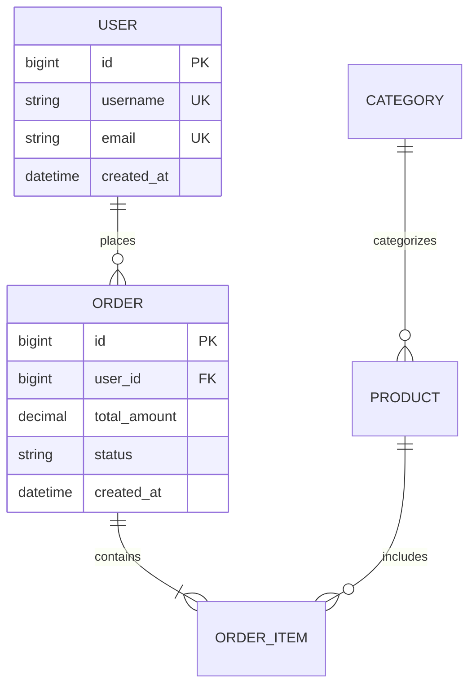

# Database Design Skill

## Skill Overview

本技能包提供数据库设计的专业知识、最佳实践和常见陷阱，指导AI高质量地完成从领域模型到数据库Schema的设计。

### Core Competencies

- **数据建模**: 掌握ER建模、规范化理论、反范式化优化
- **索引设计**: 理解B-Tree、哈希、全文索引的适用场景
- **性能调优**: 分析执行计划，优化慢查询
- **容量规划**: 预估数据增长，制定分库分表策略
- **安全合规**: 敏感字段加密，符合GDPR等合规要求

## Use When

使用此技能的场景：

- 新项目启动，需要设计数据库Schema
- 现有数据库需要重构或优化
- 数据量增长，需要评估扩容方案
- 查询性能下降，需要诊断和优化

## Instructions

### 步骤 1：业务需求分析

**目标**: 理解核心实体、数据特征、访问模式

**操作方法**:
1. **实体识别**: 从领域模型中提取核心业务实体
2. **属性定义**: 为每个实体定义属性和数据类型
3. **关系建模**: 确定实体间关系（1:1、1:N、M:N）
4. **访问模式分析**: 
   - OLTP（在线事务处理）：高频读写，强调一致性
   - OLAP（在线分析处理）：复杂查询，强调吞吐量
   - 实时查询：低延迟要求

**检查点**:
- [ ] 核心实体已识别（至少3-5个）
- [ ] 实体属性完整
- [ ] 关系类型明确
- [ ] 访问模式已分类

---

### 步骤 2：数据约束分析

**目标**: 评估一致性要求、合规约束、数据类型选择

**操作方法**:
1. **一致性级别**:
   - 强一致性：金融交易、库存扣减
   - 最终一致性：社交feed、推荐系统
   - 因果一致性：评论回复链
2. **合规要求**:
   - GDPR：用户数据可删除权
   - PII：敏感字段加密（手机号、邮箱、身份证）
   - 审计日志：记录所有数据变更
3. **数据类型选择**:
   - 整数：INT/BIGINT（根据范围选择）
   - 字符串：VARCHAR（可变长度）/CHAR（固定长度）
   - 时间：DATETIME/TIMESTAMP（考虑时区）
   - 大文本：TEXT/MEDIUMTEXT/LONGTEXT
   - JSON：JSON类型（MySQL 5.7+）

**检查点**:
- [ ] 一致性级别与业务需求匹配
- [ ] 合规要求已识别
- [ ] 数据类型选择合理

---

### 步骤 3：概念模型设计（ER图）

**目标**: 绘制ER图，定义实体和关系

**操作方法**:
1. **实体表示**: 矩形框表示实体，包含实体名和属性
2. **关系表示**: 菱形框表示关系，标注关系类型
3. **属性表示**: 椭圆形表示属性，主键加下划线
4. **基数标注**: 1:1、1:N、M:N

**ER图示例（Mermaid）**:


**检查点**:
- [ ] ER图包含所有核心实体
- [ ] 关系类型正确
- [ ] 基数标注清晰

---

### 步骤 4：逻辑模型设计（表结构）

**目标**: 转换为表结构，定义主键、外键、约束

**操作方法**:
1. **表命名规范**:
   - 使用小写字母和下划线（snake_case）
   - 表名用复数形式（users, orders）
   - 避免使用保留字
2. **主键设计**:
   - 单节点：AUTO_INCREMENT（简单高效）
   - 分布式：Snowflake ID/UUID（全局唯一）
   - 复合主键：谨慎使用，增加复杂度
3. **外键设计**:
   - 物理外键：保证参照完整性（开发环境）
   - 逻辑外键：应用层维护（生产环境，提升性能）
4. **约束定义**:
   - NOT NULL：必填字段
   - UNIQUE：唯一性约束
   - CHECK：值域约束（MySQL 8.0+支持）
   - DEFAULT：默认值

**检查点**:
- [ ] 所有表达到第三范式（3NF）
- [ ] 主键定义清晰
- [ ] 外键关系正确
- [ ] 约束完整

---

### 步骤 5：物理模型设计（索引和分区）

**目标**: 设计索引策略、分区方案、存储参数

**操作方法**:
1. **索引类型选择**:
   - **B-Tree索引**: 最常用，支持范围查询、排序
   - **哈希索引**: 仅支持等值查询，速度快
   - **全文索引**: 文本搜索（FULLTEXT）
   - **空间索引**: 地理位置查询（GIS）
2. **索引设计原则**:
   - 高频查询字段必须有索引
   - 联合索引遵循最左前缀原则
   - 避免过度索引（≤5个/表）
   - 定期审查无用索引
3. **分区策略**:
   - **范围分区**: 按时间范围（适合日志、订单）
   - **哈希分区**: 均匀分布（适合用户ID）
   - **列表分区**: 按枚举值（适合状态、地区）
4. **存储参数**:
   - 字符集：utf8mb4（支持emoji和多语言）
   - 排序规则：utf8mb4_unicode_ci
   - 存储引擎：InnoDB（支持事务和外键）
   - 行格式：DYNAMIC（支持大字段高效存储）

**检查点**:
- [ ] 索引覆盖高频查询（≥90%）
- [ ] 索引数量合理（≤5个/表）
- [ ] 分区策略与查询模式匹配
- [ ] 存储参数配置正确

---

### 步骤 6：性能优化

**目标**: 分析执行计划，优化慢查询

**操作方法**:
1. **EXPLAIN分析**:
   ```sql
   EXPLAIN SELECT * FROM orders WHERE user_id = 123 AND status = 'pending';
   ```
   - type: ALL（全表扫描）→ 需优化
   - type: ref/range（索引扫描）→ 良好
   - type: const（常量查询）→ 最优
2. **优化技巧**:
   - 避免SELECT *，只查询需要的字段
   - 减少JOIN数量（≤5个）
   - 避免在索引列上使用函数
   - 使用覆盖索引避免回表
   - 分页查询使用游标而非OFFSET
3. **缓存策略**:
   - 热点数据：Redis缓存
   - 查询结果：应用层缓存
   - 静态数据：CDN缓存

**检查点**:
- [ ] 无全表扫描（除非小表）
- [ ] JOIN表数量合理
- [ ] 索引被正确使用
- [ ] P99延迟<500ms

---

### 步骤 7：容量规划

**目标**: 预估数据增长，制定分库分表策略

**操作方法**:
1. **容量估算公式**:
   ```
   年增长率 = 当前数据量 × 月增长率(%) × 12
   3年容量 = (当前数据 + 年增长 × 3) × 1.5余量
   
   单行大小估算：
   - INT: 4字节
   - BIGINT: 8字节
   - VARCHAR(100): 平均50字节
   - DATETIME: 8字节
   - 索引开销：约数据量的30-50%
   ```
2. **分库分表触发条件**:
   - 单表行数 > 1000万
   - 单库大小 > 500GB
   - QPS > 5000
3. **分片策略**:
   - **垂直拆分**: 按业务域拆分（用户库、订单库、商品库）
   - **水平拆分**: 按分片键拆分（user_id % 16）
   - **混合拆分**: 先垂直后水平
4. **迁移方案**:
   - 双写过渡期
   - 数据同步工具（Canal/DTS）
   - 灰度切换

**检查点**:
- [ ] 容量预估有依据
- [ ] 分库分表方案可行
- [ ] 迁移风险可控

## Core Knowledge

### Normalization Theory

**First Normal Form (1NF)**:
- Each column contains atomic values
- No repeating groups

**Second Normal Form (2NF)**:
- Meets 1NF requirements
- All non-key attributes fully depend on primary key

**Third Normal Form (3NF)**:
- Meets 2NF requirements
- No transitive dependencies (non-key → non-key)

**When to Denormalize**:
- Read-heavy workloads
- Complex JOINs impact performance
- Reporting and analytics queries

### Index Types

| Type | Use Case | Pros | Cons |
|------|----------|------|------|
| B-Tree | Range queries, sorting | Versatile | Slower for exact match |
| Hash | Exact match only | Very fast | No range support |
| Fulltext | Text search | Powerful search | Large index size |
| Spatial | Geographic queries | GIS support | Specialized use |

### Sharding Strategies

**Vertical Sharding**:
- Split by business domain
- Example: User DB, Order DB, Product DB
- Pros: Simple, clear boundaries
- Cons: Cross-shard JOINs difficult

**Horizontal Sharding**:
- Split by shard key (user_id, order_id)
- Methods: Range, Hash, List
- Pros: Linear scalability
- Cons: Complex routing, rebalancing needed

### Consistency Models

| Model | Guarantee | Use Case |
|-------|-----------|----------|
| Strong | All nodes see same data immediately | Financial transactions |
| Eventual | All nodes converge eventually | Social feeds, recommendations |
| Causal | Cause-effect relationships preserved | Comment threads, chat |

### SQL Query Patterns

#### Java (JDBC PreparedStatement)

```java
// Java implementation - JDBC PreparedStatement with connection pooling
// Dependencies: mysql-connector-java, HikariCP (Maven/Gradle)
public class UserRepository {
    private final DataSource dataSource;

    public UserRepository(DataSource dataSource) {
        this.dataSource = dataSource;
    }

    // Query with parameterized SQL to prevent injection
    public List<Order> findOrdersByUserAndStatus(Long userId, String status) throws SQLException {
        String sql = "SELECT * FROM orders WHERE user_id = ? AND status = ? ORDER BY created_at DESC LIMIT 100";
        try (Connection conn = dataSource.getConnection();
             PreparedStatement stmt = conn.prepareStatement(sql)) {
            stmt.setLong(1, userId);
            stmt.setString(2, status);
            try (ResultSet rs = stmt.executeQuery()) {
                List<Order> orders = new ArrayList<>();
                while (rs.next()) {
                    orders.add(mapRowToOrder(rs));
                }
                return orders;
            }
        }
    }

    // Batch insert for performance
    public void batchInsertOrders(List<Order> orders) throws SQLException {
        String sql = "INSERT INTO orders (user_id, total_amount, status) VALUES (?, ?, ?)";
        try (Connection conn = dataSource.getConnection();
             PreparedStatement stmt = conn.prepareStatement(sql)) {
            for (Order order : orders) {
                stmt.setLong(1, order.getUserId());
                stmt.setBigDecimal(2, order.getTotalAmount());
                stmt.setString(3, order.getStatus());
                stmt.addBatch();
            }
            stmt.executeBatch();
        }
    }

    private Order mapRowToOrder(ResultSet rs) throws SQLException {
        Order order = new Order();
        order.setId(rs.getLong("id"));
        order.setUserId(rs.getLong("user_id"));
        order.setTotalAmount(rs.getBigDecimal("total_amount"));
        order.setStatus(rs.getString("status"));
        order.setCreatedAt(rs.getTimestamp("created_at").toLocalDateTime());
        return order;
    }
}
```

#### Go (database/sql)

```go
// Go implementation - database/sql with context support
// Dependencies: go-sql-driver/mysql (import _ "github.com/go-sql-driver/mysql")
package repository

import (
    "context"
    "database/sql"
    "fmt"
    "time"
)

type Order struct {
    ID          int64
    UserID      int64
    TotalAmount float64
    Status      string
    CreatedAt   time.Time
}

type UserRepository struct {
    db *sql.DB
}

func NewUserRepository(db *sql.DB) *UserRepository {
    return &UserRepository{db: db}
}

// Query with context timeout and prepared statement
func (r *UserRepository) FindOrdersByUserAndStatus(ctx context.Context, userID int64, status string) ([]Order, error) {
    ctx, cancel := context.WithTimeout(ctx, 5*time.Second)
    defer cancel()

    query := "SELECT id, user_id, total_amount, status, created_at FROM orders WHERE user_id = ? AND status = ? ORDER BY created_at DESC LIMIT 100"
    stmt, err := r.db.PrepareContext(ctx, query)
    if err != nil {
        return nil, fmt.Errorf("prepare query: %w", err)
    }
    defer stmt.Close()

    rows, err := stmt.QueryContext(ctx, userID, status)
    if err != nil {
        return nil, fmt.Errorf("execute query: %w", err)
    }
    defer rows.Close()

    var orders []Order
    for rows.Next() {
        var o Order
        if err := rows.Scan(&o.ID, &o.UserID, &o.TotalAmount, &o.Status, &o.CreatedAt); err != nil {
            return nil, fmt.Errorf("scan row: %w", err)
        }
        orders = append(orders, o)
    }
    return orders, rows.Err()
}

// Batch insert with transaction
func (r *UserRepository) BatchInsertOrders(ctx context.Context, orders []Order) error {
    tx, err := r.db.BeginTx(ctx, nil)
    if err != nil {
        return fmt.Errorf("begin tx: %w", err)
    }
    defer tx.Rollback() // no-op if committed

    stmt, err := tx.PrepareContext(ctx, "INSERT INTO orders (user_id, total_amount, status) VALUES (?, ?, ?)")
    if err != nil {
        return fmt.Errorf("prepare insert: %w", err)
    }
    defer stmt.Close()

    for _, o := range orders {
        if _, err := stmt.ExecContext(ctx, o.UserID, o.TotalAmount, o.Status); err != nil {
            return fmt.Errorf("exec insert: %w", err)
        }
    }
    return tx.Commit()
}
```

#### Node.js (mysql2/pg)

```javascript
// Node.js implementation - mysql2 with async/await and prepared statements
// Dependencies: mysql2 (npm install mysql2)
const mysql = require('mysql2/promise');

class OrderRepository {
    constructor(pool) {
        this.pool = pool;
    }

    // Query with parameterized SQL
    async findByUserAndStatus(userId, status) {
        const sql = 'SELECT * FROM orders WHERE user_id = ? AND status = ? ORDER BY created_at DESC LIMIT 100';
        const [rows] = await this.pool.execute(sql, [userId, status]);
        return rows;
    }

    // Batch insert with transaction
    async batchInsert(orders) {
        const connection = await this.pool.getConnection();
        try {
            await connection.beginTransaction();
            const sql = 'INSERT INTO orders (user_id, total_amount, status) VALUES (?, ?, ?)';
            for (const order of orders) {
                await connection.execute(sql, [order.userId, order.totalAmount, order.status]);
            }
            await connection.commit();
        } catch (err) {
            await connection.rollback();
            throw err;
        } finally {
            connection.release();
        }
    }

    // Streaming query for large result sets
    async streamOrders(userId, callback) {
        const sql = 'SELECT * FROM orders WHERE user_id = ? ORDER BY created_at';
        const stream = this.pool.query(sql, [userId]).stream();
        stream.on('data', (row) => callback(row));
        return new Promise((resolve, reject) => {
            stream.on('end', resolve);
            stream.on('error', reject);
        });
    }
}

// Usage
const pool = mysql.createPool({
    host: 'localhost',
    user: 'app',
    database: 'ecommerce',
    waitForConnections: true,
    connectionLimit: 10,
    queueLimit: 0
});
const repo = new OrderRepository(pool);
const orders = await repo.findByUserAndStatus(123, 'pending');
```

### Schema Migration

#### Java (Flyway)

```java
// Java implementation - Flyway schema migration
// Dependencies: flyway-core, flyway-mysql (Maven/Gradle)
// File: src/main/resources/db/migration/V1__create_users_table.sql
/*
CREATE TABLE users (
    id BIGINT PRIMARY KEY AUTO_INCREMENT,
    username VARCHAR(50) NOT NULL UNIQUE,
    email VARCHAR(255) NOT NULL UNIQUE,
    created_at DATETIME NOT NULL DEFAULT CURRENT_TIMESTAMP,
    updated_at DATETIME NOT NULL DEFAULT CURRENT_TIMESTAMP ON UPDATE CURRENT_TIMESTAMP,
    deleted_at DATETIME DEFAULT NULL
) ENGINE=InnoDB DEFAULT CHARSET=utf8mb4 COLLATE=utf8mb4_unicode_ci;
*/

// Programmatic Flyway configuration
import org.flywaydb.core.Flyway;

public class DatabaseMigration {
    public void migrate(String jdbcUrl, String user, String password) {
        Flyway flyway = Flyway.configure()
            .dataSource(jdbcUrl, user, password)
            .locations("classpath:db/migration")
            .baselineOnMigrate(true)
            .validateOnMigrate(true)
            .outOfOrder(false)
            .load();

        // Run migrations
        flyway.migrate();
    }

    public void repairAndMigrate(String jdbcUrl, String user, String password) {
        Flyway flyway = Flyway.configure()
            .dataSource(jdbcUrl, user, password)
            .load();

        // Repair checksums if needed, then migrate
        flyway.repair();
        flyway.migrate();
    }
}

// Spring Boot auto-configuration (application.yml)
/*
spring:
  flyway:
    enabled: true
    locations: classpath:db/migration
    baseline-on-migrate: true
    validate-on-migrate: true
*/
```

#### Go (golang-migrate)

```go
// Go implementation - golang-migrate for schema migrations
// Dependencies: github.com/golang-migrate/migrate/v4
// Install CLI: brew install golang-migrate
package migration

import (
    "fmt"
    "log"

    "github.com/golang-migrate/migrate/v4"
    _ "github.com/golang-migrate/migrate/v4/database/mysql"
    _ "github.com/golang-migrate/migrate/v4/source/file"
)

// RunMigrations applies all pending migrations from the given directory
func RunMigrations(dbURL, migrationsPath string) error {
    m, err := migrate.New(
        fmt.Sprintf("file://%s", migrationsPath),
        dbURL,
    )
    if err != nil {
        return fmt.Errorf("create migrator: %w", err)
    }
    defer m.Close()

    if err := m.Up(); err != nil && err != migrate.ErrNoChange {
        return fmt.Errorf("run migrations: %w", err)
    }
    log.Println("migrations applied successfully")
    return nil
}

// RollbackLast reverses the most recent migration
func RollbackLast(dbURL, migrationsPath string) error {
    m, err := migrate.New(
        fmt.Sprintf("file://%s", migrationsPath),
        dbURL,
    )
    if err != nil {
        return fmt.Errorf("create migrator: %w", err)
    }
    defer m.Close()

    if err := m.Steps(-1); err != nil {
        return fmt.Errorf("rollback migration: %w", err)
    }
    log.Println("last migration rolled back successfully")
    return nil
}

// Migration files go in: migrations/000001_create_users_table.up.sql
// and: migrations/000001_create_users_table.down.sql
/*
-- 000001_create_users_table.up.sql
CREATE TABLE users (
    id BIGINT PRIMARY KEY AUTO_INCREMENT,
    username VARCHAR(50) NOT NULL UNIQUE,
    email VARCHAR(255) NOT NULL UNIQUE,
    created_at DATETIME NOT NULL DEFAULT CURRENT_TIMESTAMP,
    updated_at DATETIME NOT NULL DEFAULT CURRENT_TIMESTAMP ON UPDATE CURRENT_TIMESTAMP,
    deleted_at DATETIME DEFAULT NULL
) ENGINE=InnoDB DEFAULT CHARSET=utf8mb4 COLLATE=utf8mb4_unicode_ci;

-- 000001_create_users_table.down.sql
DROP TABLE IF EXISTS users;
*/
```

#### Node.js (db-migrate)

```javascript
// Node.js implementation - db-migrate for schema migrations
// Dependencies: db-migrate, db-migrate-mysql (npm install db-migrate db-migrate-mysql)
// Configuration file: database.json
/*
{
  "dev": {
    "driver": "mysql",
    "host": "localhost",
    "user": "app",
    "password": "password",
    "database": "ecommerce"
  },
  "prod": {
    "driver": "mysql",
    "host": { "env": "DB_HOST" },
    "user": { "env": "DB_USER" },
    "password": { "env": "DB_PASSWORD" },
    "database": { "env": "DB_NAME" }
  }
}
*/

// Migration file: migrations/20260401000001-create-users-table.js
'use strict';

exports.up = function(db, callback) {
    db.runSql(`
        CREATE TABLE users (
            id BIGINT PRIMARY KEY AUTO_INCREMENT,
            username VARCHAR(50) NOT NULL UNIQUE,
            email VARCHAR(255) NOT NULL UNIQUE,
            created_at DATETIME NOT NULL DEFAULT CURRENT_TIMESTAMP,
            updated_at DATETIME NOT NULL DEFAULT CURRENT_TIMESTAMP ON UPDATE CURRENT_TIMESTAMP,
            deleted_at DATETIME DEFAULT NULL
        ) ENGINE=InnoDB DEFAULT CHARSET=utf8mb4 COLLATE=utf8mb4_unicode_ci
    `, callback);
};

exports.down = function(db, callback) {
    db.dropTable('users', callback);
};
```

## Best Practices

### 1. Always Use Third Normal Form (3NF)

**Practice Description**: Design tables to meet 3NF unless there's a compelling reason to denormalize.

**Rationale**: Prevents data anomalies and ensures data integrity.

**How to Apply**:
- Eliminate repeating groups (1NF)
- Ensure full dependency on primary key (2NF)
- Remove transitive dependencies (3NF)
- Document any denormalization with rationale

---

### 2. Design Indexes Based on Query Patterns

**Practice Description**: Create indexes that cover your most frequent and critical queries.

**Rationale**: Proper indexing dramatically improves query performance.

**How to Apply**:
- Analyze query patterns before designing indexes
- Use composite indexes for multi-column queries
- Follow leftmost prefix rule for composite indexes
- Monitor and remove unused indexes

---

### 3. Use Soft Deletes Instead of Hard Deletes

**Practice Description**: Add a `deleted_at` timestamp column instead of physically deleting rows.

**Rationale**: Preserves data history, enables recovery, simplifies auditing.

**How to Apply**:
```sql
ALTER TABLE users ADD COLUMN deleted_at DATETIME DEFAULT NULL;

-- Soft delete
UPDATE users SET deleted_at = NOW() WHERE id = 123;

-- Query active records
SELECT * FROM users WHERE deleted_at IS NULL;
```

---

### 4. Implement Audit Fields in Every Table

**Practice Description**: Include created_at, updated_at, and optionally deleted_at in all tables.

**Rationale**: Essential for debugging, auditing, and data lifecycle management.

**How to Apply**:
```sql
CREATE TABLE example (
  id BIGINT PRIMARY KEY AUTO_INCREMENT,
  -- business columns...
  created_at DATETIME NOT NULL DEFAULT CURRENT_TIMESTAMP,
  updated_at DATETIME NOT NULL DEFAULT CURRENT_TIMESTAMP ON UPDATE CURRENT_TIMESTAMP,
  deleted_at DATETIME DEFAULT NULL
);
```

---

### 5. Encrypt Sensitive Data at Rest

**Practice Description**: Encrypt PII (Personally Identifiable Information) and sensitive fields.

**Rationale**: Compliance with GDPR, HIPAA, and security best practices.

**How to Apply**:
- Use AES-256 encryption for phone, email, ID numbers
- Store encryption keys separately (KMS/HSM)
- Hash passwords with bcrypt/argon2
- Implement field-level encryption in application layer

---

### 6. Plan for Growth from Day One

**Practice Description**: Design schema with future growth in mind, even if current scale is small.

**Rationale**: Retrofitting sharding or partitioning is much harder than planning ahead.

**How to Apply**:
- Estimate 3-year growth trajectory
- Choose shard-friendly primary keys (avoid natural keys)
- Design partition-friendly table structures
- Document scaling strategy

## Anti-patterns (反模式)

> 与 Common Pitfalls 同义，执行时合并检查。

## Common Pitfalls

### Pitfall 1: Over-Indexing

**Risk**: Creating too many indexes slows down writes and wastes storage.

**Prevention**:
- Limit to 5 indexes per table
- Monitor index usage statistics
- Remove unused indexes regularly
- Consider covering indexes vs. multiple single indexes

**Impact**: Slow INSERT/UPDATE/DELETE operations, increased storage costs

---

### Pitfall 2: Using SELECT * in Production

**Risk**: Fetching unnecessary columns wastes I/O, memory, and network bandwidth.

**Prevention**:
- Always specify required columns explicitly
- Use ORM to manage field selection
- Review queries in code review process

**Impact**: Slower queries, higher memory usage, increased network traffic

---

### Pitfall 3: Ignoring Character Set and Collation

**Risk**: Incorrect character set causes data corruption or incorrect sorting.

**Prevention**:
- Always use utf8mb4 for Unicode support
- Choose appropriate collation (unicode_ci for case-insensitive)
- Be consistent across all tables and databases

**Impact**: Data corruption, incorrect sorting, emoji display issues

---

### Pitfall 4: Not Planning for Data Archival

**Risk**: Tables grow indefinitely, degrading performance and increasing costs.

**Prevention**:
- Define data retention policies
- Implement archival jobs (move old data to cold storage)
- Use partitioning for easy archival
- Test restore procedures regularly

**Impact**: Slow queries, high storage costs, backup/restore difficulties

## Related Assets

- **Scenario**: [../scenarios/design-database/SCENARIO.md](../../scenarios/design-database/SCENARIO.md)
- **Agent**: [../agents/design-database.agent.md](../../agents/design-database.agent.md)
- **Prompt**: [../prompts/design-database.prompt.md](../../prompts/design-database.prompt.md)
- **Instruction**: [../instructions/design-database.instructions.md](../../instructions/design-database.instructions.md)
