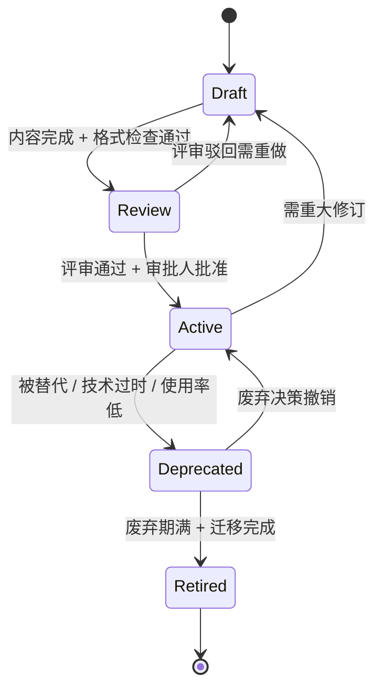

# 资产生命周期管理标准

## Overview

本文件定义了 E2E Delivery Harness 资产库中所有标准资产（Prompt / Instruction / Agent / Skill / Scenario / Standard）的完整生命周期管理流程。各阶段明确了进入条件、退出条件、审批者、最大停留时间，确保资产从创建到退役的全过程可追溯、可治理。

## 生命周期状态总览

每个资产在同一时刻必须处于且仅处于以下五个阶段之一：



## 阶段定义

### 1. Draft（草稿）

| 属性 | 说明 |
|------|------|
| **定义** | 资产初始创建阶段，内容尚未定稿，不可对外使用 |
| **进入条件** | 创建者提交新资产骨架，通过元数据格式检查 |
| **退出条件** | (1) 内容完整度 ≥ 90%, (2) 通过格式规范性自动检查, (3) 至少 1 位 Author 级人员确认可提交评审 |
| **审批者** | 创建者（自检） + 自动化格式检查 |
| **最大停留时间** | 30 个日历日（超时自动冻结并通知创建者） |

**Draft 阶段资产特性**:
- 版本号固定为 `0.1.0`，不可被外部引用
- 不参与任何搜索索引或推荐
- 超过 30 天未更新则标记为 `stale-draft`，由 Curator 决定是否保留或归档

### 2. Review（评审）

| 属性 | 说明 |
|------|------|
| **定义** | 资产已提交评审，等待同行审查和审批人批准 |
| **进入条件** | (1) Draft 退出条件全部满足, (2) 提交评审申请 PR/MR, (3) 关联变更说明 |
| **退出条件** | (1) 所有评审项通过, (2) 无 P0/P1 阻塞性问题, (3) 获得至少 2 位 Reviewer 批准, (4) Approver 最终签字 |
| **审批者** | 至少 2 位 Reviewer（技术评审） + 1 位 Approver（最终批准） |
| **最大停留时间** | 14 个日历日（超时自动升级至 Curator） |

**Review 阶段特性**:
- 版本号保持在 `0.x.0`（x 随 revision 递增）
- 评审意见须逐条闭环（Resolved / Won't Fix / Deferred）
- 评审驳回（退出到 Draft）需明确说明原因和改进要求
- 评审通过率要求：首次通过率 ≥ 70%（组织级 KPI）

### 3. Active（活跃）

| 属性 | 说明 |
|------|------|
| **定义** | 资产已发布上线，可供全组织正式使用和引用 |
| **进入条件** | (1) Review 退出条件全部满足, (2) 版本号分配至 `1.0.0` 及以上, (3) 配套文档与示例完整 |
| **退出条件** | (1) 被新版本替代, (2) 技术过时裁定, (3) 使用率连续 90 天低于阈值, (4) 发现重大缺陷需回退 |
| **审批者** | Curator（退役审批） |
| **最大停留时间** | 无硬性限制，但每 6 个月须进行一次**健康度评审** |

**Active 阶段特性**:
- 版本号遵循语义化版本规范（见下文）
- 资产可被其他资产正式引用和依赖
- 每次 MAJOR 或 MINOR 版本发布须更新变更日志
- 健康度评审触发条件：
  - 定期：每 6 个月自动触发
  - 事件驱动：关联资产变更、安全公告、合规要求变化

### 4. Deprecated（废弃）

| 属性 | 说明 |
|------|------|
| **定义** | 资产已标记为不建议使用，但仍在运行以提供迁移缓冲期 |
| **进入条件** | (1) Curator 审批通过退役申请, (2) 已发布替代资产或明确退役理由, (3) 开始≥30 天废弃通知期计时 |
| **退出条件** | (1) 废弃通知期届满, (2) 所有已知使用者已完成迁移, (3) 迁移指南已验证 |
| **审批者** | Curator + 受影响资产负责人确认 |
| **最大停留时间** | 90 个日历日（超过则强制进入 Retired） |

**Deprecated 阶段特性**:
- 资产仍在索引中，但搜索结果中排在 Active 资产之后
- 所有引用该资产的地方须收到废弃通知（自动扫描 + 邮件）
- 新项目禁止引用 Deprecated 资产
- 版本号不再递增，固定在废弃时的版本

**废弃通知要求**:
- 通知期 ≥ 30 个日历日
- 通知内容必须包括：
  - 废弃资产名称与版本
  - 替代资产名称与版本（如有）
  - 迁移截止日期
  - 迁移指南链接
  - 联系人（负责 Engineer）
- 通知渠道：资产注册处公告 + 直接通知所有已知使用者

### 5. Retired（退役）

| 属性 | 说明 |
|------|------|
| **定义** | 资产已完全退役，不再提供任何服务或可访问性 |
| **进入条件** | (1) Deprecated 退出条件全部满足, (2) Curator 执行退役操作 |
| **退出条件** | 无（终态） |
| **审批者** | Curator 执行 + 归档操作 |
| **最大停留时间** | 永久（仅归档） |

**Retired 阶段特性**:
- 资产从搜索索引和推荐系统中移除
- 资产文件移入 `archive/` 目录
- 外部引用链接返回 410 Gone 或明确退役提示
- 元数据保留在系统中（至少保留 3 年）
- 如需重新激活，须重新从 Draft 阶段开始

## 角色职责矩阵

| 角色 | Draft | Review | Active | Deprecated | Retired |
|------|-------|--------|--------|------------|---------|
| **Author（创建者）** | 创建与编辑 | 响应评审意见 | 维护与更新 | 编写迁移指南 | — |
| **Reviewer（评审者）** | — | 技术审查 | 定期健康度评估 | 参与迁移验证 | — |
| **Approver（审批者）** | — | 最终批准 | — | 退役审批 | — |
| **Curator（管理者）** | 冻结/归档裁定 | 超时升级处理 | 健康度评审组织 | 通知执行监督 | 退役执行 |

## 版本号演进规则

采用语义化版本号格式 `MAJOR.MINOR.PATCH`：

```
主版本.次版本.修订号
例如：1.3.2
```

### 版本号触发条件

| 版本位 | 变更类型 | 触发条件 | 示例 |
|--------|---------|---------|------|
| **MAJOR** | 不兼容变更 | 资产结构/接口重大重构；向后不兼容的格式变更；删除已有字段或能力 | `1.x.x → 2.0.0` |
| **MINOR** | 功能新增（兼容） | 新增字段或能力，不影响现有接口；增加新章节；扩展可选内容 | `1.1.0 → 1.2.0` |
| **PATCH** | 问题修复（兼容） | 修正拼写错误；澄清模糊表述；修复链接；微调格式不影响语义 | `1.1.0 → 1.1.1` |

### 版本号生命周期映射

| 生命周期阶段 | 版本号范围 | 示例 |
|-------------|-----------|------|
| Draft | `0.x.0` | `0.1.0`, `0.2.0` |
| Review | `0.x.0` | `0.3.0`, `0.4.0` |
| Active | `≥1.0.0` | `1.0.0`, `2.3.1` |
| Deprecated | 冻结 | 固定为退役时版本 |
| Retired | 冻结 | 同 Deprecated |

### 变更记录格式

每次版本更新须记录以下信息：

| 字段 | 描述 | 必填 |
|------|------|------|
| `version` | 新版本号（如 `1.2.0`） | 是 |
| `date` | 发布日期（ISO 8601） | 是 |
| `author` | 变更执行人 | 是 |
| `type` | 变更类型（MAJOR / MINOR / PATCH） | 是 |
| `description` | 中文变更摘要 | 是 |
| `breaking` | 是否破坏性变更（true / false） | 是 |
| `reviewers` | 参与评审人员列表 | MAJOR/MINOR 必填 |

## 迁移指南要求

每项 Deprecated 资产必须附带迁移指南，指南内容须包含：

1. **迁移目标**: 从当前资产迁移到哪个替代资产
2. **差异分析**: 新旧资产的字段/能力/接口差异对照表
3. **迁移步骤**: 逐条操作步骤（可自动化部分标注 `[auto]`）
4. **兼容性说明**: 是否存在过渡期兼容模式
5. **回滚方案**: 迁移失败时的回滚操作
6. **验证清单**: 迁移完成后须验证的检查项
7. **时间估计**: 预计迁移工时

## Compliance Checklist

资产从创建到退役的全流程合规检查清单：

### Draft → Review 门禁
- [ ] QG-001: 格式规范自动检查通过
- [ ] QG-002: 元数据完整（name / description / type / version / author）
- [ ] QG-003: 内容完整度 ≥ 90%
- [ ] QG-004: 不包含未解析的占位符（`TODO`, `FIXME`, `{{placeholder}}`）
- [ ] QG-005: 文件名符合 `{verb}-{noun}` kebab-case 规范
- [ ] QG-006: 关联的测试或验证用例已创建（如适用）

### Review → Active 门禁
- [ ] QG-007: 所有评审意见已闭环
- [ ] QG-008: 至少 2 位 Reviewer 批准
- [ ] QG-009: Approver 最终签字确认
- [ ] QG-010: 版本号已正确分配（≥ `1.0.0`）
- [ ] QG-011: 变更日志已更新
- [ ] QG-012: 配套文档和示例已完成

### Active 阶段合规
- [ ] QG-013: 每 6 个月健康度评审按时完成
- [ ] QG-014: 外部依赖资产的版本兼容性已验证
- [ ] QG-015: 安全与合规扫描通过

### Active → Deprecated 门禁
- [ ] QG-016: Curator 退役审批通过
- [ ] QG-017: 替代资产已发布或退役理由记录在案
- [ ] QG-018: 废弃通知已发送至所有已知使用者
- [ ] QG-019: 通知期 ≥ 30 天
- [ ] QG-020: 迁移指南已编写并发布

### Deprecated → Retired 门禁
- [ ] QG-021: 废弃通知期已届满
- [ ] QG-022: 所有已知使用者已确认迁移完成
- [ ] QG-023: 迁移指南已验证可操作
- [ ] QG-024: 资产已移入 `archive/` 目录
- [ ] QG-025: 元数据保留（至少 3 年）

## 状态流转速查表

| 当前状态 | 允许的下一个状态 | 触发动作 | 典型原因 |
|---------|----------------|---------|---------|
| Draft | Review | 提交评审 | 创建完成 |
| Draft | (归档) | Curator 执行 | 超时无更新 |
| Review | Active | 批准发布 | 评审通过 |
| Review | Draft | 驳回 | 需重大修改 |
| Active | Deprecated | 退役申请 | 被替代/过时 |
| Active | Draft | 回退 | 需重大修订 |
| Deprecated | Active | 撤销废弃 | 退役决策取消 |
| Deprecated | Retired | 执行退役 | 通知期满 |

## 反模式

| 反模式 | 表现 | 正确做法 |
|--------|------|---------|
| 永久 Draft | 资产长期处于 Draft 不推动 | 设置 30 天超时自动冻结 |
| 跳过 Deprecated | 直接从 Active 到 Retired 不给迁移期 | 必须经过 ≥30 天废弃通知期 |
| 版本号滥用 | 微小修改却升 MAJOR 版本 | 严格按语义化版本规则触发 |
| 评审走过场 | 评审不发现问题直接批准 | 要求至少 2 位 Reviewer + 逐条闭环 |
| 无通知退役 | 退役不通知使用者 | 按本规范执行通知流程 |

## Related Standards

- [naming-conventions.md](naming-conventions.md) - 命名规范标准（文件名检查）
- [output-quality-rubric.md](output-quality-rubric.md) - 产出质量评估标准（健康度评审）
- [error-classification.md](error-classification.md) - 错误分类与处理策略（退役异常处理）
- [user-story-format.md](user-story-format.md) - 用户故事格式标准（Draft 阶段产出物要求）
