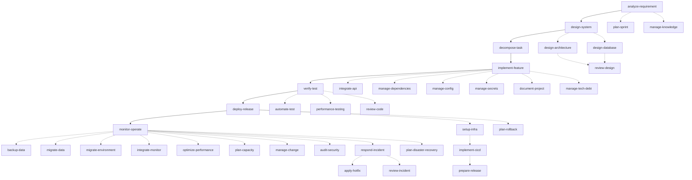

# 场景间 DAG 依赖模型

## 概述

本文件定义了 E2E Delivery Harness 中 37 个场景之间的**有向无环图 (DAG) 依赖关系**。通过显式建模每个场景的前置条件、后置触发和并行约束，使 Workflow 引擎能够自动检测可并行执行的场景并预防循环依赖。

## 依赖关系类型

```yaml
dependency_types:
  BLOCKS:        # A BLOCKS B = A 未完成则 B 不能开始 (串行依赖)
    symbol: "A → B"
    example: "analyze-requirement → design-system"
    
  TRIGGERS:      # A TRIGGERS B = A 完成后自动触发 B (事件驱动)
    symbol: "A ⇒ B"
    example: "respond-incident ⇒ apply-hotfix (if code fix needed)"
    
  ENRICHES:      # A ENRICHES B = A 的输出增强 B 的质量 (可选增强)
    symbol: "A ⇢ B"
    example: "design-architecture ⇢ design-system (提供 ADR 参考)"
    
  PARALLEL_WITH: # A ∥ B = 可同时执行 (无冲突)
    symbol: "A ∥ B"
    example: "automate-test ∥ performance-testing"
    
  CONFLICTS_WITH: # A ⊗ B = 不能同时执行 (资源冲突)
    symbol: "A ⊗ B"
    example: "migrate-data ⊗ migrate-environment (共享目标资源)"
```

## 核心 7 阶段 DAG



## 完整依赖矩阵

### Phase 1: Requirement (需求)

| 场景 | 类型 | 前置依赖 (BLOCKS) | 后置触发 (TRIGGERS) | 增强关系 (ENRICHES) | 可并行 (PARALLEL_WITH) |
|------|------|------------------|-------------------|-------------------|----------------------|
| `analyze-requirement` | 核心 | (入口场景) | design-system | — | plan-sprint |
| `plan-sprint` | 扩展 | analyze-requirement (非阻塞) | decompose-task | analyze-requirement | — |

### Phase 2: Design (设计)

| 场景 | 类型 | 前置依赖 (BLOCKS) | 后置触发 (TRIGGERS) | 增强关系 (ENRICHES) | 可并行 (PARALLEL_WITH) |
|------|------|------------------|-------------------|-------------------|----------------------|
| `design-system` | 核心 | analyze-requirement | decompose-task | — | design-architecture, design-database |
| `design-architecture` | 扩展 | design-system (非阻塞) | review-design | design-system | design-database |
| `design-database` | 扩展 | design-system (非阻塞) | review-design | design-system | design-architecture |
| `review-design` | 扩展 | design-architecture OR design-database | implement-feature | design-system | — |

### Phase 3: Development (开发)

| 场景 | 类型 | 前置依赖 (BLOCKS) | 后置触发 (TRIGGERS) | 增强关系 (ENRICHES) | 可并行 (PARALLEL_WITH) |
|------|------|------------------|-------------------|-------------------|----------------------|
| `decompose-task` | 核心 | design-system | implement-feature | — | — |
| `implement-feature` | 核心 | decompose-task | verify-test | — | integrate-api, manage-dependencies, manage-config, manage-secrets |
| `integrate-api` | 扩展 | implement-feature (非阻塞) | verify-test | implement-feature | manage-dependencies |
| `manage-dependencies` | 扩展 | implement-feature (非阻塞) | verify-test | implement-feature | integrate-api |
| `manage-config` | 扩展 | implement-feature (非阻塞) | verify-test | implement-feature | manage-secrets |
| `manage-secrets` | 扩展 | implement-feature (非阻塞) | verify-test | implement-feature | manage-config |
| `document-project` | 扩展 | implement-feature (非阻塞) | monitor-operate | — | manage-knowledge |

### Phase 4: Testing (测试)

| 场景 | 类型 | 前置依赖 (BLOCKS) | 后置触发 (TRIGGERS) | 增强关系 (ENRICHES) | 可并行 (PARALLEL_WITH) |
|------|------|------------------|-------------------|-------------------|----------------------|
| `verify-test` | 核心 | implement-feature | deploy-release (pass) / implement-feature (fail) | — | automate-test, performance-testing |
| `automate-test` | 扩展 | verify-test (非阻塞) | verify-test | verify-test | performance-testing |
| `performance-testing` | 扩展 | verify-test (非阻塞) | verify-test | verify-test | automate-test |
| `review-code` | 扩展 | implement-feature (非阻塞) | verify-test | implement-feature | — |

### Phase 5: Deployment (部署)

| 场景 | 类型 | 前置依赖 (BLOCKS) | 后置触发 (TRIGGERS) | 增强关系 (ENRICHES) | 可并行 (PARALLEL_WITH) |
|------|------|------------------|-------------------|-------------------|----------------------|
| `setup-infra` | 扩展 | (按需触发) | implement-cicd | — | — |
| `implement-cicd` | 扩展 | setup-infra | prepare-release | — | — |
| `prepare-release` | 扩展 | implement-cicd, verify-test | deploy-release | — | plan-rollback |
| `deploy-release` | 核心 | verify-test, prepare-release | monitor-operate | — | — |
| `plan-rollback` | 扩展 | deploy-release (非阻塞) | deploy-release | deploy-release | prepare-release |

### Phase 6: Operations (运维)

| 场景 | 类型 | 前置依赖 (BLOCKS) | 后置触发 (TRIGGERS) | 增强关系 (ENRICHES) | 可并行 (PARALLEL_WITH) |
|------|------|------------------|-------------------|-------------------|----------------------|
| `monitor-operate` | 核心 | deploy-release | (稳态循环) | — | backup-data, integrate-monitor |
| `backup-data` | 扩展 | monitor-operate (非阻塞) | monitor-operate | monitor-operate | — |
| `migrate-data` | 扩展 | (按需触发) | monitor-operate | — | — |
| `migrate-environment` | 扩展 | (按需触发) | monitor-operate | — | — |
| `integrate-monitor` | 扩展 | monitor-operate (非阻塞) | monitor-operate | monitor-operate | — |
| `manage-change` | 扩展 | monitor-operate (非阻塞) | monitor-operate | — | — |
| `optimize-performance` | 扩展 | monitor-operate (非阻塞) | monitor-operate | monitor-operate | — |
| `plan-capacity` | 扩展 | monitor-operate (非阻塞) | monitor-operate | monitor-operate | — |

### Phase 7: Governance (治理)

| 场景 | 类型 | 前置依赖 (BLOCKS) | 后置触发 (TRIGGERS) | 增强关系 (ENRICHES) | 可并行 (PARALLEL_WITH) |
|------|------|------------------|-------------------|-------------------|----------------------|
| `audit-security` | 扩展 | deploy-release (非阻塞) | deploy-release | — | — |
| `manage-tech-debt` | 扩展 | implement-feature (非阻塞) | implement-feature | implement-feature | — |
| `manage-knowledge` | 扩展 | (跨阶段) | (跨阶段) | — | document-project |
| `respond-incident` | 扩展 | monitor-operate (事件触发) | apply-hotfix, review-incident | — | — |
| `apply-hotfix` | 扩展 | respond-incident | monitor-operate | — | — |
| `review-incident` | 扩展 | respond-incident | monitor-operate | — | — |
| `plan-disaster-recovery` | 扩展 | monitor-operate (非阻塞) | monitor-operate | — | — |

## 并行执行策略

### 可安全并行的场景组

```yaml
parallel_groups:
  design_phase:
    - [design-architecture, design-database]  # 可同时执行
    max_parallel: 2
    
  development_phase:
    - [integrate-api, manage-dependencies, manage-config, manage-secrets, manage-tech-debt]
    max_parallel: 3
    
  testing_phase:
    - [automate-test, performance-testing]
    max_parallel: 2
    
  deployment_prep:
    - [prepare-release, plan-rollback]
    max_parallel: 2
    
  operations_steady:
    - [backup-data, integrate-monitor, optimize-performance, plan-capacity]
    max_parallel: 2
```

### 冲突检测规则

```yaml
conflict_rules:
  - resources: ["database"]
    cannot_parallel: [migrate-data, backup-data]
    reason: "共享数据库资源，同时操作可能导致数据不一致"
    
  - resources: ["infrastructure"]
    cannot_parallel: [migrate-environment, setup-infra]
    reason: "共享基础设施管理权限，可能导致配置冲突"
    
  - resources: ["production_environment"]
    cannot_parallel: [deploy-release, apply-hotfix]
    reason: "生产环境不能同时执行两个部署操作"
```

## 死锁预防

```yaml
deadlock_prevention:
  cycle_detection:
    method: "拓扑排序 (Kahn's algorithm)"
    action_on_cycle: "阻止执行，报告循环依赖链"
    
  timeout_recovery:
    max_wait_minutes: 120
    action: "通知干系人，建议人工介入"
    
  deadlock_resolution:
    strategy: "选择 cost 最低的依赖边断开"
    cost_function: "场景执行时间 + 阻塞的下游场景数 × 权重"
```

## 相关资产

- [workflows/e2e-delivery.pipeline.md](../workflows/e2e-delivery.pipeline.md) - 主交付流水线
- [workflows/incident-response.pipeline.md](../workflows/incident-response.pipeline.md) - 故障响应流水线
- [cross-pipeline-protocol.md](cross-pipeline-protocol.md) - 跨流水线集成协议
- [traceability-mapping.md](traceability-mapping.md) - 跨资产可追溯性
